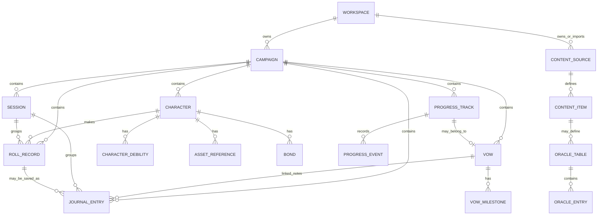
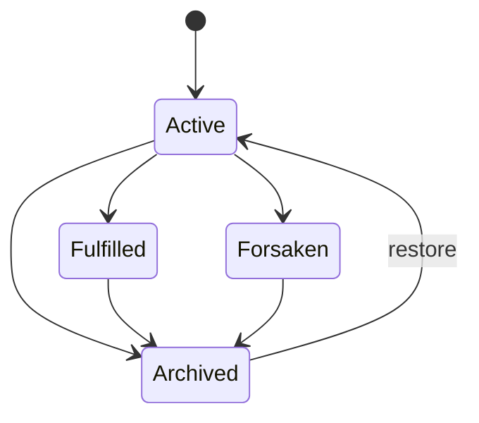
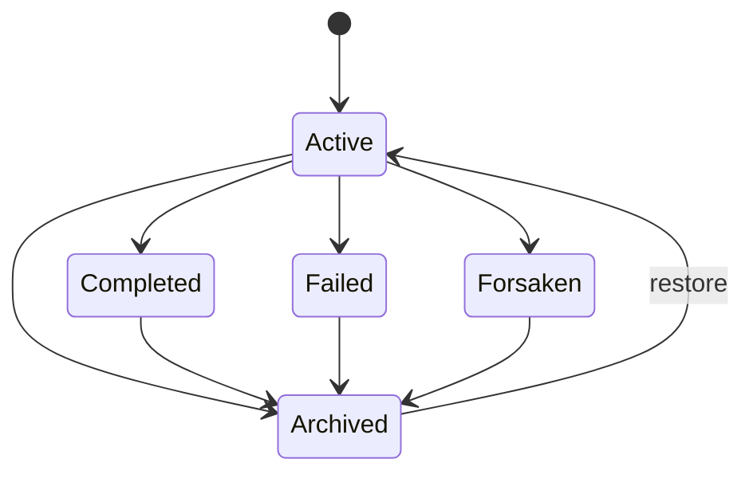
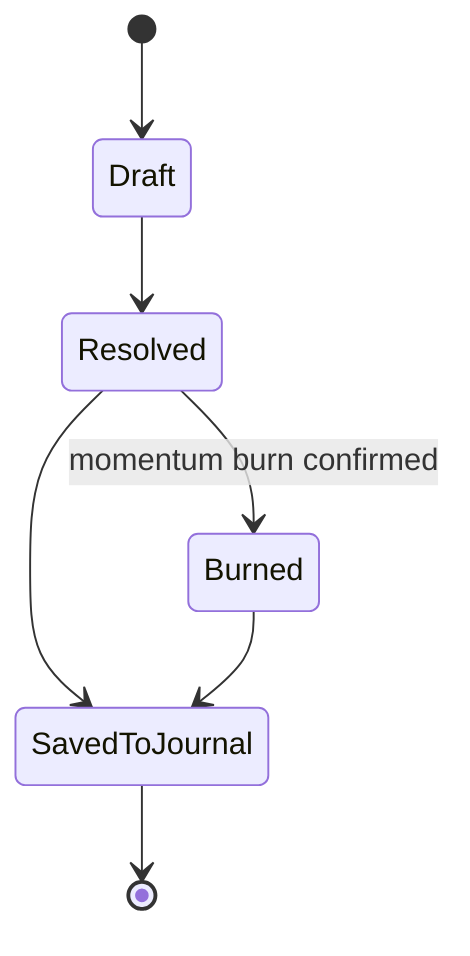

# Data Model / Domain Model Specification

## Ironsworn Digital Companion

*Version 0.1 | Draft | Prepared for the Ironsworn Project*

| Field | Value |
|---|---|
| Document owner | Product Owner / Project Lead |
| Related documents | Business Requirements Document v0.1; MVP Scope Document v0.1; Functional Requirements Document v0.1; Rules Engine Requirements v0.1; future UX Flow / Wireframe Requirements; future Content & Licensing Requirements; future Acceptance Criteria / Test Plan |
| Product scope | Solo-first Ironsworn digital companion MVP |
| MVP baseline | Character sheet, move roller, momentum/progress trackers, oracle tables, vow journal |
| Intended audience | Product owner, developer, UX designer, QA/tester, content/licensing reviewer |
| Status | Draft for review |

---

# Contents

1. Purpose
2. Source Basis
3. Modeling Context
4. Data Model Scope
5. Modeling Principles
6. Priority Definitions
7. Bounded Contexts
8. Domain Overview
9. Entity Relationship Summary
10. Core Domain Entities
11. Value Objects
12. Enumeration Catalog
13. Validation Rules and Invariants
14. Data Lifecycle and State Transitions
15. Persistence and Storage Guidance
16. Content Provenance and Licensing Data
17. Import / Export Model
18. Audit, History, and Journal Linkage
19. Deletion, Archival, and Data Safety
20. Traceability Matrix
21. MVP Acceptance Criteria
22. Open Questions
23. Approval

---

# 1. Purpose

This document defines the logical data model and domain model for the Ironsworn Digital Companion MVP. It describes the main business objects, relationships, value objects, enumerations, validation rules, lifecycle states, and persistence expectations needed to support the MVP features.

The document is intentionally implementation-neutral. It should be usable whether the first build uses local browser storage, a local-first database, or a server-backed account model. Where helpful, it includes implementation guidance for a future relational database or TypeScript domain model, but it is not a final database migration script.

The primary goal is to give developers, UX designers, QA testers, and content reviewers a shared vocabulary for the data that powers the character sheet, move roller, momentum/progress trackers, oracle tables, and vow journal.

---

# 2. Source Basis

This document is based on:

- Ironsworn Rulebook by Shawn Tomkin.
- Ironsworn Digital Companion Business Requirements Document v0.1.
- Ironsworn Digital Companion MVP Scope Document v0.1.
- Ironsworn Digital Companion Functional Requirements Document v0.1.
- Ironsworn Digital Companion Rules Engine Requirements v0.1.
- The agreed MVP baseline: character sheet, move roller, momentum/progress trackers, oracle tables, and vow journal.

Important licensing note: this document models the product's data structures. It does not approve reproduction of official rulebook prose, oracle tables, move text, asset text, artwork, or icons. Every official, SRD-derived, custom, and user-authored content item must carry provenance metadata and remain subject to the future Content & Licensing Requirements document.

---

# 3. Modeling Context

The MVP is solo-first but should not permanently assume only one character, one campaign, one storage mode, or one content source. The data model should support a simple first version while preserving future expansion paths for:

- Multiple characters.
- Multiple campaigns.
- Campaign/session history.
- Co-op or guided play.
- Custom oracle tables.
- Lightweight official or SRD-derived rules metadata.
- Export, backup, and data portability.

The model should preserve fiction-first play. Mechanical results, oracle outputs, and progress changes may be stored, but the app should not automatically author narrative consequences or overwrite the user's interpretation.

---

# 4. Data Model Scope

## 4.1 In Scope for MVP

| Area | In-scope data model support |
|---|---|
| Character Sheet | Character identity, concept, stats, health, spirit, supply, momentum, debilities, bonds, experience, assets references, equipment, notes. |
| Move Roller | Roll records for action rolls, progress rolls, oracle rolls, dice values, inputs, result classification, match status, momentum burn details. |
| Momentum / Progress Trackers | Progress tracks for vows, journeys, combat, bonds, and custom challenges; track rank, ticks, status, and progress events. |
| Oracle Tables | Oracle table metadata, oracle entries, yes/no odds configuration, table provenance, oracle result records. |
| Vow Journal | Vow identity, rank, status, progress track, milestones, outcome notes, linked journal entries. |
| Journal | Session entries, vow entries, roll/oracle saved entries, freeform notes, links to domain objects. |
| Persistence | Stable IDs, timestamps, version fields, archive/delete states, export-friendly structures. |
| Content Provenance | Content source, license metadata, content origin, attribution fields, source type labels. |

## 4.2 Out of Scope for MVP

| Area | Excluded from data model v0.1 |
|---|---|
| Full VTT | Maps, tokens, grids, scene boards, fog of war, coordinates. |
| Real-time Multiplayer | Live presence, invitations, shared editing locks, conflict resolution protocol. |
| AI GM | AI-authored narrative state, prompt chains, memory graph, generated plot automation. |
| Marketplace | Paid content products, entitlements, creator payouts, community publishing workflow. |
| Full Asset Automation | Complete official asset effect engine and automated asset modifiers. |
| Full Rulebook Compendium | Complete copied move text, rulebook prose, artwork, or image assets. |
| Native App Platform Data | App-store-specific purchases, push notification tokens, platform account linkage. |

---

# 5. Modeling Principles

| ID | Principle | Meaning for the data model |
|---|---|---|
| DMP-01 | MVP-simple, future-safe | The first UX can expose one character and one default campaign, but the model should allow multiple records later. |
| DMP-02 | Fiction-first data | Store user-authored interpretation separately from mechanical results. |
| DMP-03 | Generic progress model | Use one ProgressTrack model for vows, journeys, combat, bonds, and custom challenges. |
| DMP-04 | Immutable roll records | Completed roll records should not be silently recalculated after saving. Corrections should create new records or explicit amendments. |
| DMP-05 | Manual override support | Store override flags or notes where the user departs from standard values. |
| DMP-06 | Content provenance by default | Any official, SRD-derived, custom, or user-authored content must identify its source category. |
| DMP-07 | Soft deletion preferred | Archive user-created records by default to reduce accidental campaign data loss. |
| DMP-08 | Exportable by design | Data should serialize cleanly to JSON and support future Markdown export for journals. |
| DMP-09 | Rules engine separation | Rules calculations may consume the domain model, but the saved model should not depend on UI-only state. |

---

# 6. Priority Definitions

| Priority | Meaning |
|---|---|
| Must | Required for MVP release candidate unless explicitly descoped by product decision. |
| Should | Important for usability, safety, or future compatibility, but deferrable if documented. |
| Could | Useful enhancement if time allows. |
| Won't | Explicitly excluded from MVP v0.1. |

---

# 7. Bounded Contexts

| Context | Responsibility | Primary entities |
|---|---|---|
| Identity / Ownership | Represents who owns data when accounts exist, or a local workspace when local-first. | User, Workspace |
| Campaign | Groups characters, sessions, vows, tracks, and journals. | Campaign, Session |
| Character | Stores character sheet state and related notes. | Character, CharacterDebility, AssetReference, Bond |
| Progress | Stores progress-based challenges and their event history. | ProgressTrack, ProgressEvent |
| Vows | Stores sworn quests and vow-specific journal state. | Vow, VowMilestone |
| Rolls | Stores resolved action, progress, and oracle rolls. | RollRecord |
| Oracles | Stores oracle table metadata, table entries, and oracle result records. | OracleTable, OracleEntry |
| Journal | Stores freeform and linked narrative notes. | JournalEntry, JournalLink |
| Content / Licensing | Tracks content source, license, and attribution metadata. | ContentSource, ContentItem |
| Import / Export | Supports backup and portability. | ExportPackage, ImportReport |

---

# 8. Domain Overview

## 8.1 Recommended MVP Architecture Shape

For MVP, create a formal `Campaign` object even if the first interface hides it and creates a default campaign automatically. This avoids making characters, vows, journal entries, and progress tracks float without a durable container. It also supports future co-op and guided play without redesigning the database.

Recommended hierarchy:

```text
Workspace/User
  └── Campaign
        ├── Character(s)
        │     ├── CharacterDebility records
        │     ├── AssetReference records
        │     └── Bond records
        ├── ProgressTrack records
        ├── Vow records
        ├── Session records
        ├── RollRecord records
        ├── OracleResult records
        └── JournalEntry records
```

## 8.2 MVP Exposure vs Domain Capability

| Domain capability | MVP UI exposure |
|---|---|
| Multiple campaigns | Can be hidden behind one default campaign. |
| Multiple characters | Should be supported by the model; MVP may limit or simplify UI. |
| Multiple active sessions | Model supports history; MVP may show one active session at a time. |
| Progress tracks independent of vows | Exposed for journey, combat, bond, and custom tracks. |
| Structured content provenance | Exposed minimally through source labels; fully reviewed later. |
| Custom content | Data model supports it; authoring UI can be deferred. |

---

# 9. Entity Relationship Summary

## 9.1 Mermaid ER Diagram



## 9.2 Cardinality Summary

| Relationship | Cardinality | Notes |
|---|---:|---|
| Workspace to Campaign | 1-to-many | MVP may create one default campaign automatically. |
| Campaign to Character | 1-to-many | MVP may present one active character. |
| Campaign to Session | 1-to-many | Sessions group play history and journal entries. |
| Campaign to ProgressTrack | 1-to-many | Tracks may be vow, journey, combat, bond, or custom. |
| Vow to ProgressTrack | 1-to-1 recommended | Vow progress should not duplicate a separate track. |
| Character to AssetReference | 1-to-many | Asset references are lightweight in MVP. |
| Character to Bond | 1-to-many | Individual bond notes plus optional aggregate bond progress track. |
| ProgressTrack to ProgressEvent | 1-to-many | Records why progress changed. |
| RollRecord to JournalEntry | 1-to-many or many-to-many via JournalLink | A roll can be saved as a journal entry or linked into an existing note. |
| ContentSource to ContentItem | 1-to-many | Required for licensing review and future custom content. |
| OracleTable to OracleEntry | 1-to-many | Entries use inclusive d100 ranges. |

---

# 10. Core Domain Entities

## 10.1 Workspace

### Purpose

Represents the top-level ownership boundary. For local-first MVP, this may be a generated local workspace. For account-based MVP, it may belong to a user account.

### Fields

| Field | Type | Required | Priority | Notes |
|---|---|---:|---|---|
| id | UUID/string | Yes | Must | Stable primary ID. |
| ownerUserId | UUID/string/null | No | Should | Null for local-only mode. |
| name | string | No | Could | Useful if multiple workspaces are ever supported. |
| storageMode | enum StorageMode | Yes | Must | `local`, `account`, `server`, `hybrid`. |
| schemaVersion | string | Yes | Must | Supports migrations/imports. |
| createdAt | datetime | Yes | Must | Creation timestamp. |
| updatedAt | datetime | Yes | Must | Last update timestamp. |

### Validation

- `storageMode` must be a known enum value.
- `schemaVersion` must be present in exports.

---

## 10.2 User

### Purpose

Represents an authenticated user only if accounts are implemented. If MVP is local-only, this entity can be omitted from implementation but retained in the logical model.

### Fields

| Field | Type | Required | Priority | Notes |
|---|---|---:|---|---|
| id | UUID/string | Yes | Must if account-based | Stable user ID. |
| displayName | string | No | Could | User-facing display only. |
| email | string | No | Must if login uses email | Avoid storing if not required. |
| createdAt | datetime | Yes | Must if account-based | Creation timestamp. |
| updatedAt | datetime | Yes | Must if account-based | Last update timestamp. |

### Privacy Note

User campaign notes are private application data. If accounts are introduced, every user-created entity must be scoped to the owning user or workspace.

---

## 10.3 Campaign

### Purpose

Represents a play container for one or more characters, vows, sessions, progress tracks, and journal entries. MVP should create a default campaign even if the UX calls it simply “My Game” or hides the campaign concept.

### Fields

| Field | Type | Required | Priority | Notes |
|---|---|---:|---|---|
| id | UUID/string | Yes | Must | Stable primary ID. |
| workspaceId | UUID/string | Yes | Must | Ownership boundary. |
| title | string | Yes | Must | Default may be “My Ironsworn Campaign”. |
| description | text | No | Should | Freeform campaign premise. |
| playMode | enum PlayMode | Yes | Should | MVP default: `solo`. |
| status | enum RecordStatus | Yes | Should | `active`, `archived`, `deleted`. |
| activeCharacterId | UUID/string/null | No | Should | Optional shortcut for MVP UX. |
| createdAt | datetime | Yes | Must | Creation timestamp. |
| updatedAt | datetime | Yes | Must | Last update timestamp. |
| archivedAt | datetime/null | No | Should | Soft archive support. |

### Validation

- `playMode` defaults to `solo`.
- A campaign may have zero characters during onboarding.
- Archiving a campaign should not hard-delete child records by default.

---

## 10.4 Character

### Purpose

Stores the digital character sheet state needed for MVP solo play.

### Fields

| Field | Type | Required | Priority | Notes |
|---|---|---:|---|---|
| id | UUID/string | Yes | Must | Stable primary ID. |
| campaignId | UUID/string | Yes | Must | Parent campaign. |
| name | string | Yes | Must | User-entered character name. |
| concept | text | No | Should | Short description, archetype, or background. |
| edge | integer | Yes | Must | Core stat. MVP allows 0-5 for flexibility. |
| heart | integer | Yes | Must | Core stat. MVP allows 0-5 for flexibility. |
| iron | integer | Yes | Must | Core stat. MVP allows 0-5 for flexibility. |
| shadow | integer | Yes | Must | Core stat. MVP allows 0-5 for flexibility. |
| wits | integer | Yes | Must | Core stat. MVP allows 0-5 for flexibility. |
| health | integer | Yes | Must | Status track, default 5. |
| spirit | integer | Yes | Must | Status track, default 5. |
| supply | integer | Yes | Must | Status track, default 5. |
| momentum | integer | Yes | Must | Current momentum, default 2. |
| momentumMax | integer | Yes | Must | Default 10; can be derived from debilities. |
| momentumReset | integer | Yes | Must | Default 2; can be derived from debilities. |
| momentumOverride | boolean | Yes | Should | If true, do not auto-enforce derived values. |
| experienceEarned | integer | Yes | Should | Total experience gained. |
| experienceSpent | integer | Yes | Should | Experience spent on advances. |
| equipmentNotes | text | No | Should | Important gear only; not inventory micro-management. |
| characterNotes | text | No | Should | Freeform notes. |
| status | enum RecordStatus | Yes | Should | `active`, `archived`, `deleted`. |
| createdAt | datetime | Yes | Must | Creation timestamp. |
| updatedAt | datetime | Yes | Must | Last update timestamp. |

### Derived Fields

| Derived field | Formula / rule |
|---|---|
| availableExperience | `experienceEarned - experienceSpent` |
| markedDebilityCount | Count of active CharacterDebility records. |
| derivedMomentumMax | `10 - markedDebilityCount` unless overridden. |
| derivedMomentumReset | `2` if no debilities, `1` if one debility, `0` if more than one debility, unless overridden. |

### Validation

- `health`, `spirit`, and `supply` normally range from 0 to 5.
- `momentum` normally ranges from -6 to `momentumMax`.
- Standard starting stats use 3, 2, 2, 1, 1, but the model should allow variants.
- `experienceSpent` cannot exceed `experienceEarned` unless manual override is explicitly supported.

---

## 10.5 CharacterDebility

### Purpose

Represents marked debilities on a character without hard-coding every debility as a separate boolean field.

### Fields

| Field | Type | Required | Priority | Notes |
|---|---|---:|---|---|
| id | UUID/string | Yes | Must | Stable primary ID. |
| characterId | UUID/string | Yes | Must | Parent character. |
| debilityType | enum DebilityType | Yes | Must | `wounded`, `shaken`, etc. |
| debilityCategory | enum DebilityCategory | Yes | Must | `condition`, `bane`, `burden`. |
| isMarked | boolean | Yes | Must | True if active. |
| note | text | No | Should | Narrative description, such as nature of wound/curse. |
| markedAt | datetime/null | No | Should | When marked. |
| clearedAt | datetime/null | No | Should | When cleared if applicable. |
| createdAt | datetime | Yes | Must | Creation timestamp. |
| updatedAt | datetime | Yes | Must | Last update timestamp. |

### Validation

- At most one active record per `characterId + debilityType`.
- Clearing a debility should preserve history where possible.
- Banes and burdens may be mechanically permanent or quest-bound, but the data model allows manual correction.

---

## 10.6 AssetReference

### Purpose

Stores lightweight asset references in MVP without requiring a full official asset-card database or automated effect engine.

### Fields

| Field | Type | Required | Priority | Notes |
|---|---|---:|---|---|
| id | UUID/string | Yes | Must | Stable primary ID. |
| characterId | UUID/string | Yes | Must | Parent character. |
| name | string | Yes | Should | User-entered or approved reference name. |
| assetType | enum AssetType | No | Should | `companion`, `path`, `combat_talent`, `ritual`, `custom`, `unknown`. |
| sourceCategory | enum SourceCategory | Yes | Should | Official/SRD/custom/user-authored marker. |
| contentItemId | UUID/string/null | No | Could | Link to approved content item if present. |
| selectedAbilities | integer[]/json | No | Could | Ability indexes/flags if structured later. |
| companionHealth | integer/null | No | Could | For companion assets if tracked in future. |
| notes | text | No | Should | Freeform details or copied user notes. |
| createdAt | datetime | Yes | Must | Creation timestamp. |
| updatedAt | datetime | Yes | Must | Last update timestamp. |

### MVP Rule

Asset effects are manual in MVP. The move roller may accept adds/modifiers entered by the user, but it should not automatically apply asset modifiers unless a future approved content/data model expands this entity.

---

## 10.7 Bond

### Purpose

Represents an individual bond with a person, community, faction, or other relationship anchor. The aggregate bond progress track is represented separately as a ProgressTrack of type `bond`.

### Fields

| Field | Type | Required | Priority | Notes |
|---|---|---:|---|---|
| id | UUID/string | Yes | Must | Stable primary ID. |
| characterId | UUID/string | Yes | Must | Parent character. |
| campaignId | UUID/string | Yes | Must | Denormalized for easier queries. |
| name | string | Yes | Must | Person/community/faction name. |
| bondTargetType | enum BondTargetType | No | Should | `person`, `community`, `faction`, `place`, `other`. |
| description | text | No | Should | Relationship detail. |
| isBackgroundBond | boolean | Yes | Should | True for starting/background bonds. |
| status | enum RecordStatus | Yes | Should | `active`, `archived`, `deleted`. |
| createdAt | datetime | Yes | Must | Creation timestamp. |
| updatedAt | datetime | Yes | Must | Last update timestamp. |

### Validation

- A character may have zero or more individual bond records.
- Starting/background bonds may be highlighted but should remain editable.

---

## 10.8 ProgressTrack

### Purpose

Generic progress model for vow, journey, combat, bond, and custom tracks.

### Fields

| Field | Type | Required | Priority | Notes |
|---|---|---:|---|---|
| id | UUID/string | Yes | Must | Stable primary ID. |
| campaignId | UUID/string | Yes | Must | Parent campaign. |
| characterId | UUID/string/null | No | Should | Null allowed for shared/future tracks. |
| title | string | Yes | Must | Track title. |
| trackType | enum ProgressTrackType | Yes | Must | `vow`, `journey`, `combat`, `bond`, `custom`. |
| rank | enum ChallengeRank/null | Required except bond | Must | Null allowed for bond tracks. |
| ticks | integer | Yes | Must | 0-40 in normal mode. |
| status | enum ProgressStatus | Yes | Should | `active`, `completed`, `failed`, `forsaken`, `archived`. |
| isShared | boolean | Yes | Could | Future co-op/guided support. |
| notes | text | No | Should | Freeform track context. |
| createdAt | datetime | Yes | Must | Creation timestamp. |
| updatedAt | datetime | Yes | Must | Last update timestamp. |
| archivedAt | datetime/null | No | Should | Soft archive support. |

### Derived Fields

| Derived field | Formula / rule |
|---|---|
| boxesFilled | `floor(ticks / 4)` |
| ticksInCurrentBox | `ticks % 4` |
| progressScore | `floor(ticks / 4)` |
| percentFilled | `ticks / 40` |

### Validation

- Standard tracks contain 10 boxes and 40 total ticks.
- Normal controls clamp `ticks` between 0 and 40.
- `rank` is required for vow, journey, combat, and custom tracks.
- `rank` is optional/not applicable for bond tracks.
- Progress rolls use `progressScore`, not partial ticks.

---

## 10.9 ProgressEvent

### Purpose

Records changes to a progress track, including milestones, manual edits, resets, and progress-roll outcomes.

### Fields

| Field | Type | Required | Priority | Notes |
|---|---|---:|---|---|
| id | UUID/string | Yes | Must | Stable primary ID. |
| progressTrackId | UUID/string | Yes | Must | Parent track. |
| campaignId | UUID/string | Yes | Must | Denormalized for easier queries/export. |
| eventType | enum ProgressEventType | Yes | Must | `mark_progress`, `remove_progress`, `milestone`, `reset`, `status_change`, `manual_correction`, `progress_roll`. |
| tickDelta | integer | No | Should | Positive or negative change. |
| ticksBefore | integer | No | Should | Previous tick count. |
| ticksAfter | integer | No | Should | New tick count. |
| note | text | No | Should | Narrative reason or user comment. |
| rollRecordId | UUID/string/null | No | Should | Link if event came from a progress roll or move result. |
| journalEntryId | UUID/string/null | No | Should | Link to expanded note. |
| createdAt | datetime | Yes | Must | Event timestamp. |

### Validation

- `ticksAfter` should equal `ticksBefore + tickDelta` when both are present.
- Progress events should not be hard-deleted unless the parent record is purged through an explicit data deletion workflow.

---

## 10.10 Vow

### Purpose

Represents an iron vow or quest with rank, status, progress, milestones, and outcome notes.

### Fields

| Field | Type | Required | Priority | Notes |
|---|---|---:|---|---|
| id | UUID/string | Yes | Must | Stable primary ID. |
| campaignId | UUID/string | Yes | Must | Parent campaign. |
| characterId | UUID/string/null | No | Should | Character who swore the vow; nullable for future shared vows. |
| progressTrackId | UUID/string | Yes | Must | Linked track of type `vow`. |
| title | string | Yes | Must | Vow title. |
| description | text | No | Must | Vow details. |
| rank | enum ChallengeRank | Yes | Must | Mirrors linked progress track rank. |
| vowType | enum VowType | No | Should | `background`, `inciting_incident`, `personal`, `shared`, `other`. |
| status | enum VowStatus | Yes | Must | `active`, `fulfilled`, `forsaken`, `archived`. |
| swornAt | datetime/null | No | Should | When vow was created/sworn. |
| resolvedAt | datetime/null | No | Should | When fulfilled/forsaken. |
| outcomeNotes | text | No | Should | Fulfillment/forsaking consequences. |
| createdAt | datetime | Yes | Must | Creation timestamp. |
| updatedAt | datetime | Yes | Must | Last update timestamp. |

### Validation

- Each Vow must have one linked ProgressTrack of type `vow`.
- `rank` should match the linked ProgressTrack rank.
- `status = fulfilled` or `forsaken` should normally require an outcome note or confirmation prompt.
- Background and inciting incident flags should be optional labels, not separate entity types.

---

## 10.11 VowMilestone

### Purpose

Represents a narrative milestone for a vow. This may also create a ProgressEvent and/or JournalEntry.

### Fields

| Field | Type | Required | Priority | Notes |
|---|---|---:|---|---|
| id | UUID/string | Yes | Must | Stable primary ID. |
| vowId | UUID/string | Yes | Must | Parent vow. |
| progressEventId | UUID/string/null | No | Should | Link to progress change. |
| journalEntryId | UUID/string/null | No | Should | Link to narrative note. |
| title | string | No | Should | Optional short label. |
| note | text | Yes | Must | Milestone detail. |
| createdAt | datetime | Yes | Must | Milestone timestamp. |

### Validation

- A milestone may exist without progress change, but the UI should make that clear.
- If a milestone marks progress, it should link to a ProgressEvent.

---

## 10.12 Session

### Purpose

Groups play activity, roll records, oracle results, progress events, and journal entries in a dated session.

### Fields

| Field | Type | Required | Priority | Notes |
|---|---|---:|---|---|
| id | UUID/string | Yes | Must | Stable primary ID. |
| campaignId | UUID/string | Yes | Must | Parent campaign. |
| activeCharacterId | UUID/string/null | No | Should | Main character for the session. |
| title | string | No | Should | Default generated from date/time. |
| startedAt | datetime | Yes | Must | Session start. |
| endedAt | datetime/null | No | Should | Session end. |
| summary | text | No | Could | User-authored recap. |
| status | enum SessionStatus | Yes | Should | `active`, `closed`, `archived`. |
| createdAt | datetime | Yes | Must | Creation timestamp. |
| updatedAt | datetime | Yes | Must | Last update timestamp. |

### Validation

- Only one active session per campaign is recommended for MVP, but the model can support multiple historical sessions.
- Closing a session should not prevent later journal edits unless product decides otherwise.

---

## 10.13 RollRecord

### Purpose

Stores the full mechanical record of an action roll, progress roll, or oracle roll.

### Fields

| Field | Type | Required | Priority | Notes |
|---|---|---:|---|---|
| id | UUID/string | Yes | Must | Stable primary ID. |
| campaignId | UUID/string | Yes | Must | Parent campaign. |
| sessionId | UUID/string/null | No | Should | Current session if available. |
| characterId | UUID/string/null | No | Should | Character making the roll. |
| rollType | enum RollType | Yes | Must | `action`, `progress`, `oracle`, `d100`. |
| rollSource | enum RollSource | Yes | Must | `generated`, `manual`. |
| label | string | No | Should | Move name, oracle name, or custom label. |
| moveKey | string/null | No | Could | Link to approved MoveDefinition key. |
| progressTrackId | UUID/string/null | No | Should | Required for track-based progress rolls. |
| oracleTableId | UUID/string/null | No | Should | Present for table oracle rolls. |
| input | json | Yes | Must | Stat, adds, momentum, progress score, odds, etc. |
| dice | json | Yes | Must | Action die, challenge dice, oracle dice/result as applicable. |
| initialResult | json | Yes | Must | Strong/weak/miss, yes/no, table result, match status. |
| finalResult | json | No | Must | Present if momentum burn changes an action roll. |
| momentumBurn | json/null | No | Must | Burn eligibility, chosen flag, canceled dice, reset value. |
| isMatch | boolean | Yes | Must | Challenge/oracle match where applicable. |
| interpretationNote | text | No | Should | User-authored interpretation. |
| savedToJournal | boolean | Yes | Should | True if linked to journal. |
| createdAt | datetime | Yes | Must | Roll timestamp. |

### Suggested `input` JSON Shapes

Action roll:

```json
{
  "statKey": "wits",
  "statValue": 2,
  "adds": 1,
  "momentumAtRoll": 4,
  "negativeMomentumApplied": false,
  "actionScoreCap": 10
}
```

Progress roll:

```json
{
  "progressTrackId": "track-id",
  "progressScore": 6,
  "ticksAtRoll": 27,
  "momentumIgnored": true
}
```

Oracle roll:

```json
{
  "oracleMode": "yes_no",
  "odds": "likely"
}
```

### Validation

- Roll records should be append-only after completion.
- If a roll is corrected, create a new record or explicit amendment rather than mutating historical dice silently.
- `rollType = progress` should not include an action die.
- `rollType = action` should include action die and two challenge dice.
- `rollType = oracle` should include d100 result and dice-level match data if available.

---

## 10.14 OracleTable

### Purpose

Represents an approved oracle table or custom table. It stores metadata, not necessarily full official prose unless approved.

### Fields

| Field | Type | Required | Priority | Notes |
|---|---|---:|---|---|
| id | UUID/string | Yes | Must | Stable primary ID. |
| contentItemId | UUID/string/null | No | Must if official/SRD | Link to provenance record. |
| key | string | Yes | Must | Stable machine key, e.g. `ask_yes_no`. |
| title | string | Yes | Must | User-facing table name. |
| description | text | No | Should | Original summary or approved text. |
| tableType | enum OracleTableType | Yes | Must | `yes_no`, `d100_table`, `prompt_table`, `custom`. |
| sourceCategory | enum SourceCategory | Yes | Must | Official/SRD/custom/user-authored. |
| isEnabled | boolean | Yes | Must | Allows disabling unapproved content. |
| createdAt | datetime | Yes | Must | Creation timestamp. |
| updatedAt | datetime | Yes | Must | Last update timestamp. |

### Validation

- Official/SRD-derived tables require a ContentItem and ContentSource before public release.
- Disabled oracle tables should not appear as rollable in normal UI.

---

## 10.15 OracleEntry

### Purpose

Represents an inclusive result range within an oracle table.

### Fields

| Field | Type | Required | Priority | Notes |
|---|---|---:|---|---|
| id | UUID/string | Yes | Must | Stable primary ID. |
| oracleTableId | UUID/string | Yes | Must | Parent table. |
| rangeStart | integer | Yes | Must | Inclusive start, normally 1-100. |
| rangeEnd | integer | Yes | Must | Inclusive end, normally 1-100. |
| resultText | text | Yes | Must | Approved result text or user-authored custom result. |
| resultKey | string/null | No | Could | Stable key for localization/automation. |
| sourceCategory | enum SourceCategory | Yes | Must | Source marker. |
| createdAt | datetime | Yes | Must | Creation timestamp. |
| updatedAt | datetime | Yes | Must | Last update timestamp. |

### Validation

- `rangeStart <= rangeEnd`.
- Ranges must not overlap within a table.
- Full d100 tables should cover 1-100 unless explicitly configured as partial.
- Official copied text must not be entered until licensing approval confirms permitted use.

---

## 10.16 JournalEntry

### Purpose

Stores freeform notes and saved mechanical/oracle results. Journal entries should separate user-authored interpretation from mechanical data.

### Fields

| Field | Type | Required | Priority | Notes |
|---|---|---:|---|---|
| id | UUID/string | Yes | Must | Stable primary ID. |
| campaignId | UUID/string | Yes | Must | Parent campaign. |
| sessionId | UUID/string/null | No | Should | Related session. |
| characterId | UUID/string/null | No | Should | Related character. |
| entryType | enum JournalEntryType | Yes | Must | `freeform`, `roll_result`, `oracle_result`, `vow_note`, `milestone`, `outcome`, `progress_note`, `session_summary`. |
| title | string | No | Should | Optional heading. |
| body | text | Yes | Must | User-authored note or saved result text. |
| userInterpretation | text/null | No | Should | Optional user interpretation separate from raw result. |
| rollRecordId | UUID/string/null | No | Should | Link to roll if saved. |
| vowId | UUID/string/null | No | Should | Link to vow if relevant. |
| progressTrackId | UUID/string/null | No | Should | Link to progress track if relevant. |
| oracleTableId | UUID/string/null | No | Should | Link to oracle table if relevant. |
| tags | string[]/json | No | Could | Lightweight organization. |
| sourceCategory | enum SourceCategory | Yes | Must | Usually user-authored or generated mechanical result. |
| createdAt | datetime | Yes | Must | Creation timestamp. |
| updatedAt | datetime | Yes | Must | Last update timestamp. |
| archivedAt | datetime/null | No | Should | Soft archive support. |

### Validation

- `body` should not be empty unless the entry is a pure linked placeholder, which should be avoided in MVP.
- Saved roll/oracle entries should include a link to the underlying RollRecord where available.
- AI-authored content is out of scope for MVP and should not require fields in v0.1.

---

## 10.17 JournalLink

### Purpose

Optional join entity for many-to-many journal linkage if simple nullable foreign keys are insufficient.

### Fields

| Field | Type | Required | Priority | Notes |
|---|---|---:|---|---|
| id | UUID/string | Yes | Could | Stable primary ID. |
| journalEntryId | UUID/string | Yes | Could | Linked journal entry. |
| targetType | enum LinkTargetType | Yes | Could | `character`, `vow`, `progress_track`, `roll_record`, `oracle_table`, `bond`, `asset`, `session`. |
| targetId | UUID/string | Yes | Could | ID of linked object. |
| linkRole | string | No | Could | `context`, `source`, `outcome`, `reference`. |
| createdAt | datetime | Yes | Could | Creation timestamp. |

### MVP Guidance

Nullable direct links on JournalEntry are enough for MVP unless UX requires one note to link to many vows/tracks/rolls. Keep JournalLink as a future-safe option.

---

## 10.18 ContentSource

### Purpose

Stores source and licensing metadata for official, SRD-derived, original, custom, and imported content.

### Fields

| Field | Type | Required | Priority | Notes |
|---|---|---:|---|---|
| id | UUID/string | Yes | Must | Stable primary ID. |
| workspaceId | UUID/string/null | No | Should | Null for bundled app-level sources. |
| title | string | Yes | Must | Source title. |
| creator | string | No | Must if official | Creator/author attribution. |
| sourceUrl | string/null | No | Should | Source or reference URL if applicable. |
| licenseName | string/null | No | Must if official/SRD | License label. |
| licenseUrl | string/null | No | Should | License URL if applicable. |
| sourceCategory | enum SourceCategory | Yes | Must | Official/SRD/original/custom/user. |
| attributionText | text | No | Must if official/SRD | Public attribution text if required. |
| commercialUseAllowed | boolean/null | No | Should | Null until reviewed. |
| shareAlikeRequired | boolean/null | No | Should | Null until reviewed. |
| reviewStatus | enum ContentReviewStatus | Yes | Must | `unreviewed`, `approved`, `restricted`, `rejected`. |
| createdAt | datetime | Yes | Must | Creation timestamp. |
| updatedAt | datetime | Yes | Must | Last update timestamp. |

### Validation

- Public release requires approved ContentSource records for all bundled official/SRD-derived content.
- `reviewStatus = approved` should be required for official content shown in public release builds.

---

## 10.19 ContentItem

### Purpose

Represents a specific content object derived from a source, such as a move metadata entry, oracle table, oracle entry, asset reference, label, or help text.

### Fields

| Field | Type | Required | Priority | Notes |
|---|---|---:|---|---|
| id | UUID/string | Yes | Must | Stable primary ID. |
| contentSourceId | UUID/string | Yes | Must | Parent source. |
| contentType | enum ContentType | Yes | Must | `move`, `oracle_table`, `oracle_entry`, `asset`, `label`, `rules_summary`, `help_text`, `other`. |
| key | string | Yes | Must | Stable machine key. |
| title | string | Yes | Must | Human-readable label. |
| body | text/json/null | No | Should | Approved content body or structured data. |
| sourceCategory | enum SourceCategory | Yes | Must | Official/SRD/custom/user/original. |
| reviewStatus | enum ContentReviewStatus | Yes | Must | Mirrors or overrides source review. |
| createdAt | datetime | Yes | Must | Creation timestamp. |
| updatedAt | datetime | Yes | Must | Last update timestamp. |

### Validation

- `contentType` must match the consuming domain object.
- Official content items must be traceable to a ContentSource.
- Full copied rulebook text should be excluded from MVP unless approved.

---

## 10.20 ExportPackage

### Purpose

Represents a generated export of user-created data for backup or portability.

### Fields

| Field | Type | Required | Priority | Notes |
|---|---|---:|---|---|
| id | UUID/string | Yes | Could | Stable primary ID if export history is stored. |
| workspaceId | UUID/string | Yes | Could | Exported workspace. |
| format | enum ExportFormat | Yes | Could | `json`, `markdown`, `zip`. |
| schemaVersion | string | Yes | Should | Required for import compatibility. |
| generatedAt | datetime | Yes | Should | Export timestamp. |
| includedEntityTypes | string[] | Yes | Should | Summary of exported content. |
| contentPolicy | text/json | No | Should | Notes about official content inclusion/exclusion. |

### MVP Guidance

JSON export is the preferred first export format because it preserves structure. Markdown export is useful for journals but should not be the only backup format.

---

## 10.21 ImportReport

### Purpose

Represents the result of importing or restoring an export package.

### Fields

| Field | Type | Required | Priority | Notes |
|---|---|---:|---|---|
| id | UUID/string | Yes | Could | Stable primary ID if import history is stored. |
| workspaceId | UUID/string | Yes | Could | Target workspace. |
| sourceSchemaVersion | string | Yes | Should | Imported schema version. |
| status | enum ImportStatus | Yes | Should | `success`, `partial_success`, `failed`. |
| warnings | string[]/json | No | Should | Non-fatal issues. |
| errors | string[]/json | No | Should | Fatal issues. |
| importedAt | datetime | Yes | Should | Import timestamp. |

---

# 11. Value Objects

## 11.1 Stats

Although implemented as columns on Character for simplicity, stats can be treated as a value object.

| Field | Type | Range | Notes |
|---|---|---:|---|
| edge | integer | 0-5 MVP flexible | Standard values usually 1-3. |
| heart | integer | 0-5 MVP flexible | Standard values usually 1-3. |
| iron | integer | 0-5 MVP flexible | Standard values usually 1-3. |
| shadow | integer | 0-5 MVP flexible | Standard values usually 1-3. |
| wits | integer | 0-5 MVP flexible | Standard values usually 1-3. |

## 11.2 StatusTracks

| Field | Type | Range | Default |
|---|---|---:|---:|
| health | integer | 0-5 | 5 |
| spirit | integer | 0-5 | 5 |
| supply | integer | 0-5 | 5 |

## 11.3 MomentumState

| Field | Type | Range | Default |
|---|---|---:|---:|
| current | integer | -6 to max | 2 |
| max | integer | 0-10 normally | 10 |
| reset | integer | 0-2 normally | 2 |
| override | boolean | true/false | false |

## 11.4 DiceValues

| Roll type | Required dice fields |
|---|---|
| Action roll | `actionDie`, `challengeDie1`, `challengeDie2` |
| Progress roll | `challengeDie1`, `challengeDie2` |
| Oracle roll | `oracleTensDie`, `oracleOnesDie`, `d100` or `d100` only if dice-level values unavailable |

## 11.5 RollOutcome

| Field | Type | Notes |
|---|---|---|
| classification | enum ResultClassification | `strong_hit`, `weak_hit`, `miss`, `yes`, `no`, `table_result`, `none`. |
| isMatch | boolean | Based on challenge/oracle dice where applicable. |
| beatenChallengeDice | integer | 0, 1, or 2 for action/progress rolls. |
| resultText | text/null | Oracle result or app-original prompt. |
| explanation | text/json | Optional transparent calculation summary. |

## 11.6 SourceProvenance

| Field | Type | Notes |
|---|---|---|
| sourceCategory | enum SourceCategory | Required marker. |
| contentSourceId | UUID/string/null | Required for official/SRD-derived content. |
| contentItemId | UUID/string/null | Optional specific content link. |
| reviewStatus | enum ContentReviewStatus | Required for bundled content. |

---

# 12. Enumeration Catalog

## 12.1 StorageMode

| Value | Meaning |
|---|---|
| local | Data stored locally on device/browser. |
| account | Data tied to authenticated account. |
| server | Data stored server-side. |
| hybrid | Local-first with sync/server backup. |

## 12.2 PlayMode

| Value | Meaning |
|---|---|
| solo | One player, no GM. MVP default. |
| co_op | Multiple players, no GM. Future support. |
| guided | Players plus GM. Future support. |

## 12.3 RecordStatus

| Value | Meaning |
|---|---|
| active | Normal visible record. |
| archived | Hidden from active views but recoverable. |
| deleted | Soft-deleted or pending purge. |

## 12.4 ChallengeRank

| Value | Notes |
|---|---|
| troublesome | Mark-progress helper: 12 ticks. |
| dangerous | Mark-progress helper: 8 ticks. |
| formidable | Mark-progress helper: 4 ticks. |
| extreme | Mark-progress helper: 2 ticks. |
| epic | Mark-progress helper: 1 tick. |

## 12.5 ProgressTrackType

| Value | Meaning |
|---|---|
| vow | Quest/vow progress. |
| journey | Travel progress. |
| combat | Fight progress. |
| bond | Bonds progress. |
| custom | User-created challenge. |

## 12.6 ProgressStatus

| Value | Meaning |
|---|---|
| active | Track is ongoing. |
| completed | Track resolved successfully. |
| failed | Track failed or lost. |
| forsaken | Vow-specific failure/abandonment. |
| archived | Track hidden from active list. |

## 12.7 ProgressEventType

| Value | Meaning |
|---|---|
| mark_progress | Added progress. |
| remove_progress | Removed progress. |
| milestone | Narrative milestone. |
| reset | Cleared/reset track. |
| status_change | Changed active/completed/forsaken/etc. |
| manual_correction | User corrected state. |
| progress_roll | Rolled to resolve a track. |

## 12.8 VowStatus

| Value | Meaning |
|---|---|
| active | Ongoing vow. |
| fulfilled | Successfully resolved vow. |
| forsaken | Abandoned/failed vow. |
| archived | Hidden from active play. |

## 12.9 VowType

| Value | Meaning |
|---|---|
| background | Long-term starting vow. |
| inciting_incident | Starting/early immediate vow. |
| personal | Character-specific vow. |
| shared | Future co-op/guided shared vow. |
| other | User-defined/uncategorized. |

## 12.10 DebilityCategory

| Value | Meaning |
|---|---|
| condition | Temporary/clearable conditions. |
| bane | Permanent or long-term harm/corruption. |
| burden | Quest-bound burden. |

## 12.11 DebilityType

| Value | Category |
|---|---|
| wounded | condition |
| shaken | condition |
| unprepared | condition |
| encumbered | condition |
| maimed | bane |
| corrupted | bane |
| cursed | burden |
| tormented | burden |

## 12.12 AssetType

| Value | Meaning |
|---|---|
| companion | Companion asset reference. |
| path | Path asset reference. |
| combat_talent | Combat talent reference. |
| ritual | Ritual reference. |
| custom | User-created or imported asset. |
| unknown | Asset type not specified. |

## 12.13 BondTargetType

| Value | Meaning |
|---|---|
| person | Individual NPC or ally. |
| community | Settlement/community. |
| faction | Group or organization. |
| place | Significant location. |
| other | Other relationship target. |

## 12.14 SessionStatus

| Value | Meaning |
|---|---|
| active | Session is in progress. |
| closed | Session is ended but editable. |
| archived | Hidden from active history. |

## 12.15 RollType

| Value | Meaning |
|---|---|
| action | Action roll with action die and challenge dice. |
| progress | Progress roll with challenge dice only. |
| oracle | Oracle roll linked to yes/no or table. |
| d100 | Standalone d100 roll. |

## 12.16 RollSource

| Value | Meaning |
|---|---|
| generated | App generated dice. |
| manual | User entered physical dice values. |

## 12.17 ResultClassification

| Value | Meaning |
|---|---|
| strong_hit | Beats both challenge dice. |
| weak_hit | Beats one challenge die. |
| miss | Beats no challenge dice. |
| yes | Yes/no oracle result. |
| no | Yes/no oracle result. |
| table_result | Oracle table lookup result. |
| none | No classification needed. |

## 12.18 OracleTableType

| Value | Meaning |
|---|---|
| yes_no | Ask yes/no odds table/configuration. |
| d100_table | Standard d100 range table. |
| prompt_table | Prompt-only table. |
| custom | User-created custom oracle. |

## 12.19 JournalEntryType

| Value | Meaning |
|---|---|
| freeform | User note. |
| roll_result | Saved roll. |
| oracle_result | Saved oracle output. |
| vow_note | Vow-related note. |
| milestone | Vow/progress milestone. |
| outcome | Vow or track resolution note. |
| progress_note | Track note. |
| session_summary | Session recap. |

## 12.20 SourceCategory

| Value | Meaning |
|---|---|
| official_rulebook | Official rulebook-derived content. |
| srd_derived | SRD-derived content. |
| original_app | Original app wording/data. |
| user_authored | User-created note/content. |
| custom_imported | Imported custom content. |
| unknown | Unclassified; should not ship publicly if bundled. |

## 12.21 ContentReviewStatus

| Value | Meaning |
|---|---|
| unreviewed | Not reviewed yet. |
| approved | Approved for intended use. |
| restricted | May be used only under limits. |
| rejected | Must not be included. |

## 12.22 ContentType

| Value | Meaning |
|---|---|
| move | Move metadata or approved move text. |
| oracle_table | Oracle table metadata. |
| oracle_entry | Oracle table result entry. |
| asset | Asset metadata/reference. |
| label | UI/content label. |
| rules_summary | Original or approved rules summary. |
| help_text | Help/onboarding text. |
| other | Other content item. |

## 12.23 LinkTargetType

| Value | Meaning |
|---|---|
| character | Character record. |
| vow | Vow record. |
| progress_track | ProgressTrack record. |
| roll_record | RollRecord record. |
| oracle_table | OracleTable record. |
| bond | Bond record. |
| asset | AssetReference record. |
| session | Session record. |

## 12.24 ExportFormat

| Value | Meaning |
|---|---|
| json | Structured backup/export. |
| markdown | Human-readable journal/character export. |
| zip | Bundle containing multiple files/assets. |

## 12.25 ImportStatus

| Value | Meaning |
|---|---|
| success | Import completed. |
| partial_success | Some records imported with warnings. |
| failed | Import failed. |

---

# 13. Validation Rules and Invariants

## 13.1 Character and Status Validation

| ID | Rule | Priority |
|---|---|---|
| DM-VAL-01 | Character stats should allow 0-5 in MVP for flexibility, with standard starting helper for 3,2,2,1,1. | Should |
| DM-VAL-02 | Health, spirit, and supply normally range from 0 to 5. | Must |
| DM-VAL-03 | Current momentum normally ranges from -6 to current momentum max. | Must |
| DM-VAL-04 | Momentum max normally starts at 10 and may be reduced by marked debilities. | Should |
| DM-VAL-05 | Momentum reset normally starts at 2 and may be reduced by marked debility count. | Should |
| DM-VAL-06 | Manual override must be available or at least planned for house rules and correction. | Should |

## 13.2 Progress Track Validation

| ID | Rule | Priority |
|---|---|---|
| DM-VAL-07 | Standard progress tracks have 10 boxes and 40 total ticks. | Must |
| DM-VAL-08 | `ticks` must remain between 0 and 40 through normal controls. | Must |
| DM-VAL-09 | Progress score is `floor(ticks / 4)`. | Must |
| DM-VAL-10 | Partial ticks do not count toward progress score. | Must |
| DM-VAL-11 | Rank is required for vow, journey, combat, and custom tracks. | Must |
| DM-VAL-12 | Rank is optional/not applicable for bond tracks. | Should |

## 13.3 Roll Record Validation

| ID | Rule | Priority |
|---|---|---|
| DM-VAL-13 | Action roll records must include one action die and two challenge dice. | Must |
| DM-VAL-14 | Progress roll records must include two challenge dice and no action die. | Must |
| DM-VAL-15 | Oracle roll records must include d100 result and dice-level match data if available. | Must |
| DM-VAL-16 | Roll records should be immutable after completion. | Should |
| DM-VAL-17 | Momentum burn must preserve both initial and final results. | Must |

## 13.4 Oracle Validation

| ID | Rule | Priority |
|---|---|---|
| DM-VAL-18 | Oracle entry ranges must be inclusive. | Must |
| DM-VAL-19 | Oracle entry ranges within one table must not overlap. | Must |
| DM-VAL-20 | Full d100 oracle tables should cover 1-100 unless configured as partial. | Should |
| DM-VAL-21 | Official/SRD-derived oracle content must have provenance metadata. | Must |

## 13.5 Journal and Link Validation

| ID | Rule | Priority |
|---|---|---|
| DM-VAL-22 | Journal entries must belong to a campaign. | Must |
| DM-VAL-23 | Saved roll/oracle entries should link to the underlying RollRecord. | Should |
| DM-VAL-24 | User interpretation should be stored separately from mechanical result where practical. | Should |

---

# 14. Data Lifecycle and State Transitions

## 14.1 Vow Lifecycle



| Transition | Data effect |
|---|---|
| Create vow | Create Vow and linked ProgressTrack of type `vow`. |
| Mark milestone | Create VowMilestone; optionally create ProgressEvent and JournalEntry. |
| Fulfill vow | Set status `fulfilled`, set `resolvedAt`, store outcome notes. |
| Forsake vow | Set status `forsaken`, set `resolvedAt`, store outcome notes. |
| Archive vow | Hide from active list without deleting progress/journal history. |

## 14.2 Progress Track Lifecycle



| Transition | Data effect |
|---|---|
| Create track | `ticks = 0`, status `active`. |
| Mark progress | Update ticks; create ProgressEvent. |
| Remove progress | Update ticks; create ProgressEvent. |
| Progress roll | Create RollRecord; optionally create ProgressEvent. |
| Complete/fail/forsake | Update status; add optional JournalEntry. |
| Archive | Hide from active list, preserve history. |

## 14.3 RollRecord Lifecycle



| Transition | Data effect |
|---|---|
| Draft roll | User selects inputs; no permanent record required yet. |
| Resolve roll | Dice generated/manual; RollRecord created. |
| Burn momentum | Store burn details and final result; reset character momentum after confirmation. |
| Save to journal | Create JournalEntry or JournalLink. |

---

# 15. Persistence and Storage Guidance

## 15.1 Recommended MVP Storage Strategy

The model supports three approaches:

| Option | Summary | Pros | Risks |
|---|---|---|---|
| Local-first | Store all user data in browser/device storage. | Fast, simple, no accounts. | Data loss if browser storage cleared; harder multi-device use. |
| Account/server-backed | Store data by authenticated user. | Safer persistence and multi-device support. | More infrastructure/auth complexity. |
| Hybrid/local-first with export | Local storage plus JSON export/backup. | Good MVP balance. | User must manage backups unless sync exists. |

Recommended v0.1 decision: use the domain model as if account/server support may exist later, but allow the first implementation to create a local Workspace and default Campaign without requiring login.

## 15.2 ID Strategy

| Requirement | Priority |
|---|---|
| Use stable IDs for all user-created records. | Must |
| IDs should survive export/import. | Should |
| Imported records should preserve original IDs when safe, or maintain an ID mapping in ImportReport. | Should |

## 15.3 Timestamp Strategy

| Field | Required for |
|---|---|
| createdAt | All main entities. |
| updatedAt | Mutable entities. |
| archivedAt | Soft-archivable entities. |
| resolvedAt | Vows and resolved tracks. |
| startedAt / endedAt | Sessions. |

## 15.4 Schema Versioning

Every export should include:

```json
{
  "app": "Ironsworn Digital Companion",
  "schemaVersion": "0.1",
  "exportedAt": "ISO-8601 datetime",
  "workspace": {}
}
```

---

# 16. Content Provenance and Licensing Data

## 16.1 Provenance Requirement

Every content-bearing object should identify one of:

- `official_rulebook`
- `srd_derived`
- `original_app`
- `user_authored`
- `custom_imported`
- `unknown`

Public release should block or flag `unknown`, `unreviewed`, and `rejected` bundled content.

## 16.2 Content Inventory Objects

The following objects must be covered by content inventory before public release:

| Object type | Why it matters |
|---|---|
| OracleTable | May contain official table names or structure. |
| OracleEntry | May contain official oracle result text. |
| ContentItem of type move | May contain official move names, categories, or summaries. |
| AssetReference linked to ContentItem | May contain official asset names/text. |
| Help/onboarding text | May paraphrase or copy rulebook concepts. |
| Labels and enums | Some official terminology may require attribution/review. |

## 16.3 User-Created Content

User-created journals, notes, custom oracles, and custom asset notes should be tagged `user_authored` unless the user explicitly imports official/SRD content. The app should not claim ownership or official provenance for user-authored material.

---

# 17. Import / Export Model

## 17.1 JSON Export Structure

Suggested export root:

```json
{
  "schemaVersion": "0.1",
  "exportedAt": "2026-07-08T00:00:00Z",
  "workspace": {
    "id": "workspace-id",
    "campaigns": [],
    "contentSources": []
  }
}
```

## 17.2 Export Inclusion Rules

| Data | Include in MVP JSON export? | Notes |
|---|---:|---|
| User-created characters | Yes | Core backup need. |
| Vows and progress tracks | Yes | Core campaign state. |
| Journal entries | Yes | High emotional value. |
| Roll records | Should | Useful session history. |
| Oracle tables | Only if custom/user-authored or approved | Avoid unauthorized redistribution. |
| Official content text | Only if licensing review approves | Otherwise export references/keys only. |
| Content source metadata | Yes | Needed for provenance. |

## 17.3 Markdown Export Guidance

Markdown export should be treated as presentation output, not the canonical backup. It may include:

- Character summary.
- Active vows and progress.
- Journal entries by session/date.
- Saved roll/oracle summaries.

---

# 18. Audit, History, and Journal Linkage

## 18.1 What Should Be Historical

| Data | History approach |
|---|---|
| Roll results | Immutable RollRecord. |
| Progress changes | ProgressEvent. |
| Vow milestones | VowMilestone plus optional JournalEntry. |
| Journal edits | MVP may update in place; future version may add revision history. |
| Character stat changes | MVP may update in place; major changes may be captured manually in journal. |

## 18.2 Save-to-Journal Pattern

When the user saves a roll or oracle output to the journal:

1. Preserve the original RollRecord.
2. Create a JournalEntry with `entryType = roll_result` or `oracle_result`.
3. Link the JournalEntry to the RollRecord.
4. Store user-authored interpretation in `userInterpretation` or body text.
5. Do not generate narrative consequences automatically.

---

# 19. Deletion, Archival, and Data Safety

## 19.1 Default Policy

| Action | MVP behavior |
|---|---|
| Delete character | Confirm first; prefer archive. |
| Delete campaign | Confirm strongly; prefer archive. |
| Delete vow/track | Confirm first; prefer archive if journal links exist. |
| Delete journal entry | Confirm first; deletion may be hard delete if user explicitly chooses. |
| Delete roll record | Prefer not to delete if journal-linked; allow hiding/archiving if needed. |
| Purge all local data | Require explicit destructive confirmation. |

## 19.2 Data Loss Prevention

- Unsaved changes should be visibly saved or auto-saved.
- Local-only storage must communicate its limitations.
- Export/backup should be considered before public playtest.
- Import should validate schema version and produce an ImportReport.

---

# 20. Traceability Matrix

| Data model area | Supports MVP / FRD / RER area | Notes |
|---|---|---|
| Workspace/User | Users, permissions, storage decision | Allows local-first or account-based implementation. |
| Campaign | Persistence, future compatibility | Prevents model from being permanently single-character only. |
| Character | Character Sheet | Supports stats, status tracks, momentum, notes, and experience. |
| CharacterDebility | Character Sheet; Momentum Rules | Supports derived max/reset momentum and debility tracking. |
| AssetReference | Character Sheet | Lightweight asset handling without full automation. |
| Bond | Character Sheet; Progress Trackers | Tracks individual bond notes and background bonds. |
| ProgressTrack | Momentum/Progress Trackers; Vow Journal | Generic progress for vows, journeys, combat, bonds, custom challenges. |
| ProgressEvent | Journal; Trackers; QA | Creates auditable progress history. |
| Vow | Vow Journal | Central quest object with rank, status, progress, and outcome. |
| VowMilestone | Vow Journal | Records narrative milestones and links to progress/journal. |
| Session | Journal; Roll History | Groups play activity. |
| RollRecord | Move Roller; Rules Engine | Stores dice, inputs, outcomes, matches, and momentum burn details. |
| OracleTable / OracleEntry | Oracle Tables | Supports approved tables and custom future tables. |
| JournalEntry | Journal; Save-to-journal | Stores user-authored notes and saved mechanical outputs. |
| ContentSource / ContentItem | Licensing; Provenance | Enables source inventory and review gates. |
| ExportPackage / ImportReport | Persistence; Portability | Supports backup and future import/export. |

---

# 21. MVP Acceptance Criteria

The Data Model / Domain Model Specification is satisfied for MVP release candidate when:

1. The model supports creating, saving, editing, archiving, and restoring at least one character inside a default campaign.
2. Character state includes stats, health, spirit, supply, momentum, max momentum, reset momentum, debilities, bonds, experience, asset references, equipment notes, and character notes.
3. The model supports generic progress tracks with type, rank, ticks, status, derived progress score, and progress events.
4. Vows are modeled as first-class records linked to one progress track and capable of storing status, rank, milestones, and outcome notes.
5. Roll records can store action rolls, progress rolls, oracle rolls, dice values, inputs, result classification, match status, and momentum burn details.
6. Oracle tables and entries can be represented with inclusive ranges and provenance metadata.
7. Journal entries can link to sessions, vows, progress tracks, roll records, oracle tables, and user-authored interpretation.
8. Official, SRD-derived, original app, custom, and user-authored content can be distinguished through provenance metadata.
9. The model supports persistence without deciding prematurely between local-first and account/server-backed storage.
10. The model does not require out-of-scope MVP features such as full VTT, real-time multiplayer, AI GM, marketplace, or full asset automation.
11. Data can be serialized to a JSON export shape without losing core character, vow, progress, roll, oracle, and journal state.
12. Deletion/archival behavior protects emotionally valuable campaign and journal data from accidental loss.

---

# 22. Open Questions

| ID | Question | Owner | Needed By |
|---|---|---|---|
| OQ-DM-01 | Will MVP persistence be local-first, account/server-backed, or hybrid local-first with export? | Product / Tech | Before implementation |
| OQ-DM-02 | Should the MVP expose multiple characters in UI, or only support them in the model? | Product / UX | Before character sheet UX |
| OQ-DM-03 | Should Campaign be visible to users in MVP, or created silently as a default container? | Product / UX | Before onboarding UX |
| OQ-DM-04 | Should roll history persist permanently, or only until saved to journal? | Product / UX | Before roll history implementation |
| OQ-DM-05 | Should ProgressEvent history be visible in MVP, or stored only for future audit/export? | Product / UX | Before tracker UX |
| OQ-DM-06 | Which exact oracle tables and move metadata are approved for inclusion? | Content/Licensing | Before content entry |
| OQ-DM-07 | Should custom oracle table authoring be supported in the model only, or exposed in MVP UI? | Product | Before oracle implementation |
| OQ-DM-08 | Should journal entries use direct nullable links or a JournalLink join table from day one? | Tech | Before database schema |
| OQ-DM-09 | Should companion asset health be modeled in MVP, or deferred until structured asset support? | Product / Rules | Before asset implementation |
| OQ-DM-10 | Should deletes be recoverable archives by default for all user-created data? | Product / UX | Before data safety design |

---

# 23. Approval

This Data Model / Domain Model Specification is approved when the project owner confirms that:

- The core entities match the MVP baseline.
- The recommended default Campaign container is acceptable.
- The generic ProgressTrack model is acceptable for vows, journeys, combat, bonds, and custom tracks.
- Lightweight AssetReference handling is acceptable for MVP.
- Provenance and content review metadata are sufficient for the future Content & Licensing Requirements document.
- Open questions are ready for technical architecture, UX flow, and acceptance test planning.

| Role | Name / Signature | Date |
|---|---|---|
| Product Owner |  |  |
| Technical Lead |  |  |
| UX Lead |  |  |
| QA Lead |  |  |
| Content/Licensing Reviewer |  |  |
