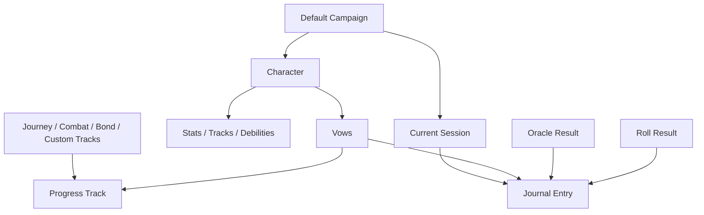
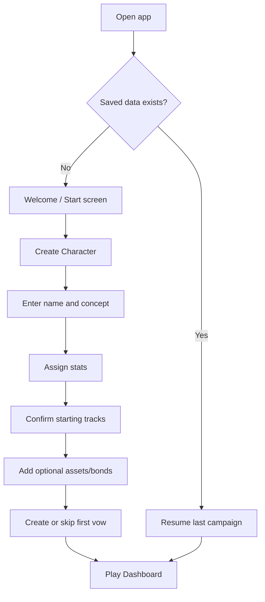
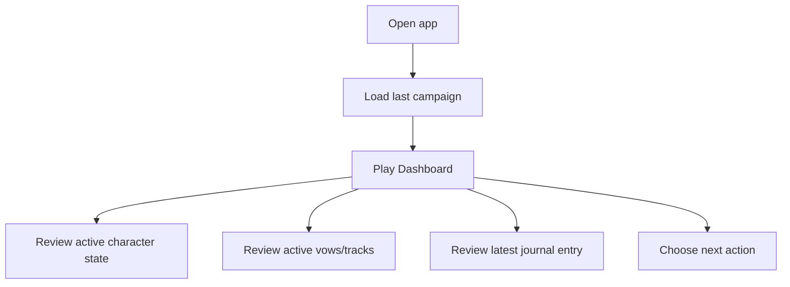
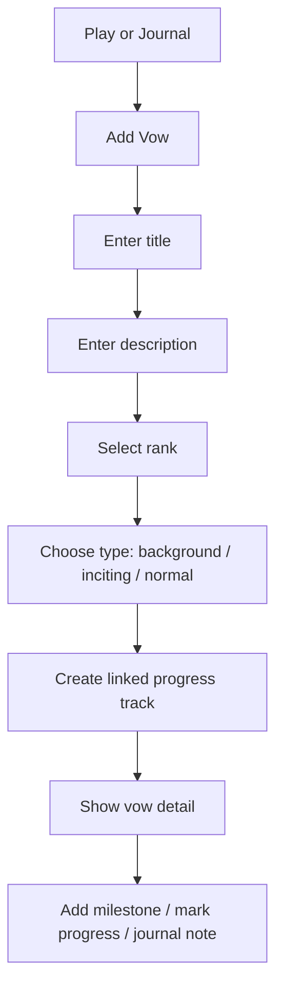
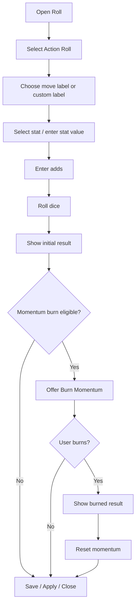
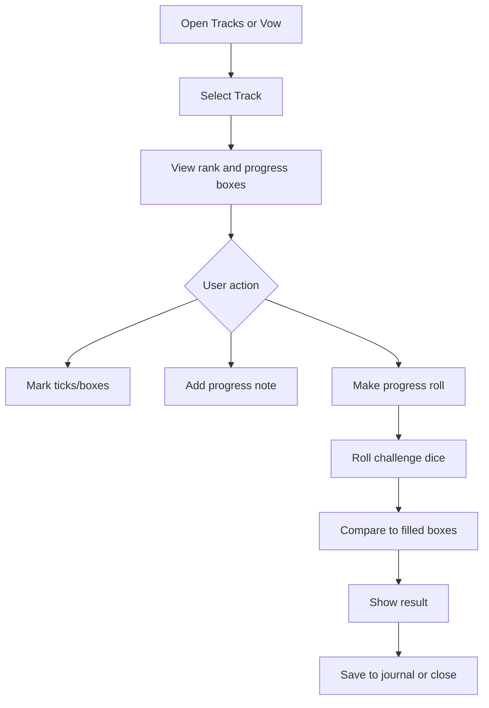
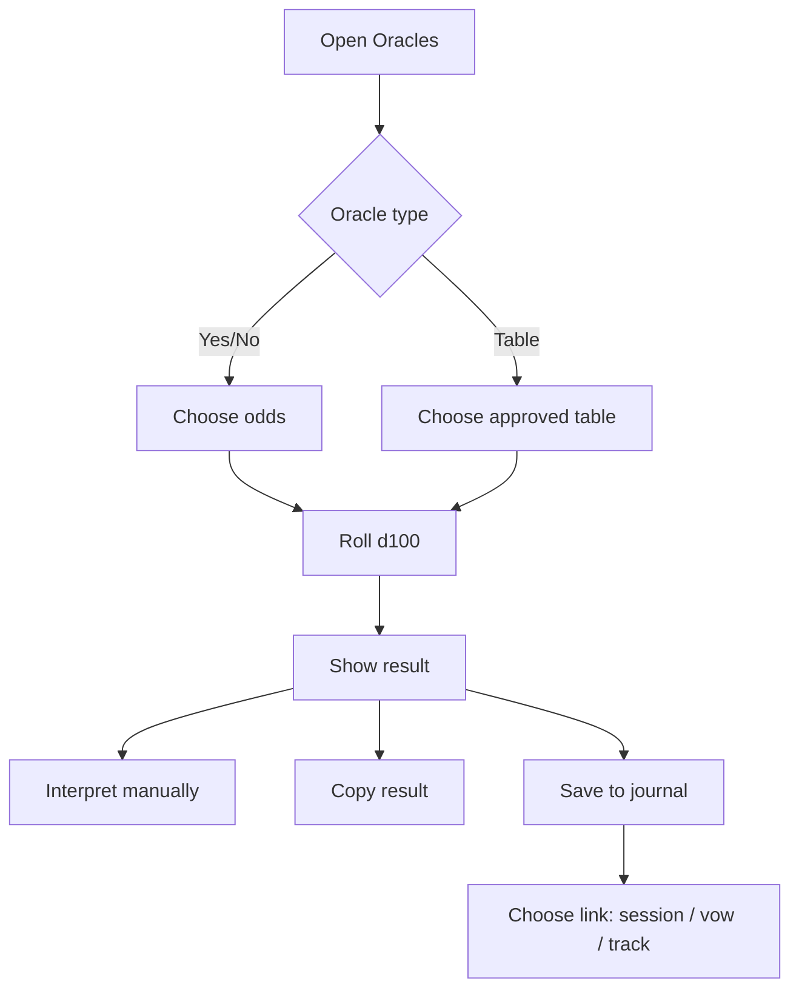
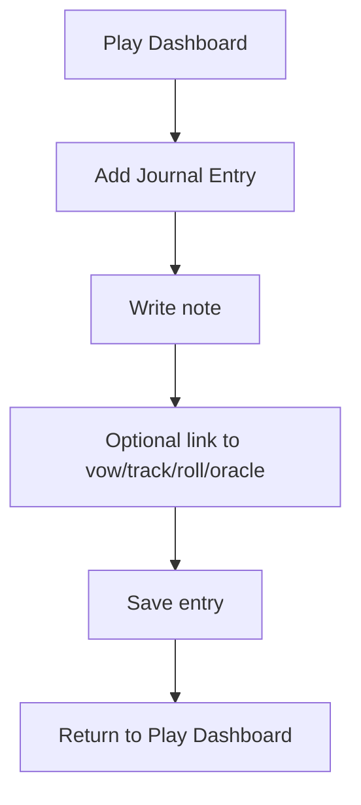

# UX Flow / Wireframe Requirements

## Ironsworn Digital Companion

*Version 0.1 | Draft | Prepared for the Ironsworn Project*

| Field | Value |
|---|---|
| Document owner | Product Owner / Project Lead |
| Related documents | Business Requirements Document v0.1; MVP Scope Document v0.1; Functional Requirements Document v0.1; Rules Engine Requirements v0.1; Data Model / Domain Model Specification v0.1; future Content & Licensing Requirements; future Acceptance Criteria / Test Plan |
| Product scope | Solo-first Ironsworn digital companion MVP |
| MVP baseline | Character sheet, move roller, momentum/progress trackers, oracle tables, vow journal |
| Intended audience | Product owner, UX/UI designer, developer, QA/tester, content/licensing reviewer |
| Status | Draft for review |

---

# Contents

1. Purpose
2. Source Basis
3. UX Context
4. UX Scope
5. UX Principles
6. Target Users and UX Needs
7. Information Architecture
8. App Shell and Navigation
9. Core User Flows
10. Wireframe Requirements
11. Low-Fidelity Wireframes
12. Screen-Level Functional Requirements
13. Component Requirements
14. Responsive Behavior
15. Accessibility Requirements
16. Empty, Loading, Error, and Confirmation States
17. Content and Licensing UX Requirements
18. Traceability Matrix
19. MVP UX Acceptance Criteria
20. Open Questions
21. Approval

---

# 1. Purpose

This document defines the user experience flows and low-fidelity wireframe requirements for the Ironsworn Digital Companion MVP.

The goal is to give the UX designer and developer enough structure to design the first usable product experience without turning the MVP into a full visual design system, full rules compendium, virtual tabletop, AI game master, or campaign-management suite.

The MVP UX must let a solo-first player create or resume a character, manage the main play state, make action/progress/oracle rolls, consult approved oracle content, update progress, and record what happened in a journal. It should reduce friction during play while preserving user interpretation and fiction-first decision-making.

---

# 2. Source Basis

This document is based on:

- Ironsworn Rulebook by Shawn Tomkin.
- Ironsworn Digital Companion Business Requirements Document v0.1.
- Ironsworn Digital Companion MVP Scope Document v0.1.
- Ironsworn Digital Companion Functional Requirements Document v0.1.
- Ironsworn Digital Companion Rules Engine Requirements v0.1.
- Ironsworn Digital Companion Data Model / Domain Model Specification v0.1.
- The agreed MVP baseline: character sheet, move roller, momentum/progress trackers, oracle tables, and vow journal.

Important licensing note: wireframes may use short labels, placeholders, and original UI copy. They must not assume reproduction of official rulebook prose, full move text, oracle table text, asset-card text, artwork, icons, or page imagery unless approved by the future Content & Licensing Requirements document.

---

# 3. UX Context

The product is a lightweight play companion. The player should not feel they are operating a heavy campaign database. The ideal experience is a compact session workspace that keeps the most important state visible and allows the user to record the story as it unfolds.

The UX must support three repeated player questions:

1. **What is my current state?** Character tracks, momentum, vows, active progress tracks, and recent notes.
2. **What do I do now?** Roll a move, consult an oracle, mark progress, or write a journal note.
3. **What changed?** Result, consequence, progress update, momentum change, milestone, saved note, or session log entry.

The app should help the user continue the play loop rather than burying them in forms.

---

# 4. UX Scope

## 4.1 In Scope for MVP UX

| Area | UX scope |
|---|---|
| First launch | Clear entry point for creating a character or resuming existing play. |
| Character sheet | View/edit the core sheet state without deep navigation. |
| Move roller | Fast access to action roll, progress roll, oracle roll, result classification, match display, and optional momentum burn. |
| Momentum/progress | Visible momentum, editable progress tracks, rank display, tick/box controls, progress roll entry point. |
| Oracles | Yes/no oracle flow, approved table browsing/rolling, result save/copy actions. |
| Vow journal | Create vows, track rank/progress/status, add milestones, add outcome notes. |
| Session journal | Freeform notes, saved roll/oracle outputs, links to vows/tracks where possible. |
| Persistence clarity | Auto-save or unsaved-change state must be understandable. |
| Content provenance | Official/SRD/custom/user-authored labels must be visible where relevant. |
| Responsive web | Layout must work on desktop, tablet, and mobile browser widths. |

## 4.2 Out of Scope for MVP UX

| Area | Excluded UX |
|---|---|
| Full VTT | Map boards, tokens, tactical grids, scene boards, fog of war. |
| Multiplayer | Live shared state, invite flows, presence indicators, user roles. |
| AI | AI narration, AI GM, AI oracle interpretation, AI-authored journal prose. |
| Marketplace | Storefront, subscriptions, purchases, entitlements, creator publishing. |
| Full compendium | Rulebook replacement, full official move database, full asset database. |
| Advanced campaign wiki | NPC graph, relationship map, timeline, world atlas, region map editor. |
| Final visual design | Typography, color system, high-fidelity imagery, final branding system. |

---

# 5. UX Principles

| ID | Principle | UX meaning |
|---|---|---|
| UX-P01 | Session-first | The main screen should support active play, not just data management. |
| UX-P02 | Low interruption | Common actions should use panels, drawers, or modals that return the user to play. |
| UX-P03 | Character state always nearby | Momentum, health, spirit, supply, and active vows should be visible or one tap away. |
| UX-P04 | Player interpretation preserved | Results should explain mechanics and prompt interpretation, not write story consequences for the player. |
| UX-P05 | Manual control | The user must be able to adjust values manually for house rules, mistakes, and physical play. |
| UX-P06 | Progressive disclosure | New players should see guidance, while experienced players can move quickly. |
| UX-P07 | No hidden destructive actions | Delete, archive, reset, burn momentum, and mark vow outcome require confirmation where appropriate. |
| UX-P08 | Content provenance visible | Official, SRD-derived, custom, and user-authored content must be distinguishable. |
| UX-P09 | Mobile viable | The MVP should be usable on a phone, even if desktop is the more comfortable layout. |
| UX-P10 | Lightweight over exhaustive | Prefer fast play support over a comprehensive campaign database in v0.1. |

---

# 6. Target Users and UX Needs

| User | UX priority | Needs |
|---|---:|---|
| Solo Player | Primary | Fast session loop, compact state summary, quick rolls, oracle access, journal continuity. |
| New Player | Secondary | Starting value hints, empty-state guidance, simple first vow path, visible next actions. |
| Co-op Player | Later | Local reference and manual tracking; no live shared state in MVP. |
| Guided Player / GM | Later | Manual oracles, rolls, notes, and track tools; no GM-specific campaign controls in MVP. |

---

# 7. Information Architecture

## 7.1 Primary Navigation

Recommended primary navigation:

1. **Play** — active session dashboard and most common actions.
2. **Character** — character sheet, stats, status tracks, debilities, bonds, assets, notes.
3. **Roll** — action roll, progress roll, oracle roll, current-session roll history.
4. **Tracks** — vow, journey, combat, bond, and custom progress tracks.
5. **Oracles** — yes/no oracle and approved oracle tables.
6. **Journal** — session notes, saved rolls, saved oracles, vow-linked notes.

The MVP may combine **Roll** into **Play** as a right-side panel on desktop and a bottom action on mobile. The separate Roll workspace is still recommended for clarity and testing.

## 7.2 Secondary Navigation

| Area | Secondary tabs/sections |
|---|---|
| Character | Overview, Stats & Tracks, Debilities, Bonds, Assets, Notes |
| Roll | Action Roll, Progress Roll, Oracle Roll, History |
| Tracks | Active, Vows, Journeys, Combat, Bonds, Custom, Archived |
| Oracles | Yes/No, Tables, Recent Results, Source Notes |
| Journal | Current Session, All Entries, Vow Notes, Saved Rolls, Saved Oracles |

## 7.3 Key Object Relationships in UX



---

# 8. App Shell and Navigation

## 8.1 Desktop App Shell

Desktop should use a three-zone layout:

- **Left sidebar:** product name, current campaign/character, primary navigation.
- **Center workspace:** selected screen or active play view.
- **Right utility rail:** quick roll, momentum/status summary, recent results, or contextual actions.

## 8.2 Mobile App Shell

Mobile should use:

- **Top bar:** app title, active character, save/sync state.
- **Bottom navigation:** Play, Character, Roll, Tracks, Journal. Oracles may be inside Roll or an overflow menu if space is tight.
- **Modal/drawer pattern:** roll result, momentum burn, add progress, and oracle result should open as bottom sheets.

## 8.3 Global Actions

| Action | Availability |
|---|---|
| Quick Roll | Always visible on Play; one tap from all other screens. |
| Add Journal Entry | Always visible on Play and Journal; optional floating action button on mobile. |
| Add Vow / Track | Visible on Play, Tracks, and Vow Journal contexts. |
| Save / Autosave Status | Visible in top bar or footer. |
| Search / Filter | Could-have for Journal and Oracles; not required for first MVP. |

---

# 9. Core User Flows

## 9.1 Flow A: First Launch to First Character



### UX Requirements

| ID | Requirement | Priority |
|---|---|---|
| UX-FLOW-A01 | First launch shall provide a clear “Create Character” primary action. | Must |
| UX-FLOW-A02 | Character setup should avoid overwhelming the user with every possible field at once. | Should |
| UX-FLOW-A03 | Starting values should be suggested or prefilled where allowed by the product requirements. | Should |
| UX-FLOW-A04 | The user shall be able to skip optional details and edit them later. | Must |
| UX-FLOW-A05 | The user should be prompted to create a first vow after character setup. | Should |

---

## 9.2 Flow B: Resume Session



### UX Requirements

| ID | Requirement | Priority |
|---|---|---|
| UX-FLOW-B01 | Returning users should land on the Play Dashboard by default. | Should |
| UX-FLOW-B02 | The dashboard shall show the active character, status tracks, momentum, active vows, and latest journal context. | Must |
| UX-FLOW-B03 | The dashboard shall provide quick actions for Roll, Oracle, Add Journal Entry, and Add Progress. | Must |
| UX-FLOW-B04 | If saved data cannot be loaded, the user shall see a clear error and recovery path. | Must |

---

## 9.3 Flow C: Create or Update a Vow



### UX Requirements

| ID | Requirement | Priority |
|---|---|---|
| UX-FLOW-C01 | Vow creation shall include title, rank, status, progress, and notes. | Must |
| UX-FLOW-C02 | A vow shall create or reference a single linked vow progress track. | Must |
| UX-FLOW-C03 | The user should be able to mark a vow as background vow or inciting incident vow. | Should |
| UX-FLOW-C04 | The user shall be able to add milestone notes from the vow detail screen. | Must |
| UX-FLOW-C05 | Fulfill/forsake/archive actions shall require confirmation or an intermediate outcome form. | Should |

---

## 9.4 Flow D: Action Roll with Optional Momentum Burn



### UX Requirements

| ID | Requirement | Priority |
|---|---|---|
| UX-FLOW-D01 | Action roll form shall fit on one compact panel or modal. | Must |
| UX-FLOW-D02 | Result display shall show action die, challenge dice, adds/stat, action score, result classification, and match state. | Must |
| UX-FLOW-D03 | The burn momentum action shall never happen automatically. | Must |
| UX-FLOW-D04 | The burn momentum prompt shall explain which challenge die or dice can be canceled. | Should |
| UX-FLOW-D05 | The user shall be able to save the roll result to the journal if roll history/journal linkage is implemented. | Should |
| UX-FLOW-D06 | The result screen shall avoid writing narrative consequences for the user. | Must |

---

## 9.5 Flow E: Progress Track and Progress Roll



### UX Requirements

| ID | Requirement | Priority |
|---|---|---|
| UX-FLOW-E01 | Progress track detail shall visually represent 10 boxes and partial ticks. | Must |
| UX-FLOW-E02 | The user shall be able to add/remove ticks and full boxes manually. | Must |
| UX-FLOW-E03 | The user should have a rank-based “mark progress” helper. | Should |
| UX-FLOW-E04 | Progress roll shall display filled-box score and challenge dice. | Must |
| UX-FLOW-E05 | Progress roll UI shall make clear that momentum is ignored. | Must |
| UX-FLOW-E06 | Progress changes should support an optional note. | Should |

---

## 9.6 Flow F: Oracle Roll to Journal



### UX Requirements

| ID | Requirement | Priority |
|---|---|---|
| UX-FLOW-F01 | Oracle screen shall support yes/no oracle and approved d100 tables. | Must |
| UX-FLOW-F02 | Oracle result shall show source/provenance information where relevant. | Must |
| UX-FLOW-F03 | Oracle result shall provide copy and save-to-journal actions where implemented. | Should |
| UX-FLOW-F04 | Oracle UI shall encourage user interpretation rather than automatic story generation. | Must |
| UX-FLOW-F05 | If no approved oracle tables are available, the screen shall provide an empty-state explanation. | Must |

---

## 9.7 Flow G: Journal During Play



### UX Requirements

| ID | Requirement | Priority |
|---|---|---|
| UX-FLOW-G01 | The user shall be able to create a session journal entry from the Play Dashboard. | Must |
| UX-FLOW-G02 | Journal entry creation should be fast and not require complex categorization. | Should |
| UX-FLOW-G03 | The user should be able to link a journal entry to a vow, track, roll, or oracle result. | Should |
| UX-FLOW-G04 | The Journal screen shall show entries in reverse chronological order by default. | Should |
| UX-FLOW-G05 | The user shall be able to edit saved journal entries. | Must |

---

# 10. Wireframe Requirements

## 10.1 Wireframe Fidelity

The MVP wireframes in this document are low-fidelity structural wireframes. They define layout, hierarchy, and interaction targets. They do not define final visual style, final copy, final colors, typography, illustrations, icons, or animation.

## 10.2 Required Wireframe Set

| ID | Wireframe | Priority |
|---|---|---|
| WF-01 | Welcome / First Launch | Must |
| WF-02 | Character Setup | Must |
| WF-03 | Play Dashboard | Must |
| WF-04 | Character Sheet | Must |
| WF-05 | Action Roll Panel / Modal | Must |
| WF-06 | Momentum Burn Confirmation | Must |
| WF-07 | Progress Track Detail | Must |
| WF-08 | Oracle Workspace | Must |
| WF-09 | Vow Journal / Vow Detail | Must |
| WF-10 | Session Journal | Must |
| WF-11 | Mobile App Shell | Should |
| WF-12 | Error / Empty State Templates | Should |

---

# 11. Low-Fidelity Wireframes

## WF-01: Welcome / First Launch

```text
┌──────────────────────────────────────────────────────────────┐
│ IRONSWORN COMPANION                                  [About] │
├──────────────────────────────────────────────────────────────┤
│                                                              │
│  Keep your vows. Track your journey.                         │
│  A lightweight companion for solo-first Ironsworn play.       │
│                                                              │
│  [ Create Character ]     [ Import / Restore Data ]          │
│                                                              │
│  ┌────────────────────────────────────────────────────────┐  │
│  │ What this MVP helps with                              │  │
│  │ • Character sheet                                     │  │
│  │ • Move rolls                                          │  │
│  │ • Momentum and progress                               │  │
│  │ • Oracles                                             │  │
│  │ • Vow journal                                         │  │
│  └────────────────────────────────────────────────────────┘  │
│                                                              │
│  Content notice: official/SRD/custom content will be labeled.│
└──────────────────────────────────────────────────────────────┘
```

### WF-01 Requirements

| ID | Requirement | Priority |
|---|---|---|
| WF-01-REQ-01 | The primary action shall be “Create Character.” | Must |
| WF-01-REQ-02 | The screen should summarize the five MVP feature areas. | Should |
| WF-01-REQ-03 | Import/restore may be present as disabled or could-have if export/import is not implemented. | Could |
| WF-01-REQ-04 | The screen shall include a licensing/content notice area before public release. | Must before public release |

---

## WF-02: Character Setup

```text
┌──────────────────────────────────────────────────────────────┐
│ ← Back                                        Step 1 of 4     │
├──────────────────────────────────────────────────────────────┤
│ Create Your Character                                        │
│                                                              │
│ Name                                                         │
│ [__________________________________________________________] │
│                                                              │
│ Concept / short description                                  │
│ [__________________________________________________________] │
│ [__________________________________________________________] │
│                                                              │
│ Stats                                                        │
│ [Apply standard spread: 3,2,2,1,1]                           │
│ Edge   [-] 1 [+]     Heart  [-] 2 [+]     Iron   [-] 3 [+]   │
│ Shadow [-] 1 [+]     Wits   [-] 2 [+]                        │
│                                                              │
│ Starting Tracks                                              │
│ Health [5]  Spirit [5]  Supply [5]  Momentum [+2]            │
│                                                              │
│                         [ Save & Continue ]                  │
└──────────────────────────────────────────────────────────────┘
```

### WF-02 Requirements

| ID | Requirement | Priority |
|---|---|---|
| WF-02-REQ-01 | Setup shall support name, concept, stats, and starting tracks. | Must |
| WF-02-REQ-02 | Setup should provide standard starting value helpers. | Should |
| WF-02-REQ-03 | Setup shall allow later editing; it must not trap the user in a wizard. | Must |
| WF-02-REQ-04 | Optional steps for bonds, assets, equipment, and first vow should be skippable. | Should |

---

## WF-03: Play Dashboard

```text
┌─────────────────────────────────────────────────────────────────────────────┐
│ Ironsworn Companion        My Campaign / Asha                Saved • 12:04 │
├───────────────┬──────────────────────────────────────────────┬──────────────┤
│ NAV           │ PLAY DASHBOARD                               │ QUICK PANEL  │
│               │                                              │              │
│ > Play        │ Current Situation                            │ Momentum +4  │
│   Character   │ [Write or review what is happening now...]   │ Max +10      │
│   Roll        │                                              │ Reset +2     │
│   Tracks      │ Active Vows                                  │              │
│   Oracles     │ ┌──────────────────────────────────────────┐ │ Health 5     │
│   Journal     │ │ Find my sister        Dangerous   ▣▣□□□ │ │ Spirit 5     │
│               │ │ Guide caravan         Formidable  ▣□□□  │ │ Supply 4     │
│               │ └──────────────────────────────────────────┘ │              │
│               │                                              │ [Action Roll]│
│               │ Active Tracks                                │ [Oracle]     │
│               │ ┌──────────────────────────────────────────┐ │ [Add Note]   │
│               │ │ Journey: Mournwood      ▣▣▣□□            │ │ [Add Track]  │
│               │ │ Combat: Broken Raider   ▣□□              │ │              │
│               │ └──────────────────────────────────────────┘ │ Recent Roll  │
│               │                                              │ Weak Hit     │
│               │ Latest Journal                              │              │
│               │ “The trail bends toward the old standing...” │              │
└───────────────┴──────────────────────────────────────────────┴──────────────┘
```

### WF-03 Requirements

| ID | Requirement | Priority |
|---|---|---|
| WF-03-REQ-01 | Dashboard shall show current character context and save state. | Must |
| WF-03-REQ-02 | Dashboard shall show momentum and health/spirit/supply without deep navigation. | Must |
| WF-03-REQ-03 | Dashboard shall show active vows and active tracks. | Must |
| WF-03-REQ-04 | Dashboard shall provide quick actions for action roll, oracle, note, and track creation. | Must |
| WF-03-REQ-05 | Dashboard should show latest journal context and recent roll result. | Should |

---

## WF-04: Character Sheet

```text
┌─────────────────────────────────────────────────────────────────────────────┐
│ CHARACTER: Asha Shadiya                                      [Edit] [Save] │
├─────────────────────────────────────────────────────────────────────────────┤
│ Concept                                                                    │
│ Storyweaver seeking a lost sister.                                         │
│                                                                             │
│ Stats                         Status                         Momentum       │
│ ┌──────────────────────┐     ┌──────────────────────┐      ┌────────────┐ │
│ │ Edge   3             │     │ Health  [●●●●●] 5    │      │ Current +4 │ │
│ │ Heart  1             │     │ Spirit  [●●●●●] 5    │      │ Max     10 │ │
│ │ Iron   2             │     │ Supply  [●●●●○] 4    │      │ Reset   2 │ │
│ │ Shadow 1             │     └──────────────────────┘      └────────────┘ │
│ │ Wits   2             │                                                   │
│ └──────────────────────┘                                                   │
│                                                                             │
│ Debilities                         Bonds                                    │
│ [ ] Wounded  [ ] Shaken            ▣▢▢▢▢▢▢▢▢▢                              │
│ [ ] Unprepared [ ] Encumbered      Background bonds: [Add / Edit]           │
│ [ ] Maimed   [ ] Corrupted                                                  │
│ [ ] Cursed   [ ] Tormented                                                  │
│                                                                             │
│ Assets / Equipment / Notes                                                  │
│ ┌───────────────────────────────────────────────────────────────────────┐   │
│ │ Asset references and important equipment notes...                      │   │
│ └───────────────────────────────────────────────────────────────────────┘   │
└─────────────────────────────────────────────────────────────────────────────┘
```

### WF-04 Requirements

| ID | Requirement | Priority |
|---|---|---|
| WF-04-REQ-01 | Character sheet shall group stats, status, momentum, debilities, bonds, assets, and notes. | Must |
| WF-04-REQ-02 | Editable numeric tracks shall provide clear increment/decrement or direct edit controls. | Must |
| WF-04-REQ-03 | Debility changes should show their impact on momentum max/reset when implemented. | Should |
| WF-04-REQ-04 | Asset area shall support lightweight references, not full asset automation in MVP. | Should |

---

## WF-05: Action Roll Panel / Modal

```text
┌────────────────────────────────────────────┐
│ Action Roll                         [×]    │
├────────────────────────────────────────────┤
│ Move / label                               │
│ [Face Danger___________________________▼]  │
│                                            │
│ Stat                                       │
│ [Edge +3 ▼]     Adds [-] 0 [+]             │
│                                            │
│ [ Roll ]   [ Enter physical dice ]         │
│                                            │
│ Result                                     │
│ Action die: 4    Challenge: 5 and 8        │
│ Score: 7         Outcome: Weak Hit         │
│ Match: No                                  │
│                                            │
│ Momentum burn available: Cancel 5?         │
│ [ Burn Momentum ] [ Keep Result ]          │
│                                            │
│ [ Save to Journal ] [ Close ]              │
└────────────────────────────────────────────┘
```

### WF-05 Requirements

| ID | Requirement | Priority |
|---|---|---|
| WF-05-REQ-01 | Action roll panel shall show selected stat, adds, dice, score, outcome, and match status. | Must |
| WF-05-REQ-02 | The move label selector may use approved metadata or custom user labels. | Should |
| WF-05-REQ-03 | Manual dice entry should be available if implemented by the rules engine. | Could |
| WF-05-REQ-04 | Momentum burn actions shall be separated from the initial roll action. | Must |

---

## WF-06: Momentum Burn Confirmation

```text
┌────────────────────────────────────────────┐
│ Burn Momentum?                      [×]    │
├────────────────────────────────────────────┤
│ Current momentum: +6                       │
│ Momentum reset: +2                         │
│                                            │
│ Initial result: Miss                       │
│ Challenge dice: 5 and 8                    │
│                                            │
│ Burning momentum will cancel: 5            │
│ New result: Weak Hit                       │
│                                            │
│ After burn, momentum becomes +2.           │
│                                            │
│ [ Confirm Burn ]   [ Cancel ]              │
└────────────────────────────────────────────┘
```

### WF-06 Requirements

| ID | Requirement | Priority |
|---|---|---|
| WF-06-REQ-01 | Burn confirmation shall show current momentum and reset value. | Must |
| WF-06-REQ-02 | Burn confirmation shall show initial and post-burn outcomes. | Must |
| WF-06-REQ-03 | Burn confirmation shall show which challenge dice are canceled. | Should |
| WF-06-REQ-04 | Burn confirmation shall clearly state the momentum reset consequence. | Must |

---

## WF-07: Progress Track Detail

```text
┌──────────────────────────────────────────────────────────────┐
│ Track: Journey through the Mournwood              [Archive]  │
├──────────────────────────────────────────────────────────────┤
│ Type: Journey        Rank: Formidable        Status: Active  │
│                                                              │
│ Progress                                                     │
│ [✶][✶][✶][◩][□][□][□][□][□][□]                              │
│  3 full boxes + 2 ticks                                      │
│                                                              │
│ [ + Tick ] [ - Tick ] [ Mark Progress ] [ Progress Roll ]    │
│                                                              │
│ Notes                                                        │
│ [Reached the black river crossing...]                        │
│                                                              │
│ Progress Events                                              │
│ 12:03 Marked progress — reached waypoint                     │
│ 11:41 Created track                                          │
└──────────────────────────────────────────────────────────────┘
```

### WF-07 Requirements

| ID | Requirement | Priority |
|---|---|---|
| WF-07-REQ-01 | Progress detail shall show title, type, rank, status, progress boxes/ticks, notes, and events. | Must |
| WF-07-REQ-02 | Track controls shall support tick edits and rank-based mark-progress helper. | Should |
| WF-07-REQ-03 | Progress roll action shall be available from the selected track. | Must |
| WF-07-REQ-04 | Reset/archive/delete actions shall require confirmation. | Should |

---

## WF-08: Oracle Workspace

```text
┌──────────────────────────────────────────────────────────────┐
│ ORACLES                                                       │
├─────────────────────────────┬────────────────────────────────┤
│ Oracle Type                 │ Result                         │
│                             │                                │
│ (•) Yes / No                │ Roll: 64                       │
│ Odds                        │ Answer: Yes                    │
│ [Likely ▼]                  │ Match: No                      │
│                             │                                │
│ ( ) Table                   │ Interpretation                 │
│ Table                       │ [What does this mean in the    │
│ [Action ▼]                  │  current scene?]               │
│                             │                                │
│ [ Roll Oracle ]             │ [ Copy ] [ Save to Journal ]   │
│                             │                                │
│ Source: Approved / SRD / Custom label                         │
└─────────────────────────────┴────────────────────────────────┘
```

### WF-08 Requirements

| ID | Requirement | Priority |
|---|---|---|
| WF-08-REQ-01 | Oracle workspace shall support yes/no odds and approved table rolls. | Must |
| WF-08-REQ-02 | Oracle result area shall show roll value, result, match status if applicable, and source label. | Must |
| WF-08-REQ-03 | Oracle result should provide interpretation note space. | Should |
| WF-08-REQ-04 | Save-to-journal shall allow the user to link the result to session, vow, or track where supported. | Should |

---

## WF-09: Vow Journal / Vow Detail

```text
┌──────────────────────────────────────────────────────────────┐
│ VOW JOURNAL                                      [Add Vow]   │
├─────────────────────────────┬────────────────────────────────┤
│ Active Vows                 │ Vow Detail                     │
│                             │                                │
│ > Find my sister            │ Find my sister                 │
│   Dangerous • Active        │ Rank: Dangerous                │
│   ▣▣□□□                     │ Status: Active                 │
│                             │ Type: Background Vow           │
│   Guide the caravan         │                                │
│   Formidable • Active       │ Progress                       │
│   ▣□□□                      │ [✶][✶][□][□][□][□][□][□][□][□]│
│                             │                                │
│ Archived                    │ Description                    │
│ ...                         │ [Freeform vow description...]  │
│                             │                                │
│                             │ Milestones                     │
│                             │ [+ Add Milestone]              │
│                             │ - Found tracks near the ford   │
│                             │                                │
│                             │ [Fulfill] [Forsake] [Journal]  │
└─────────────────────────────┴────────────────────────────────┘
```

### WF-09 Requirements

| ID | Requirement | Priority |
|---|---|---|
| WF-09-REQ-01 | Vow journal shall list active vows with rank, status, and progress summary. | Must |
| WF-09-REQ-02 | Vow detail shall show linked progress, description, milestones, outcome actions, and journal link. | Must |
| WF-09-REQ-03 | Background vow and inciting incident markers should be visible where used. | Should |
| WF-09-REQ-04 | Fulfill and forsake flows shall collect outcome notes. | Must |

---

## WF-10: Session Journal

```text
┌──────────────────────────────────────────────────────────────┐
│ JOURNAL                                          [+ New Note]│
├─────────────────────────────┬────────────────────────────────┤
│ Filters                     │ Entry Editor / Detail          │
│ [Current Session ▼]         │                                │
│ [All types ▼]               │ Title                          │
│ [Linked vow ▼]              │ [The trail goes cold________]  │
│                             │                                │
│ Entries                     │ Body                           │
│ > 12:20 The trail goes...   │ [Freeform session note...]     │
│   linked: Find my sister    │                                │
│   type: Note                │ Links                          │
│                             │ Vow: [Find my sister ▼]        │
│ > 12:04 Weak Hit roll       │ Roll: [Weak Hit 12:04]         │
│   type: Saved Roll          │ Oracle: [None ▼]               │
│                             │                                │
│ > 11:58 Oracle result       │ [ Save ] [ Delete ]            │
│   type: Oracle              │                                │
└─────────────────────────────┴────────────────────────────────┘
```

### WF-10 Requirements

| ID | Requirement | Priority |
|---|---|---|
| WF-10-REQ-01 | Journal shall support freeform entries. | Must |
| WF-10-REQ-02 | Journal should support saved roll and saved oracle entry types. | Should |
| WF-10-REQ-03 | Journal should support filtering by session, type, and linked vow/track. | Could |
| WF-10-REQ-04 | Journal entries shall be editable and persist after app reload. | Must |

---

## WF-11: Mobile App Shell

```text
┌──────────────────────────────┐
│ Ironsworn        Saved • now │
├──────────────────────────────┤
│ PLAY                         │
│ Asha Shadiya                 │
│ Health 5  Spirit 5  Supply 4 │
│ Momentum +4                  │
│                              │
│ Active Vows                  │
│ ┌──────────────────────────┐ │
│ │ Find my sister    ▣▣□□□  │ │
│ └──────────────────────────┘ │
│                              │
│ [ Action Roll ] [ Oracle ]   │
│ [ Add Note ]    [ Track ]    │
│                              │
│ Latest Note                  │
│ The trail bends toward...    │
├──────────────────────────────┤
│ Play | Char | Roll | Tracks | Journal │
└──────────────────────────────┘
```

### WF-11 Requirements

| ID | Requirement | Priority |
|---|---|---|
| WF-11-REQ-01 | Mobile layout shall prioritize Play Dashboard content vertically. | Must |
| WF-11-REQ-02 | Mobile navigation shall use bottom navigation or another thumb-friendly pattern. | Should |
| WF-11-REQ-03 | Roll/oracle result panels should open as bottom sheets or full-screen modals. | Should |
| WF-11-REQ-04 | Mobile controls shall avoid tiny tick targets; use larger add/remove controls. | Must |

---

# 12. Screen-Level Functional Requirements

## 12.1 Play Dashboard Requirements

| ID | Requirement | Priority |
|---|---|---|
| UX-SCR-PLAY-01 | The Play Dashboard shall be the default workspace after setup or resume. | Should |
| UX-SCR-PLAY-02 | It shall summarize character status, momentum, active vows, active tracks, latest journal entry, and recent roll. | Must |
| UX-SCR-PLAY-03 | It shall provide quick actions: Action Roll, Oracle, Add Journal Entry, Add Track, Add Vow. | Must |
| UX-SCR-PLAY-04 | It should allow inline editing of the “current situation” note. | Should |
| UX-SCR-PLAY-05 | It shall not require the user to visit separate screens for every common play action. | Must |

## 12.2 Character Screen Requirements

| ID | Requirement | Priority |
|---|---|---|
| UX-SCR-CHAR-01 | Character screen shall expose all core sheet fields required by the FRD. | Must |
| UX-SCR-CHAR-02 | It shall support both direct editing and quick increment/decrement for numeric tracks. | Must |
| UX-SCR-CHAR-03 | It should group fields into readable sections. | Should |
| UX-SCR-CHAR-04 | It shall show save/autosave state or unsaved-change state. | Must |

## 12.3 Roll Screen Requirements

| ID | Requirement | Priority |
|---|---|---|
| UX-SCR-ROLL-01 | Roll screen shall support action, progress, and oracle roll entry points. | Must |
| UX-SCR-ROLL-02 | Result area shall show the mechanical explanation required by the rules engine. | Must |
| UX-SCR-ROLL-03 | It should support current-session roll history. | Should |
| UX-SCR-ROLL-04 | It shall make clear that narrative interpretation remains with the user. | Must |

## 12.4 Tracks Screen Requirements

| ID | Requirement | Priority |
|---|---|---|
| UX-SCR-TRK-01 | Tracks screen shall support creating and editing vow, journey, combat, bond, and custom tracks. | Must |
| UX-SCR-TRK-02 | It shall show progress visually as boxes/ticks or an equivalent clear representation. | Must |
| UX-SCR-TRK-03 | It should allow filtering by type and status. | Could |
| UX-SCR-TRK-04 | It shall allow progress rolls from a selected track. | Must |

## 12.5 Oracles Screen Requirements

| ID | Requirement | Priority |
|---|---|---|
| UX-SCR-ORC-01 | Oracles screen shall include yes/no odds and approved d100 table roll flows. | Must |
| UX-SCR-ORC-02 | It shall show content source/provenance labels. | Must |
| UX-SCR-ORC-03 | It should support copy/save-to-journal actions. | Should |
| UX-SCR-ORC-04 | It shall provide empty state messaging if approved oracle content is unavailable. | Must |

## 12.6 Journal Screen Requirements

| ID | Requirement | Priority |
|---|---|---|
| UX-SCR-JRN-01 | Journal screen shall support freeform session notes. | Must |
| UX-SCR-JRN-02 | It should support linked entries from rolls, oracles, vows, and progress events. | Should |
| UX-SCR-JRN-03 | It shall allow editing and saving entries. | Must |
| UX-SCR-JRN-04 | It should support reverse chronological display by default. | Should |

---

# 13. Component Requirements

| Component | Requirement | Priority |
|---|---|---|
| Status Track Control | Supports 0-5 value, plus/minus buttons, direct value display, disabled state. | Must |
| Momentum Control | Supports -6 to max, max/reset display, plus/minus buttons, burn-reset updates. | Must |
| Progress Box Control | Shows 10 boxes and partial ticks; supports tick/box updates. | Must |
| Rank Selector | Supports standard challenge ranks for relevant tracks. | Must |
| Roll Result Card | Displays dice, inputs, outcome, match, momentum effects, save action. | Must |
| Oracle Result Card | Displays roll value, result, source/provenance, copy/save actions. | Must |
| Vow Card | Displays title, rank, status, progress, and quick actions. | Must |
| Journal Entry Card | Displays timestamp, title/excerpt, type, links, edit action. | Must |
| Confirmation Dialog | Used for burn momentum, delete, reset, archive, fulfill, forsake. | Must |
| Source Badge | Shows official/SRD/custom/user-authored/future content category. | Must |

---

# 14. Responsive Behavior

## 14.1 Desktop

| Requirement | Priority |
|---|---|
| Use sidebar + center workspace + right utility panel where space allows. | Should |
| Keep quick roll and status summary visible in the utility panel. | Should |
| Allow dense but readable tables/lists for vows, tracks, and journal entries. | Should |

## 14.2 Tablet

| Requirement | Priority |
|---|---|
| Collapse the right utility panel into a drawer or top summary strip. | Should |
| Keep primary navigation visible as icons or compact tabs. | Should |
| Avoid hover-only interactions. | Must |

## 14.3 Mobile

| Requirement | Priority |
|---|---|
| Use vertical card layout. | Must |
| Use bottom navigation or another mobile-friendly global navigation pattern. | Should |
| Use bottom sheets/full-screen modals for roll, oracle, and confirmation workflows. | Should |
| Large tap targets for progress ticks, plus/minus controls, and quick actions. | Must |
| Avoid requiring horizontal scrolling for core play actions. | Must |

---

# 15. Accessibility Requirements

| ID | Requirement | Priority |
|---|---|---|
| UX-A11Y-01 | Core actions shall be keyboard accessible. | Should |
| UX-A11Y-02 | Inputs shall have labels, not placeholder-only identification. | Must |
| UX-A11Y-03 | Result classifications shall not rely on color alone. | Must |
| UX-A11Y-04 | Progress boxes/ticks shall have accessible text equivalents. | Must |
| UX-A11Y-05 | Modals/dialogs shall manage focus and support escape/cancel behavior. | Should |
| UX-A11Y-06 | Text contrast shall meet common accessibility expectations before public release. | Should |
| UX-A11Y-07 | Mobile tap targets shall be large enough for reliable touch use. | Must |
| UX-A11Y-08 | Error messages shall explain what went wrong and how to fix it. | Must |

---

# 16. Empty, Loading, Error, and Confirmation States

## 16.1 Empty States

| State | Required message/action |
|---|---|
| No character | Explain that a character is needed; show “Create Character.” |
| No vows | Explain vows are central to play; show “Add Vow.” |
| No tracks | Explain journeys/combat/custom progress can be tracked; show “Add Track.” |
| No journal entries | Invite the user to record the current situation; show “New Note.” |
| No approved oracle tables | Explain that table content depends on licensing/content approval; keep yes/no oracle available if approved. |

## 16.2 Error States

| State | Required UX behavior |
|---|---|
| Save failed | Show clear error, preserve unsaved data in the UI, offer retry/export/copy where possible. |
| Data load failed | Show recovery options; do not silently overwrite data. |
| Invalid roll input | Highlight invalid field and explain accepted values. |
| Invalid progress value | Prevent invalid update or explain clamp/override behavior. |
| Missing content source | Label as unknown/unreviewed and block public-release readiness. |

## 16.3 Confirmation States

Require confirmation for:

- Burn momentum.
- Delete or archive character.
- Delete or archive vow.
- Delete or archive progress track.
- Reset progress track.
- Fulfill vow.
- Forsake vow.
- Delete journal entry.
- Clear roll history, if implemented.

---

# 17. Content and Licensing UX Requirements

| ID | Requirement | Priority |
|---|---|---|
| UX-LIC-01 | Any official, SRD-derived, custom, or user-authored content shown in UI shall have a source/provenance label where relevant. | Must |
| UX-LIC-02 | Public-release builds shall include an accessible attribution/license area. | Must before public release |
| UX-LIC-03 | Wireframes shall avoid relying on official rulebook artwork or layout reproduction. | Must |
| UX-LIC-04 | Move/oracle labels may be placeholders until the Content & Licensing Requirements document approves exact content use. | Must |
| UX-LIC-05 | If content is unavailable due to licensing review, the UI shall show a helpful empty state rather than broken controls. | Must |
| UX-LIC-06 | User-authored notes shall be visually distinguished from official/reference content when displayed together. | Should |

---

# 18. Traceability Matrix

| UX area | Related MVP feature | Related FRD area | Related rules/data areas |
|---|---|---|---|
| Welcome / Onboarding | MVP-07 | Onboarding and Workspace Navigation | Campaign, Character defaults |
| Character Setup | MVP-01 | Character Sheet | Character, Debility, Bond, AssetReference |
| Play Dashboard | All MVP features | Cross-feature behavior | Campaign, Session, RollRecord, JournalEntry |
| Action Roll Panel | MVP-02 | Move Roller | Action roll, momentum rules, roll history |
| Momentum Burn Dialog | MVP-02 / MVP-03 | Move Roller, Trackers | Momentum rules, character state |
| Progress Track Detail | MVP-03 / MVP-05 | Momentum and Progress Trackers, Vow Journal | ProgressTrack, ProgressEvent, progress roll |
| Oracle Workspace | MVP-04 | Oracle Tables | OracleTable, OracleEntry, OracleResult, provenance |
| Vow Journal | MVP-05 | Vow Journal | Vow, ProgressTrack, VowMilestone, JournalEntry |
| Session Journal | MVP-05 / MVP-06 | Session Journal and Roll History, Persistence | JournalEntry, JournalLink, RollRecord |
| Source Badges | MVP licensing principle | Content Provenance and Licensing Support | ContentSource, ContentItem |

---

# 19. MVP UX Acceptance Criteria

The UX flow/wireframe work is acceptable for MVP implementation when:

1. A new user can move from first launch to saved character without external tracking tools.
2. A returning user can resume play from the Play Dashboard.
3. The Play Dashboard clearly surfaces character status, momentum, active vows, active tracks, quick rolls, oracle access, and journal entry creation.
4. Character sheet wireframes cover stats, health, spirit, supply, momentum, debilities, bonds, asset references, equipment, and notes.
5. Action roll wireframes show inputs, dice, score, outcome, match status, and optional momentum burn.
6. Momentum burn is user-confirmed and clearly shows the reset consequence.
7. Progress track wireframes support ticks/boxes, rank, status, progress notes, and progress roll entry.
8. Oracle wireframes support yes/no and approved d100 table workflows with save/copy actions.
9. Vow journal wireframes support title, rank, status, progress, milestones, fulfillment/forsaking, and journal notes.
10. Journal wireframes support freeform entries and optional roll/oracle/vow/track links.
11. Mobile wireframes preserve the core play loop without relying on desktop-only layout.
12. Empty, error, loading, and confirmation states are specified for core flows.
13. Content provenance and attribution areas are represented at the UX level.
14. No out-of-scope MVP feature is required to complete the main solo play flow.

---

# 20. Open Questions

| ID | Topic | Question |
|---|---|---|
| UX-OQ-01 | Platform emphasis | Should the first implementation optimize for desktop-first responsive web, mobile-first, or equal priority? |
| UX-OQ-02 | Persistence model | Will MVP be local-first, account-based, or hybrid? This affects onboarding and save-state UX. |
| UX-OQ-03 | Move content | Which move names/text can appear in-product before content/licensing review is complete? |
| UX-OQ-04 | Oracle content | Which oracle tables are approved for MVP display and rolling? |
| UX-OQ-05 | Asset handling | Should asset references be free text only, structured minimal records, or approved-content references? |
| UX-OQ-06 | Autosave | Should edits save immediately, on explicit save, or through a hybrid draft/autosave model? |
| UX-OQ-07 | Dashboard density | Should Play Dashboard favor a compact power-user layout or a more guided new-player layout? |
| UX-OQ-08 | Terminology | Should the product use “Campaign,” “Session,” and “Track” openly, or hide some technical terms behind friendlier labels? |
| UX-OQ-09 | Export | Should export be visible in MVP settings even if not fully implemented? |
| UX-OQ-10 | Visual identity | Should the visual design be original dark fantasy, minimal neutral, or intentionally plain until licensing review? |

---

# 21. Approval

This document is approved when the project owner confirms that the core UX flows, navigation model, low-fidelity wireframes, responsive behavior, and acceptance criteria are accurate enough to proceed to high-fidelity design, user stories, or implementation planning.

| Role | Name / Signature | Date |
|---|---|---|
| Product Owner |  |  |
| UX Lead |  |  |
| Technical Lead |  |  |
| QA/Test Lead |  |  |
| Content/Licensing Reviewer |  |  |
