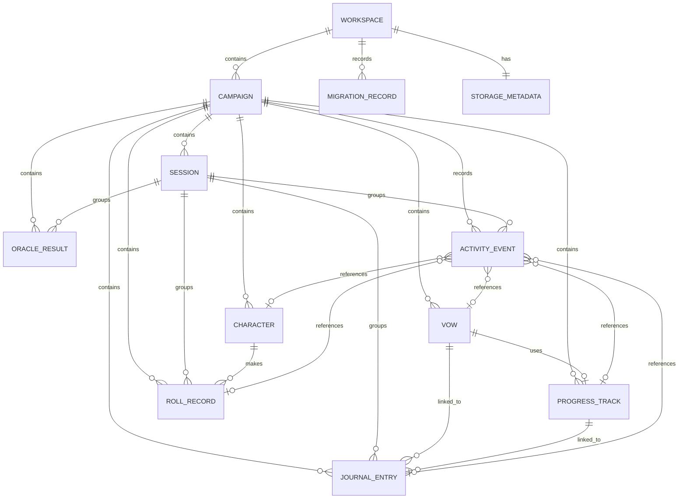

# Ironsworn Digital Companion

## v0.2 — Solo Campaign Depth: Data Model / Domain Model Addendum

*Version 0.2 | Draft | Prepared for the Ironsworn Project*

| Field | Value |
|---|---|
| Document owner | Product Owner / Project Lead |
| Parent document | Ironsworn Digital Companion Data Model / Domain Model Specification v0.1 |
| Related documents | v0.2 Business and Scope Addendum; v0.2 Functional Requirements Supplement; v0.2 UX Requirements Addendum; v0.2 Acceptance Criteria / Test Plan |
| Target release | v0.2 — Solo Campaign Depth |
| Status | Draft for review |

---

## 1. Purpose

This addendum updates the logical domain model for **v0.2 — Solo Campaign Depth**.

The v0.1 specification already introduced `Workspace`, `Campaign`, `Session`, character, vow, progress, roll, oracle, journal, provenance, import, and export concepts. v0.2 promotes campaign and session from future-safe logical containers into first-class product capabilities and strengthens the model for:

- Multiple visible campaigns.
- Explicit active-campaign selection.
- Session lifecycle and linked activity.
- Returning-player context.
- Versioned backup export.
- Validated import and atomic restore.
- Schema migration and corrupted-data recovery.
- Safe history and correction behavior.

This document supplements the v0.1 model. Unchanged v0.1 entities and rules remain valid.

---

## 2. Modeling Principles for v0.2

| ID | Principle | Meaning |
|---|---|---|
| V2-DMP-01 | Campaign ownership is mandatory | Every durable gameplay record belongs to exactly one campaign. |
| V2-DMP-02 | Session linkage is optional | Records may be created outside an active session, but session-linked records must remain campaign-consistent. |
| V2-DMP-03 | Restore is staged and atomic | Imported data is parsed, migrated, and validated before replacing current state. |
| V2-DMP-04 | Historical records preserve snapshots | Saved rolls, oracle results, and activity retain the values shown when created. |
| V2-DMP-05 | Migration is explicit and versioned | Stored data identifies its schema and passes deterministic migration steps. |
| V2-DMP-06 | Recovery never broad-clears browser data | Reset and repair operations affect only Ironsworn-owned storage. |
| V2-DMP-07 | Activity is supportive, not full event sourcing | The activity log helps continuity and correction but is not the sole source of current state. |
| V2-DMP-08 | User-authored content remains private domain data | Journal, vow, campaign, and summary text are distinct from bundled licensed content. |
| V2-DMP-09 | Local-first remains implementation-neutral | The model supports browser persistence now and a future server-backed repository later. |

---

## 3. Updated Domain Overview

```text
Workspace
├── activeCampaignId
├── Campaign[]
│   ├── Character[]
│   ├── Session[]
│   ├── Vow[]
│   ├── ProgressTrack[]
│   ├── JournalEntry[]
│   ├── RollRecord[]
│   ├── OracleResult[]
│   └── ActivityEvent[]
├── StorageMetadata
├── MigrationRecord[]
└── BackupMetadata / ImportReport staging objects
```

### 3.1 Ownership rule

All durable gameplay entities must include `campaignId`, either directly or through a parent whose ownership can be resolved without ambiguity.

Direct `campaignId` fields are recommended for:

- `Character`
- `Session`
- `Vow`
- `ProgressTrack`
- `JournalEntry`
- `RollRecord`
- `OracleResult`
- `ActivityEvent`

Direct ownership simplifies campaign filtering, import validation, deletion, export, and future authorization.

### 3.2 Session rule

`sessionId` is nullable for records that may be created outside active play. When present:

- The session must exist.
- The session and record must have the same `campaignId`.
- Deleting or archiving a session must not silently delete the linked record.

---

## 4. Entity Relationship Update



---

# 5. Updated and New Entities

## 5.1 Workspace — v0.2 updates

### Purpose

Represents the top-level local or account-backed data boundary and tracks the active campaign and schema state.

### Fields

| Field | Type | Required | Notes |
|---|---|---:|---|
| id | UUID/string | Yes | Stable workspace ID. |
| ownerUserId | UUID/string/null | No | Null in local-first mode. |
| activeCampaignId | UUID/string/null | No | Must reference a non-deleted campaign in this workspace. |
| storageMode | enum `StorageMode` | Yes | Expected v0.2 default: `local`. |
| schemaVersion | string | Yes | Current durable schema version. |
| createdAt | datetime | Yes | Creation timestamp. |
| updatedAt | datetime | Yes | Last durable update. |

### Invariants

- `activeCampaignId` must be null when the workspace has no active campaigns.
- `activeCampaignId` cannot reference an archived campaign unless archived campaigns may explicitly be opened read-only.
- Changing the active campaign must not change campaign ownership of child records.
- A workspace export must include the workspace format version even if exporting only one campaign.

---

## 5.2 Campaign — v0.2 updates

### Purpose

A first-class container for one solo campaign and all associated records.

### Fields

| Field | Type | Required | Notes |
|---|---|---:|---|
| id | UUID/string | Yes | Stable campaign ID. |
| workspaceId | UUID/string | Yes | Parent workspace. |
| title | string | Yes | Trimmed, non-empty user-authored title. |
| description | text/null | No | Premise, setting note, or campaign summary. |
| playMode | enum `PlayMode` | Yes | v0.2 default: `solo`. |
| status | enum `CampaignStatus` | Yes | `active`, `archived`, `deleted`. |
| activeCharacterId | UUID/string/null | No | Must reference a character in this campaign. |
| activeSessionId | UUID/string/null | No | Must reference an active/paused session in this campaign. |
| createdAt | datetime | Yes | Creation timestamp. |
| updatedAt | datetime | Yes | Last metadata update. |
| lastActivityAt | datetime | Yes | Last significant campaign activity; may equal creation time. |
| archivedAt | datetime/null | No | Set when archived. |
| deletedAt | datetime/null | No | Set for soft-deletion staging if used. |

### Recommended derived projections

| Projection | Derivation |
|---|---|
| characterCount | Count of non-deleted characters. |
| sessionCount | Count of non-deleted sessions. |
| activeVowCount | Count of active vows. |
| activeTrackCount | Count of active progress tracks. |
| latestSession | Most recent session by `startedAt` or `endedAt`. |
| recentActivity | Bounded query over activity and primary history records. |

### Invariants

- Campaign titles may repeat, but IDs are unique.
- `activeCharacterId` must resolve within the same campaign.
- `activeSessionId` must resolve within the same campaign.
- At most one session may be active or paused per campaign in v0.2.
- Archived campaigns retain their children.
- Permanent deletion must not affect records owned by other campaigns.
- `lastActivityAt` must not move backwards except through a deliberate migration or repair.

### Lifecycle

```text
active → archived → active
active → deleted
archived → deleted
```

`deleted` may represent immediate hard deletion in a local implementation or a short-lived tombstone used to coordinate cleanup. The chosen behavior must be documented and tested.

---

## 5.3 Session — v0.2 updates

### Purpose

Groups play activity into a resumable and reviewable unit.

### Fields

| Field | Type | Required | Notes |
|---|---|---:|---|
| id | UUID/string | Yes | Stable session ID. |
| campaignId | UUID/string | Yes | Parent campaign. |
| title | string/null | No | Optional; UI may display a generated date label. |
| summary | text/null | No | User-authored recap. |
| status | enum `SessionStatus` | Yes | `active`, `paused`, `completed`, `archived`, `deleted`. |
| startedAt | datetime | Yes | Session start time. |
| endedAt | datetime/null | No | Required when completed. |
| lastResumedAt | datetime/null | No | Useful for continuity and diagnostics. |
| createdAt | datetime | Yes | Record creation. |
| updatedAt | datetime | Yes | Last update. |
| archivedAt | datetime/null | No | Optional archive state. |

### Invariants

- `endedAt` is null for `active` and `paused` sessions.
- `endedAt` is required for `completed` sessions.
- `endedAt` must be greater than or equal to `startedAt`.
- A campaign may have no active session.
- A campaign may have only one `active` or `paused` session in v0.2.
- Reopening a completed session must be explicit and record a valid transition.
- Deleting a session must not cascade-delete journal, roll, oracle, vow, or progress records by default.

### Lifecycle

```text
active ↔ paused
active → completed
paused → completed
completed → archived
completed → active      (optional explicit reopen)
archived → completed    (optional restore)
any non-deleted → deleted
```

If the implementation omits `paused`, closing the app while a session is active leaves it `active`; this must be documented consistently in UX and tests.

---

## 5.4 JournalEntry — v0.2 updates

### Added or clarified fields

| Field | Type | Required | Notes |
|---|---|---:|---|
| campaignId | UUID/string | Yes | Mandatory direct ownership. |
| sessionId | UUID/string/null | No | Defaults to current active session when created during play. |
| entryType | enum `JournalEntryType` | Yes | Existing and new types, such as `note`, `session_summary`, `vow`, `roll`, `oracle`, `system_notice`. |
| occurredAt | datetime | Yes | Narrative/history ordering time; defaults to creation time. |
| createdAt | datetime | Yes | Record creation. |
| updatedAt | datetime | Yes | Last edit. |
| linkedEntityRefs | `EntityReference[]` | No | Vow, track, roll, oracle, or character links. |

### Rules

- User-authored text remains editable.
- Session summary text may be stored on `Session.summary`, a linked journal entry, or both, but there must be one authoritative source.
- Deleting a linked entity must not make the journal entry unreadable.
- Saved roll/oracle entries should retain a snapshot rather than relying only on the live source record.

---

## 5.5 RollRecord — v0.2 updates

### Added or clarified fields

| Field | Type | Required | Notes |
|---|---|---:|---|
| campaignId | UUID/string | Yes | Mandatory campaign ownership. |
| sessionId | UUID/string/null | No | Active-session default. |
| characterId | UUID/string/null | No | Character that made the roll. |
| characterNameSnapshot | string/null | No | Historical display stability. |
| moveId | string/null | No | Bundled/custom content reference where applicable. |
| moveNameSnapshot | string/null | No | Preserves displayed label. |
| createdAt | datetime | Yes | Roll time. |
| amendmentOfId | UUID/string/null | No | Optional explicit correction relationship. |
| correctionNote | text/null | No | User-authored explanation. |

### Rules

- Completed dice values and resolved classifications are immutable.
- A correction creates an amendment or a new record; it does not silently rewrite history.
- Deleting a character does not invalidate the roll snapshot.
- Roll records remain campaign-owned even when session linkage is absent.

---

## 5.6 OracleResult — v0.2 clarification

If oracle outcomes are persisted separately from `RollRecord`, the following fields are required:

| Field | Type | Required | Notes |
|---|---|---:|---|
| id | UUID/string | Yes | Stable ID. |
| campaignId | UUID/string | Yes | Mandatory ownership. |
| sessionId | UUID/string/null | No | Active-session default. |
| oracleTableId | string/null | No | Content reference. |
| oracleTableNameSnapshot | string | Yes | Historical label. |
| rolledValue | integer/null | No | Present for rolled outcomes. |
| resultTextSnapshot | text | Yes | Approved or user-authored displayed result at the time. |
| contentSourceId | string/null | No | Provenance reference. |
| createdAt | datetime | Yes | Result time. |

Oracle results must not depend on a content definition remaining installed in order to render historical output.

---

## 5.7 ActivityEvent — new in v0.2

### Purpose

Provides bounded recent activity, session continuity, and optional correction context without making the application fully event-sourced.

### Fields

| Field | Type | Required | Notes |
|---|---|---:|---|
| id | UUID/string | Yes | Stable ID. |
| campaignId | UUID/string | Yes | Parent campaign. |
| sessionId | UUID/string/null | No | Session context. |
| eventType | enum `ActivityEventType` | Yes | See enumeration catalog. |
| actorType | enum `ActivityActorType` | Yes | v0.2 normally `player` or `system`. |
| entityType | enum `EntityType` | Yes | Affected object type. |
| entityId | UUID/string/null | No | May become unavailable after deletion. |
| entityLabelSnapshot | string/null | No | Stable user-facing context. |
| summary | string | Yes | Project-original or user-authored concise description. |
| beforeSnapshot | JSON/null | No | Only for approved reversible fields; avoid private bulk copies. |
| afterSnapshot | JSON/null | No | Only for approved reversible fields. |
| isUndoable | boolean | Yes | False by default. |
| undoneAt | datetime/null | No | Set when successfully undone. |
| createdAt | datetime | Yes | Activity time. |
| expiresAt | datetime/null | No | Optional retention for undo snapshots. |

### Recommended event types

- `campaign_created`
- `campaign_renamed`
- `campaign_archived`
- `campaign_restored`
- `session_started`
- `session_resumed`
- `session_completed`
- `journal_created`
- `journal_updated`
- `roll_created`
- `oracle_result_created`
- `vow_created`
- `vow_status_changed`
- `progress_marked`
- `progress_corrected`
- `momentum_changed`
- `character_status_changed`
- `backup_exported` — metadata only, no private payload
- `backup_restored`
- `migration_completed`

### Rules

- Activity events support display and limited undo; they do not replace the current entity state.
- Private journal text should not be duplicated into `summary`, `beforeSnapshot`, or logs unnecessarily.
- `beforeSnapshot` and `afterSnapshot` must use allowlisted shapes rather than unrestricted entity serialization.
- Activity events may be pruned according to a documented retention policy, but required historical roll/journal/session records must remain.
- An activity event may retain a label snapshot after its entity is deleted.

---

## 5.8 StorageMetadata — new or expanded in v0.2

### Purpose

Tracks durable storage state independently of campaign content.

| Field | Type | Required | Notes |
|---|---|---:|---|
| workspaceId | UUID/string | Yes | One-to-one with workspace. |
| schemaVersion | string | Yes | Durable data schema. |
| applicationVersion | string/null | No | Version that last wrote successfully. |
| lastSuccessfulSaveAt | datetime/null | No | Used for user-facing save confidence. |
| lastMigrationId | UUID/string/null | No | Latest committed migration. |
| storageRevision | integer | Yes | Incrementing coordinated-write revision. |
| createdAt | datetime | Yes | Metadata creation. |
| updatedAt | datetime | Yes | Last metadata update. |

### Rules

- `storageRevision` increments only after a successful coordinated save.
- Save-status UI must not update `lastSuccessfulSaveAt` before persistence confirms success.
- Storage metadata must not include user-authored journal content.

---

## 5.9 MigrationRecord — new in v0.2

### Purpose

Records successful and failed schema migration attempts without becoming a substitute for diagnostics.

| Field | Type | Required | Notes |
|---|---|---:|---|
| id | UUID/string | Yes | Stable migration record ID. |
| workspaceId | UUID/string | Yes | Target workspace. |
| fromVersion | string | Yes | Input schema. |
| toVersion | string | Yes | Target schema. |
| migrationKey | string | Yes | Stable code identifier. |
| status | enum `MigrationStatus` | Yes | `started`, `completed`, `failed`, `rolled_back`. |
| startedAt | datetime | Yes | Start time. |
| completedAt | datetime/null | No | Completion or failure time. |
| errorCode | string/null | No | Safe diagnostic identifier. |
| warningCodes | string[] | Yes | Non-private warning identifiers. |
| sourceRevision | integer/null | No | Input storage revision. |
| targetRevision | integer/null | No | Committed revision. |

### Rules

- Migration records must not contain full private data payloads.
- A failed migration does not update the workspace schema version.
- A completed migration requires validated output and a successful persistence commit.

---

## 5.10 BackupPackageV2 — import/export DTO

### Purpose

Defines the portable backup contract. It is a transfer object, not a normal persisted domain entity.

```typescript
interface BackupPackageV2 {
  format: 'ironsworn-digital-companion-backup';
  formatVersion: '2';
  schemaVersion: string;
  exportedAt: string;
  applicationVersion?: string;
  scope: BackupScope;
  workspace?: WorkspaceExport;
  campaigns: CampaignExport[];
  manifest: BackupManifest;
  checksum?: string;
}
```

### Required manifest counts

- Campaigns.
- Characters.
- Sessions.
- Vows.
- Progress tracks and events.
- Journal entries.
- Roll records.
- Oracle results.
- Activity events if included by policy.
- User-defined content references if within scope.

### Rules

- The package includes only application-owned data in the chosen export scope.
- User-authored Unicode and multiline text must round-trip.
- `formatVersion` and `schemaVersion` are distinct: the outer backup contract may remain stable while internal schema evolves.
- Content definitions should not be redistributed unless their inclusion is approved. Stable references and provenance metadata may be exported instead.
- A checksum may detect accidental corruption but is not a security signature unless a separate signing design is adopted.

---

## 5.11 ImportReport — staging DTO

### Purpose

Summarizes parse, compatibility, migration, and validation results before restore confirmation.

| Field | Type | Required | Notes |
|---|---|---:|---|
| importId | UUID/string | Yes | Ephemeral staging ID. |
| fileName | string | Yes | Sanitized display value. |
| formatVersion | string/null | No | Null if not parseable. |
| schemaVersion | string/null | No | Input schema. |
| targetSchemaVersion | string | Yes | Current application schema. |
| status | enum `ImportValidationStatus` | Yes | `valid`, `valid_with_warnings`, `invalid`, `incompatible`. |
| scope | enum `BackupScope`/null | No | Detected export scope. |
| campaignSummaries | `ImportCampaignSummary[]` | Yes | Titles, IDs, and record counts. |
| blockingErrors | `ImportMessage[]` | Yes | Prevent confirmation. |
| warnings | `ImportMessage[]` | Yes | Non-blocking. |
| migrationPlan | `MigrationStepSummary[]` | Yes | Required steps. |
| stagedData | internal reference/null | No | Must not be rendered directly. |

### Rules

- Import preview is built from this report, not from unvalidated raw data.
- `stagedData` is not committed until explicit confirmation.
- Cancelling import destroys staging data without altering current state.
- Error messages use safe codes and locations; they should not echo entire private fields.

---

# 6. Enumeration Catalog

## 6.1 CampaignStatus

```text
active
archived
deleted
```

## 6.2 SessionStatus

```text
active
paused
completed
archived
deleted
```

`paused` may be omitted if the product decision uses `active` for sessions left open between app visits.

## 6.3 ActivityActorType

```text
player
system
migration
import
```

## 6.4 ActivityEventType

Use the stable event keys listed in the `ActivityEvent` section. Event keys should not embed user text.

## 6.5 EntityType

```text
campaign
character
session
vow
progress_track
journal_entry
roll_record
oracle_result
workspace
```

## 6.6 MigrationStatus

```text
started
completed
failed
rolled_back
```

## 6.7 BackupScope

```text
campaign
workspace
```

## 6.8 ImportValidationStatus

```text
valid
valid_with_warnings
invalid
incompatible
```

## 6.9 RestoreMode

```text
replace_workspace
replace_campaign
merge_campaigns
```

v0.2 may support only `replace_workspace` and/or `replace_campaign`. Unsupported values must not appear in UI.

---

# 7. Cross-Entity Invariants

| ID | Invariant |
|---|---|
| V2-INV-001 | Every durable gameplay record resolves to exactly one campaign. |
| V2-INV-002 | A session-linked record and its session have the same `campaignId`. |
| V2-INV-003 | `Workspace.activeCampaignId` references an existing non-deleted campaign in that workspace. |
| V2-INV-004 | `Campaign.activeCharacterId` references a character in that campaign. |
| V2-INV-005 | `Campaign.activeSessionId` references an active or paused session in that campaign. |
| V2-INV-006 | At most one active/paused session exists per campaign. |
| V2-INV-007 | Archived campaigns and sessions retain child records. |
| V2-INV-008 | Deleting a session does not delete linked journal, roll, oracle, vow, or progress records silently. |
| V2-INV-009 | Completed roll dice and result snapshots are immutable. |
| V2-INV-010 | Import validation completes before restore mutates current data. |
| V2-INV-011 | A failed migration or restore preserves the last valid committed storage revision. |
| V2-INV-012 | Reset affects only Ironsworn-owned keys and records. |
| V2-INV-013 | Historical records render without requiring the current existence of linked entities or content definitions. |
| V2-INV-014 | User-authored text remains separate from bundled content and provenance records. |

---

# 8. Query and Repository Requirements

The application/domain repository layer should expose campaign-scoped operations rather than requiring UI code to filter global arrays repeatedly.

Recommended repository operations:

```typescript
interface CampaignRepository {
  listCampaigns(status?: CampaignStatus): Promise<CampaignSummary[]>;
  getCampaign(id: string): Promise<Campaign | null>;
  createCampaign(input: CreateCampaignInput): Promise<Campaign>;
  updateCampaign(id: string, patch: UpdateCampaignPatch): Promise<Campaign>;
  archiveCampaign(id: string): Promise<void>;
  restoreCampaign(id: string): Promise<void>;
  deleteCampaign(id: string): Promise<void>;
  setActiveCampaign(id: string | null): Promise<void>;
}

interface SessionRepository {
  listSessions(campaignId: string, query?: SessionQuery): Promise<Session[]>;
  getSession(campaignId: string, sessionId: string): Promise<Session | null>;
  startSession(campaignId: string, input?: StartSessionInput): Promise<Session>;
  pauseSession(campaignId: string, sessionId: string): Promise<Session>;
  resumeSession(campaignId: string, sessionId: string): Promise<Session>;
  completeSession(campaignId: string, sessionId: string, input?: CompleteSessionInput): Promise<Session>;
}
```

History queries must require `campaignId` and should support bounded pagination:

```typescript
interface HistoryQuery {
  campaignId: string;
  sessionId?: string;
  types?: HistoryRecordType[];
  linkedEntity?: EntityReference;
  dateFrom?: string;
  dateTo?: string;
  searchText?: string;
  cursor?: string;
  limit: number;
}
```

---

# 9. Persistence and Coordinated Writes

## 9.1 Storage aggregate

A local-first implementation may store one versioned workspace aggregate or normalized stores. Either approach must provide coordinated behavior for ownership-sensitive operations.

Operations requiring coordinated save/staging include:

- Creating a campaign and setting it active.
- Starting a session and assigning `activeSessionId`.
- Completing a session and clearing `activeSessionId`.
- Archiving/deleting the active campaign and selecting a replacement.
- Import replacement.
- Schema migration.
- Reset.

## 9.2 Revision behavior

A monotonically increasing `storageRevision` is recommended.

- Read current revision.
- Build and validate next state.
- Persist next state.
- Confirm persistence.
- Increment revision and update `lastSuccessfulSaveAt`.

This is not a substitute for a database transaction in a future server-backed implementation, but it provides a testable local coordination contract.

---

# 10. Migration Specification

## 10.1 Required v0.1 → v0.2 migration outcomes

- Ensure a valid `Workspace` exists.
- Ensure at least one `Campaign` exists when v0.1 gameplay data exists.
- Assign existing characters, vows, tracks, journal entries, rolls, and oracle results to the migrated campaign.
- Preserve stable IDs and timestamps where present.
- Generate IDs only for records lacking valid IDs.
- Do not fabricate session links for historical records unless the v0.1 record already contains reliable session information.
- Initialize `Campaign.lastActivityAt` from the most recent valid child timestamp or campaign creation time.
- Initialize `Workspace.activeCampaignId` to the migrated campaign when valid.
- Initialize storage metadata and schema version.
- Validate all cross-entity invariants before commit.

## 10.2 Migration pipeline

```text
Read raw v0.1 data
  ↓
Create immutable safety snapshot
  ↓
Parse and normalize legacy structures
  ↓
Apply deterministic migration steps
  ↓
Validate v0.2 entities and relationships
  ↓
Stage coordinated v0.2 state
  ↓
Persist and verify
  ↓
Commit schema/revision metadata
```

## 10.3 Failure behavior

On failure:

- Do not update the stored schema version.
- Do not delete the original v0.1 data.
- Record a safe migration failure code.
- Offer retry, backup/import, recovery export, or reset according to product capability.
- Avoid logging full journal or campaign text.

---

# 11. Import / Restore Transaction Model

```text
File selected
  ↓
Parse outer backup envelope
  ↓
Validate format and compatibility
  ↓
Migrate staged data if required
  ↓
Validate all entities and invariants
  ↓
Create ImportReport and preview
  ↓
User confirms restore mode
  ↓
Create current-state safety snapshot
  ↓
Persist staged replacement atomically
  ↓
Verify load and invariants
  ↓
Commit active campaign and storage metadata
```

If any step after confirmation fails, restore the last valid revision or leave it untouched.

Merge restore should remain out of scope until duplicate IDs, content references, linked histories, and ownership conflicts have deterministic rules.

---

# 12. Deletion and Archival

## 12.1 Campaign archive

Archive changes campaign status and timestamps only. Children remain unchanged and exportable.

## 12.2 Campaign permanent deletion

Permanent deletion may cascade only to records whose `campaignId` equals the deleted campaign ID. The implementation must enumerate owned record types rather than relying on broad storage clearing.

## 12.3 Session deletion

Preferred v0.2 behavior:

- Archive sessions rather than permanently delete them.
- If deletion is offered, unlink child records by setting `sessionId = null` or cancel the operation.
- Do not delete linked journal entries, rolls, or oracle results by default.

## 12.4 Reset

Reset removes:

- Workspace domain records.
- Campaign-owned records.
- App-specific storage metadata.
- App-specific UI preference keys only where documented.

Reset must not call `localStorage.clear()` or remove keys not owned by the application.

---

# 13. Privacy and Logging

- Campaign titles, summaries, journal entries, vows, and notes are private user-authored data.
- Diagnostic logs should use record IDs, counts, schema versions, and safe error codes.
- Full backup contents must not be logged.
- Import validation errors should identify paths or record IDs without echoing entire text fields.
- Activity summaries should avoid copying large journal bodies.
- Export UI must warn that backup files may contain private notes.

---

# 14. Validation Checklist

A v0.2 workspace is valid when:

- Schema and format versions are supported.
- Workspace ID is present.
- Active campaign reference is null or valid.
- Every durable gameplay record has a valid campaign owner.
- Session links are null or campaign-consistent.
- Active character and active session references are campaign-consistent.
- Campaign and session lifecycle fields are coherent.
- Required enums contain supported values.
- Record IDs are unique within their entity namespace.
- Vow/progress relationships remain valid.
- Roll and oracle snapshots contain required historical display fields.
- Timestamps parse and ordering invariants pass.
- Unknown/restricted bundled content is not installed through backup restore.

---

# 15. Acceptance Criteria

The data-model addendum is satisfied when:

- Multiple campaigns can coexist without ownership ambiguity.
- Every durable v0.2 gameplay record resolves to one campaign.
- Session lifecycle states and invariants are implemented and tested.
- Historical roll and oracle records render from snapshots.
- Recent activity can be queried without becoming the authoritative current-state store.
- Backup packages are versioned and contain complete required relationships.
- Import produces a validation report before mutation.
- Restore and migration are atomic from the user's perspective.
- Failed restore or migration preserves the last valid data revision.
- Reset removes only Ironsworn-owned data.
- Existing supported v0.1 fixtures migrate to valid v0.2 structures.
- Privacy-sensitive text is not exposed in routine diagnostics.

---

# 16. Open Questions

1. Will v0.2 export support campaign scope, workspace scope, or both?
2. Will session `paused` be distinct from `active`?
3. How long are `ActivityEvent` undo snapshots retained?
4. Are activity events included in backups, or regenerated only for recent-context views?
5. Will permanent campaign deletion be immediate or use a tombstone/grace period?
6. Is campaign duplication included in v0.2?
7. Should checksums be included for accidental corruption detection?
8. What storage revision mechanism best fits the current persistence implementation?
9. Is raw recovery export allowed when normal domain validation fails?
10. Which legacy schema versions must remain supported after v0.2?

---

# 17. Approval

| Role | Name | Decision | Date |
|---|---|---|---|
| Product Owner |  | Pending |  |
| Development Lead |  | Pending |  |
| QA / Test Lead |  | Pending |  |
| Data / Architecture Reviewer |  | Pending |  |
| Content / Licensing Reviewer |  | Pending |  |
