# Ironsworn Digital Companion

## v0.2 — Solo Campaign Depth: UX Flow / Wireframe Requirements Addendum

*Version 0.2 | Draft | Prepared for the Ironsworn Project*

| Field | Value |
|---|---|
| Document owner | Product Owner / Project Lead |
| Parent document | Ironsworn Digital Companion UX Flow / Wireframe Requirements v0.1 |
| Related documents | v0.2 Business and Scope Addendum; v0.2 Functional Requirements Supplement; v0.2 Data Model Addendum; v0.2 Acceptance Criteria / Test Plan |
| Target release | v0.2 — Solo Campaign Depth |
| Status | Draft for review |

---

## 1. Purpose

This addendum defines the user-experience flows and low-fidelity wireframe requirements for **v0.2 — Solo Campaign Depth**.

It extends the v0.1 UX requirements. Existing character, move, tracker, oracle, vow, journal, onboarding, navigation, responsive, accessibility, and licensing requirements remain valid unless this addendum explicitly changes them.

v0.2 should make the application suitable for long-running solo campaigns while keeping campaign and session administration lightweight. The player should spend most of their time playing, not managing records.

---

## 2. UX Outcomes

The v0.2 experience should answer five questions quickly:

1. **Which campaign am I in?**
2. **Where did I leave off?**
3. **Is a session currently active?**
4. **How do I protect or restore my data?**
5. **How do I find an older event, note, roll, or session?**

The release succeeds when a returning player can reopen the application, recognize the active campaign, understand recent context, resume play, and trust that their campaign can be backed up and recovered.

---

## 3. UX Principles for v0.2

| ID | Principle | UX meaning |
|---|---|---|
| V2-UXP-01 | Campaign context is always clear | The active campaign is visible before the player changes state. |
| V2-UXP-02 | Sessions are lightweight | Starting play should require at most one deliberate action; titles and summaries are optional. |
| V2-UXP-03 | Resume before administer | Returning-player context and active play actions take priority over campaign settings. |
| V2-UXP-04 | Data safety is explicit | Export, import, overwrite, reset, archive, and delete actions explain scope and consequences. |
| V2-UXP-05 | Destructive actions are separated | Dangerous controls do not look or behave like routine play actions. |
| V2-UXP-06 | History remains navigable | Filters and session groupings reduce accumulated campaign noise. |
| V2-UXP-07 | Empty and error states are distinct | No campaign, no session, no history results, loading failure, migration failure, and corruption are not shown as the same state. |
| V2-UXP-08 | Mobile remains a first-class use case | Campaign switching, session actions, filters, and recovery remain operable on narrow screens. |
| V2-UXP-09 | Privacy is visible | Backup files and recovery exports are described as potentially containing private campaign notes. |
| V2-UXP-10 | Fiction-first remains central | Session summaries and recent activity support player recollection without generating narrative interpretations. |

---

## 4. Updated Information Architecture

### 4.1 Primary navigation

Existing primary areas remain:

- Play
- Character
- Roll
- Tracks
- Oracles
- Journal
- Settings / About

v0.2 adds campaign and session access without requiring two new permanent primary-navigation destinations.

Recommended placement:

- **Campaign switcher:** app shell header or sidebar identity area.
- **Campaign management:** switcher menu plus a dedicated Campaigns screen.
- **Session controls:** Play dashboard.
- **Session history:** Journal/History secondary navigation and campaign details.
- **Backup and restore:** Settings → Data Management.

### 4.2 Secondary navigation additions

| Area | v0.2 sections |
|---|---|
| Campaigns | Active, Archived, Create Campaign, Campaign Details |
| Play | Resume/Start Session, Current Session, Last Session, Recent Activity |
| Journal / History | All, Current Session, Sessions, Notes, Rolls, Oracles, Vows/Tracks, Archived |
| Settings | Data Management, Export Backup, Import/Restore, Storage Information, Reset Application |

### 4.3 Desktop shell update

Recommended desktop shell:

```text
┌──────────────────────────────────────────────────────────────────────────┐
│ Product / Campaign switcher                    Save status / Settings    │
├──────────────┬───────────────────────────────────────┬───────────────────┤
│ Navigation   │ Main workspace                        │ Utility rail      │
│              │                                       │                   │
│ Play         │ Active campaign and session content   │ Character status  │
│ Character    │                                       │ Quick roll        │
│ Roll         │                                       │ Active vows       │
│ Tracks       │                                       │ Recent result     │
│ Oracles      │                                       │                   │
│ Journal      │                                       │                   │
└──────────────┴───────────────────────────────────────┴───────────────────┘
```

The campaign switcher should show the active campaign title and a clear affordance to change it. It should not rely on a small unlabeled icon alone.

### 4.4 Mobile shell update

Recommended mobile shell:

```text
┌────────────────────────────────────┐
│ Campaign name ▾       Save status  │
├────────────────────────────────────┤
│ Current view                        │
│                                     │
│                                     │
├────────────────────────────────────┤
│ Play Character Roll Tracks Journal │
└────────────────────────────────────┘
```

Selecting the campaign name opens a bottom sheet or dedicated Campaigns screen. The control must remain reachable without occupying excessive vertical space.

---

# 5. Core User Flows

## 5.1 Flow A — First v0.2 launch and legacy migration

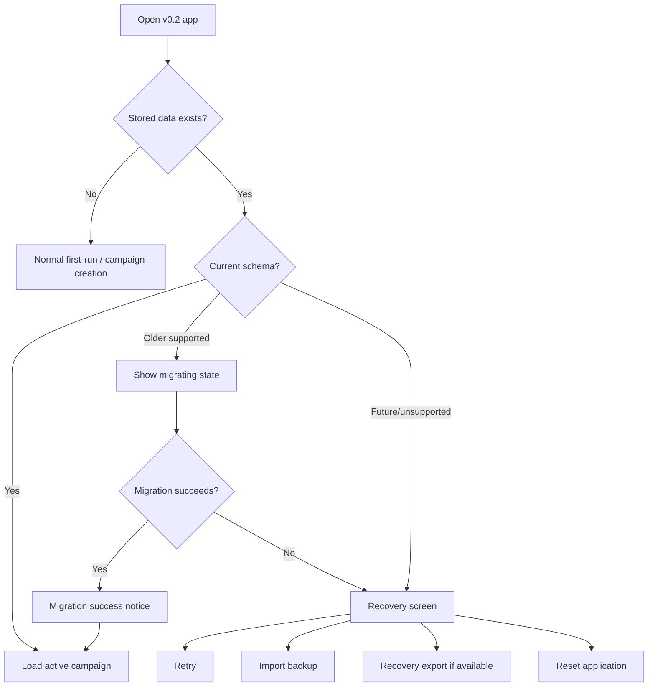

### Requirements

- Migration should normally be automatic for a supported v0.1 save.
- A brief progress state is sufficient; do not require the user to approve routine safe migration.
- Failure must not be presented as an empty new installation.
- Recovery actions must explain whether current stored data will remain untouched.
- Reset must be visually and spatially separated from Retry and Import Backup.

---

## 5.2 Flow B — No campaign to first campaign

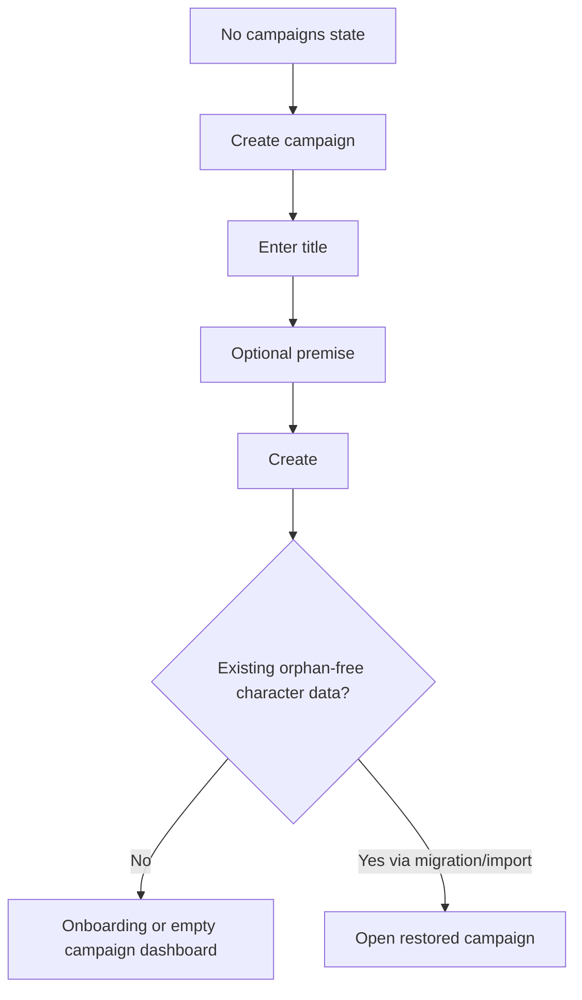

### Requirements

- Primary action: **Create campaign**.
- Secondary action: **Import backup**.
- Campaign title is the only required field.
- The form should not require play mode, dates, detailed setting metadata, or a session title.
- After creation, the campaign becomes active and the user lands on Play or onboarding according to campaign state.

---

## 5.3 Flow C — Switch campaigns

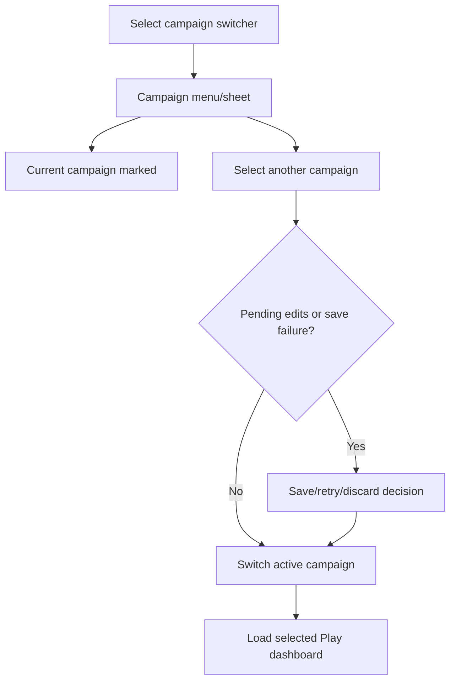

### Requirements

- The current campaign is clearly marked.
- Archived campaigns do not appear in the default quick switch list unless explicitly included.
- Campaign list entries should show title and optional last-activity context.
- Switching must not occur behind an unresolved import, destructive confirmation, or failed save.
- The destination should restore the selected campaign's last useful view or default to Play.
- A screen-reader announcement should identify the newly active campaign.

---

## 5.4 Flow D — Start or resume a session

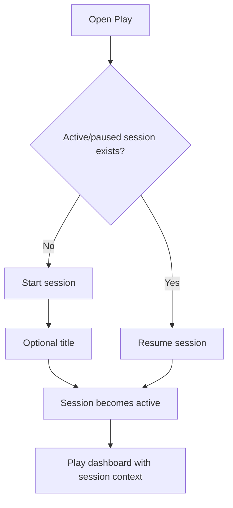

### Requirements

- **Start session** is a prominent Play action when no session is active.
- Starting a session should not require a form if the title is omitted; one tap/click may create a dated session.
- If a title form is shown, it should include a clear **Start without title** or equivalent path.
- When a session exists, the primary action becomes **Resume session**.
- Current-session context should show start time and optional title without dominating the page.

---

## 5.5 Flow E — Pause/leave or complete a session

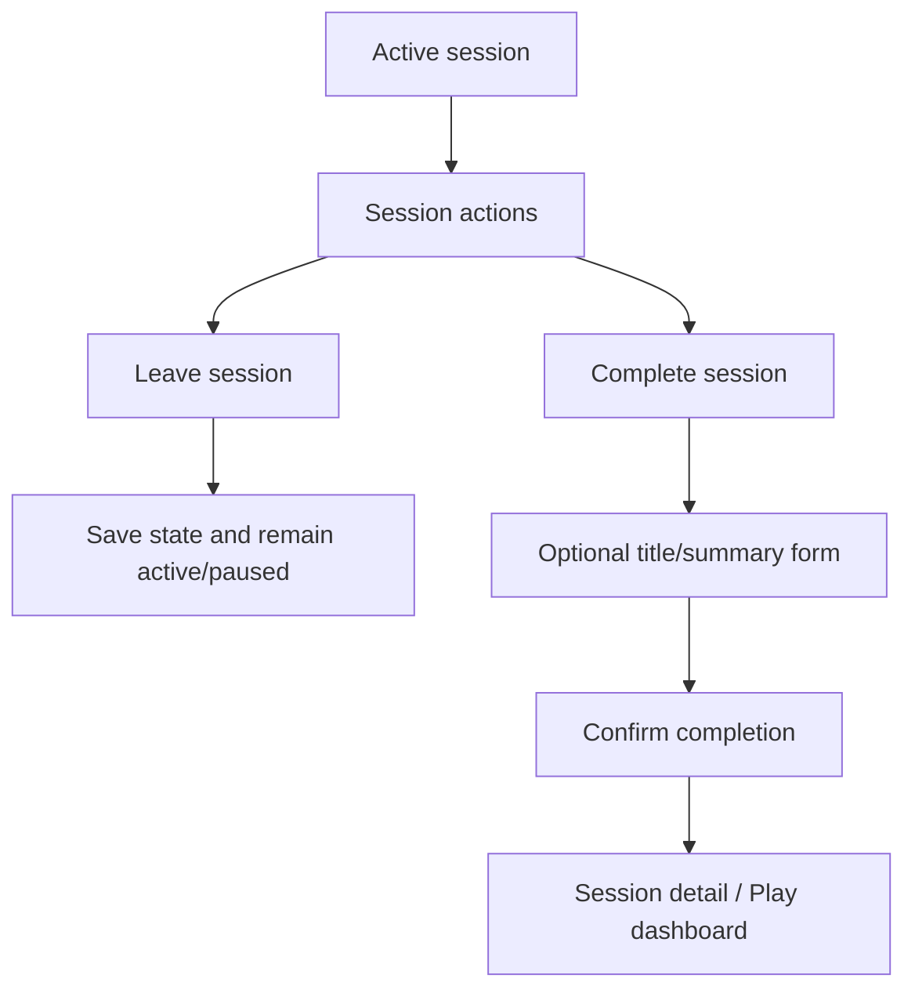

### Requirements

- Navigating away from Play is not the same as completing a session.
- Completion is deliberate and named clearly.
- Session summary is optional.
- The completion form may show prompts such as “What changed?” but must not generate or require narrative prose.
- The form should surface save failure before confirming completion.
- Completion returns to a useful campaign state: last-session summary, session detail, or Play dashboard.

---

## 5.6 Flow F — Resume a campaign after time away

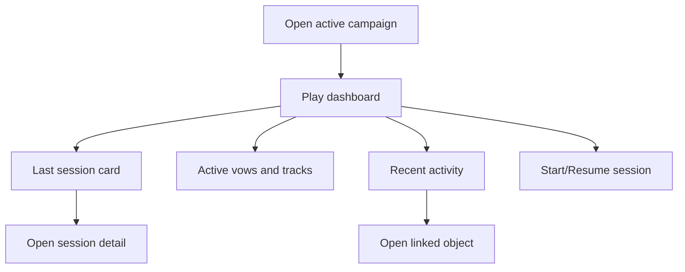

### Requirements

The returning-player section should prioritize:

1. Active/paused session, if present.
2. Last completed session.
3. Active vows and tracks.
4. Recent journal/activity.
5. Common play actions.

The dashboard should not display every historical record. Use bounded lists and **View all** links.

---

## 5.7 Flow G — Browse session history

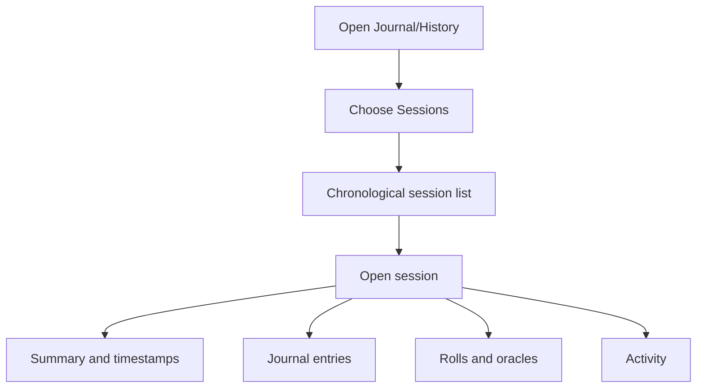

### Requirements

- Sessions should have a sensible generated label when untitled, such as a localized date.
- Completed, active, paused, and archived states must be distinguishable by text, not color alone.
- Session detail should group related records while avoiding duplicate full rendering of the same content.
- Empty session sections should be omitted or use compact empty states.
- Session deletion should not be a primary action on the detail page.

---

## 5.8 Flow H — Filter journal and history

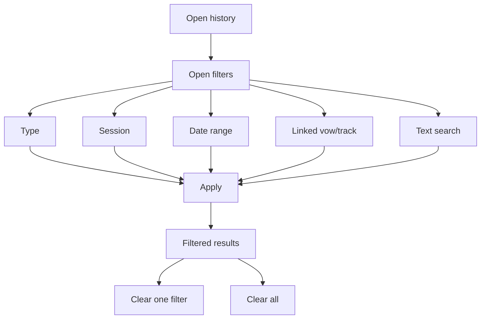

### Requirements

- Applied filters are visible as chips, summary text, or equivalent controls.
- Filters must have a **Clear all** action.
- Mobile filters should open in a bottom sheet or dedicated filter screen.
- Returning from a history detail should preserve filters where practical.
- No-results state should explain that filters are active.
- Search operates only on the active campaign unless scope is explicitly changed.

---

## 5.9 Flow I — Export backup

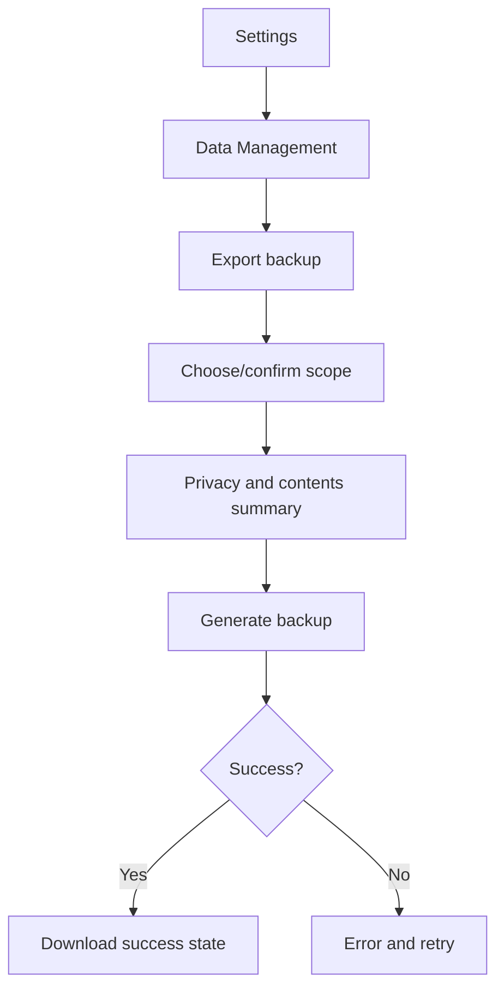

### Requirements

- Export must say whether it includes one campaign or the whole workspace.
- The contents summary should mention characters, sessions, vows, tracks, journal, and history at a high level.
- A privacy notice should state that the file may contain private campaign notes.
- Export is non-destructive and should not require a danger-styled confirmation.
- The success state should identify the generated filename where available.
- Mobile-browser download limitations should be explained accurately.

---

## 5.10 Flow J — Import and restore backup

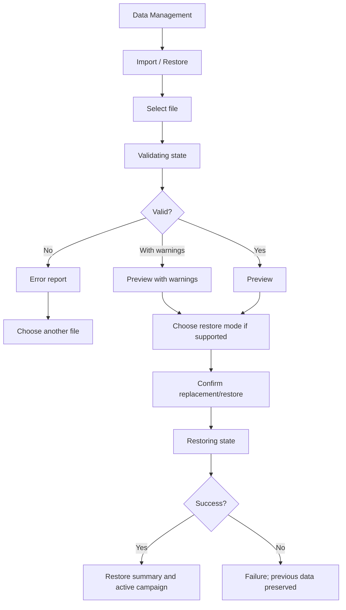

### Requirements

- Selecting a file never immediately changes data.
- Validation state should block duplicate submission.
- Preview includes file/version, scope, campaign titles/counts, record counts, and warnings.
- Replacement language must be explicit, e.g. **Replace current workspace** rather than **Continue**.
- If merge is unsupported, do not show or imply it.
- Confirmation names the affected scope.
- Restore progress should not offer navigation that can interrupt the transaction.
- Failure state confirms that previous valid data was preserved.
- Errors should be downloadable/copyable only if they do not expose private content unnecessarily.

---

## 5.11 Flow K — Archive and restore campaign

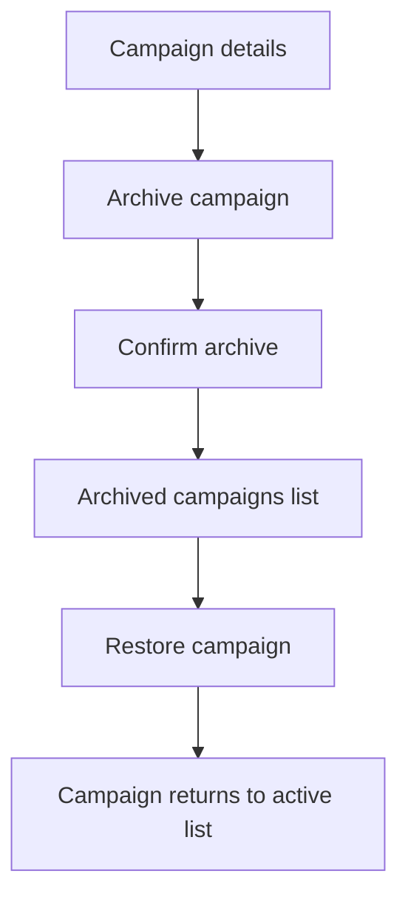

### Requirements

- Archive is reversible and visually less severe than permanent deletion.
- Confirmation explains that data is retained.
- If archiving the active campaign, the app explains what becomes active next.
- Archived campaigns are accessible through an explicit filter or tab.

---

## 5.12 Flow L — Permanently delete campaign

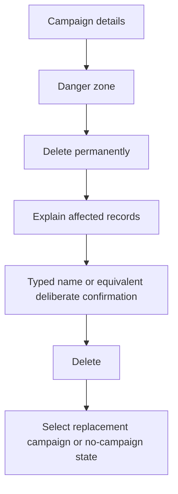

### Requirements

- Permanent deletion belongs in a **Danger zone** or similarly separated area.
- The dialog lists the campaign title and categories of records affected.
- Use a high-friction confirmation, such as entering the campaign title or a two-step confirmation.
- Cancel is the default focus where platform conventions permit.
- The app must not use language that suggests the action is recoverable unless it is.

---

## 5.13 Flow M — Corrupted-data recovery

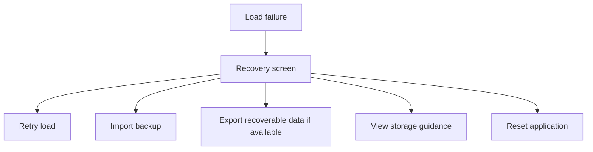

### Requirements

- Do not display the normal empty campaign onboarding state.
- Explain that stored data could not be loaded and has not been intentionally deleted.
- Prioritize Retry and Import Backup.
- Reset is destructive and separated visually.
- Recovery export must be labelled as raw/recovery data if it is not a normal validated backup.
- Technical details should be collapsed or secondary to plain-language guidance.

---

# 6. Screen-Level Requirements and Low-Fidelity Wireframes

## 6.1 Campaign switcher — desktop

```text
┌────────────────────────────────────┐
│ Current campaign                   │
│ The Ashen Road                 ▾   │
├────────────────────────────────────┤
│ ✓ The Ashen Road                   │
│   Last played today                │
│ The Broken Crown                   │
│   Last played 12 Jul               │
├────────────────────────────────────┤
│ View all campaigns                 │
│ + Create campaign                  │
└────────────────────────────────────┘
```

Requirements:

- Current item uses a check mark plus text, not highlight color alone.
- Quick list is bounded.
- **View all campaigns** opens the full management screen.
- Campaign creation is available but visually secondary to switching.

---

## 6.2 Campaigns screen

```text
Campaigns                                      [+ New campaign]

[Active] [Archived]

┌──────────────────────────────────────────────────────────┐
│ The Ashen Road                         Last played today  │
│ A hunter follows a vow into the Deep Wilds.              │
│ 1 character · 7 sessions · 3 active vows                 │
│ [Open] [More actions]                                    │
└──────────────────────────────────────────────────────────┘

┌──────────────────────────────────────────────────────────┐
│ The Broken Crown                       Last played 12 Jul │
│ 1 character · 2 sessions · 1 active vow                  │
│ [Open] [More actions]                                    │
└──────────────────────────────────────────────────────────┘
```

Requirements:

- Title is the primary identification.
- Description and counts are optional enhancements.
- Archive/delete should live under **More actions** or campaign details, not beside **Open** as equally weighted actions.
- Empty archived view explains how campaigns become archived.

---

## 6.3 Create campaign screen/modal

```text
Create campaign

Campaign title *
[                                              ]

Premise or notes (optional)
[                                              ]
[                                              ]

[Cancel]                              [Create campaign]
```

Requirements:

- Title receives initial focus.
- Inline validation appears after submit or meaningful interaction.
- Entering a premise is optional.
- Avoid lengthy setup steps; character/onboarding can follow separately.

---

## 6.4 Play dashboard — no active session

```text
The Ashen Road

┌──────────────────────────────────────────────────────┐
│ Last session · 14 July                              │
│ “Reached Greywatch, but the caravan is missing.”    │
│ [Review session]                                    │
└──────────────────────────────────────────────────────┘

[Start new session]

Active vows                 Active tracks
- Find the lost caravan     - Journey to Frostwood
- Protect Greywatch         - Broken Gate battle

Recent activity
- Marked progress on Find the lost caravan
- Weak hit on Gather Information
- Added journal note

[View full history]
```

Requirements:

- **Start new session** is primary.
- Last-session summary is shown only when available.
- Recent activity uses a bounded list.
- Existing quick-roll and journal actions remain accessible.

---

## 6.5 Play dashboard — active session

```text
The Ashen Road

Session active · Started 21:14
Session 8 — Greywatch

[Continue session]     [Complete session]     [Session actions]

Character status / active vows / tracks / recent results...
```

Requirements:

- **Continue session** or the active play content is primary.
- **Complete session** is visible but not danger-styled like deletion.
- Session actions may include rename, pause/leave, and view details.

---

## 6.6 Session completion dialog

```text
Complete session

Title (optional)
[ Session 8 — Greywatch                         ]

What changed? (optional)
[ Reached Greywatch and discovered the caravan ]
[ vanished beyond the northern ridge.           ]

Session started: 21:14
Current time: 22:37

[Keep playing]                         [Complete session]
```

Requirements:

- **Keep playing** is a clear cancel-equivalent action.
- Summary helper text must be project-original.
- Completion must not infer vow outcomes or progress changes.

---

## 6.7 Session history list

```text
Sessions

[All statuses ▾] [Newest first ▾]

14 Jul 2026
┌──────────────────────────────────────────────┐
│ Session 8 — Greywatch        Completed      │
│ 21:14–22:37                                  │
│ Reached Greywatch and found the caravan...  │
│ 5 rolls · 2 oracle results · 4 notes         │
└──────────────────────────────────────────────┘
```

Requirements:

- Untitled sessions use localized date/time labels.
- Avoid relying on dense tables on mobile.
- Counts are optional, but should be accurate if shown.

---

## 6.8 History filter drawer — mobile

```text
Filters

Type
[✓ Notes] [✓ Rolls] [✓ Oracles] [ Vows/Tracks ]

Session
[All sessions ▾]

Date
[From] [To]

Linked vow or track
[All ▾]

[Clear all]                         [Show results]
```

Requirements:

- Drawer has a labelled close action.
- Checkboxes/toggles have adequate touch targets.
- Results count may be shown when inexpensive.
- Focus returns to the filter trigger after closing.

---

## 6.9 Data Management screen

```text
Data Management

Storage
Your campaigns are stored in this browser profile on this device.
Export backups regularly to protect your data.
Last successful save: Today, 22:38

Backup
[Export backup]
[Import / Restore backup]

Recovery
[View storage and recovery guidance]

Danger zone
[Reset application]
```

Requirements:

- Explain local-first limitations in plain language.
- Export and import are standard actions.
- Reset is visually separated.
- Do not imply automatic cloud synchronization.

---

## 6.10 Import preview

```text
Restore backup

File: ironsworn-the-ashen-road-2026-07-15.json
Format: Backup v2
Created: 15 Jul 2026, 22:41
Scope: 1 campaign

The Ashen Road
- 1 character
- 8 sessions
- 3 vows
- 5 tracks
- 42 journal entries
- 31 rolls

Warnings
- Backup was created by an older compatible app version.

This will replace the current campaign data.
[Cancel]                      [Replace current campaign]
```

Requirements:

- Replacement action is explicit and names the scope.
- Blocking errors remove/disable the confirm action.
- Warnings are distinguishable from errors without color alone.
- Large manifests use summaries rather than displaying private content.

---

## 6.11 Recovery screen

```text
We couldn't load your campaign data

Your stored data has not been intentionally deleted. You can retry,
restore a backup, or reset the application if recovery is not possible.

[Retry load]
[Import backup]
[Export recovery data]   (when available)

[Technical details ▾]

Danger zone
[Reset application]
```

Requirements:

- Do not show campaign content that failed validation.
- Avoid blaming the user.
- Technical details use safe error codes and schema/version context.

---

# 7. Component Requirements

## 7.1 Campaign identity component

Must support:

- Campaign title.
- Active indicator.
- Switch action.
- Long-title truncation with accessible full name.
- Loading and unavailable states.

## 7.2 Session status component

Must support:

- No session.
- Active session.
- Paused session if used.
- Completed last session.
- Save failure affecting session operations.

## 7.3 Recent activity list

Must support:

- Event type label/icon.
- Human-readable summary.
- Timestamp.
- Linked-object navigation where valid.
- Unavailable linked object.
- Bounded item count.

Icons must be independent project or approved third-party icons, not copied Ironsworn rulebook icons.

## 7.4 Confirmation dialog

Must support:

- Action-specific title.
- Named affected scope.
- Plain-language consequence.
- Cancel and confirm actions.
- Destructive visual semantics where appropriate.
- Focus trap and focus restoration.
- Prevention of duplicate submission.

## 7.5 Operation status panel

Used for migration, validation, export, import, and restore.

Must support:

- In progress.
- Success.
- Warning.
- Recoverable error.
- Blocking error.
- Retry or next action.

## 7.6 Filter controls

Must support:

- Visible applied state.
- Individual removal.
- Clear all.
- Keyboard operation.
- Compact mobile presentation.
- No-results explanation.

---

# 8. Responsive Requirements

## 8.1 Desktop

- Campaign switcher may be in sidebar/header.
- Play dashboard may use two or three columns.
- Recent activity and active goals may appear side by side.
- Data-management descriptions may use full-width cards.

## 8.2 Tablet

- Campaign switcher remains in top bar or collapsible sidebar.
- Dashboard sections may use a two-column grid where space permits.
- Session and destructive confirmations remain modal or centered sheets.

## 8.3 Mobile

- Campaign switcher opens a bottom sheet or dedicated screen.
- Dashboard sections stack vertically.
- Session actions remain reachable without horizontal overflow.
- History filters use a sheet/screen rather than a wide toolbar.
- Campaign cards use vertical action menus.
- Import preview uses collapsible sections for counts and warnings.
- Confirmation buttons remain visible without covering critical text.
- Long titles, summaries, filenames, and validation messages wrap safely.

Recommended test widths:

- 320 px minimum narrow check.
- 375–430 px common phone range.
- 768 px tablet transition.
- 1024 px and above desktop/tablet landscape.

---

# 9. Accessibility Requirements

| ID | Requirement |
|---|---|
| V2-A11Y-001 | Campaign and session status must use text in addition to color. |
| V2-A11Y-002 | Campaign switcher has an accessible name and expanded/collapsed state. |
| V2-A11Y-003 | Menu, modal, drawer, and confirmation focus is managed predictably. |
| V2-A11Y-004 | Validation messages are programmatically associated with fields. |
| V2-A11Y-005 | Async operation status and errors are announced appropriately. |
| V2-A11Y-006 | Destructive confirmation does not rely solely on disabled styling to communicate requirements. |
| V2-A11Y-007 | History filters and chips are keyboard operable and removable. |
| V2-A11Y-008 | List item action menus have unique accessible names that include the campaign/session title. |
| V2-A11Y-009 | Touch targets meet the project's minimum size baseline. |
| V2-A11Y-010 | Text contrast meets the agreed WCAG baseline in light and dark appearance modes where supported. |
| V2-A11Y-011 | Focus remains visible on campaign, session, backup, import, and recovery controls. |
| V2-A11Y-012 | Loading indicators include text or accessible status, not animation alone. |

---

# 10. Empty, Loading, Error, and Confirmation States

## 10.1 Required empty states

- No campaigns.
- No active session.
- No completed sessions.
- No recent activity.
- No journal/history results.
- No archived campaigns.
- New campaign with no character.

## 10.2 Required loading states

- Loading active campaign.
- Switching campaign.
- Loading session history.
- Migrating legacy data.
- Validating import.
- Generating export.
- Restoring backup.

## 10.3 Required error states

- Campaign load failure.
- Campaign switch save failure.
- Session start/completion failure.
- History query/storage failure.
- Export validation or download failure.
- Invalid file format.
- Unsupported backup version.
- Import validation failure.
- Restore persistence failure with prior data preserved.
- Migration failure.
- Storage quota/write failure.
- Corrupted data.

## 10.4 Required confirmations

- Archive campaign.
- Permanent delete campaign.
- Complete session where unsaved fields exist.
- Reopen completed session if supported.
- Replace campaign/workspace from backup.
- Reset application.
- Discard pending edits during campaign switch where applicable.

---

# 11. Content and Licensing UX Requirements

- New campaign, session, backup, recovery, and history helper text should be project-original.
- No official rulebook art, page imagery, icons, card layouts, or trade dress should be introduced.
- Backup and import flows must not imply that user-entered references install or redistribute official content.
- User-authored campaign and session summaries must be treated as private data.
- Attribution and unofficial-product notices remain accessible through Settings/About.
- Test fixtures shown in public screenshots should use project-original campaign, vow, and journal text.
- File and record previews should avoid exposing private content beyond what is needed for user confirmation.

---

# 12. UX Acceptance Criteria

v0.2 UX is acceptable when:

- The active campaign is identifiable from primary play views.
- A player can create and switch campaigns without mixing state.
- A session can be started or resumed from Play with minimal friction.
- Session completion is deliberate and summary text remains optional.
- A returning player can review the last session, active goals, and recent activity.
- Session and history records can be filtered and navigated on desktop and mobile.
- Backup export communicates scope and privacy.
- Import validates and previews before destructive replacement.
- Restore failure confirms that prior valid data remains intact.
- Migration and corrupted-data states provide clear recovery actions.
- Archive, delete, restore, replace, and reset actions have appropriate confirmation hierarchy.
- Core flows are keyboard operable, labelled, focus-visible, and readable at supported widths.
- No blocked or unapproved content, artwork, icons, or copied layout is introduced.

---

# 13. Open Questions

1. Is the campaign switcher always visible or only when more than one campaign exists?
2. Does v0.2 use a distinct paused-session state?
3. Should starting a session be immediate or open a small optional-title dialog first?
4. Where should session history live primarily: Journal, Campaign Details, or both?
5. Which recent activity types are shown on the Play dashboard?
6. Is campaign duplication included, and how prominent should it be?
7. Is export scope campaign, workspace, or user-selectable?
8. Is raw recovery export included in the first release?
9. Does reset require typing a confirmation phrase?
10. Should filters persist between app visits or only within navigation?

---

# 14. Approval

| Role | Name | Decision | Date |
|---|---|---|---|
| Product Owner |  | Pending |  |
| UX/UI Reviewer |  | Pending |  |
| Development Lead |  | Pending |  |
| QA / Accessibility Reviewer |  | Pending |  |
| Content / Licensing Reviewer |  | Pending |  |
