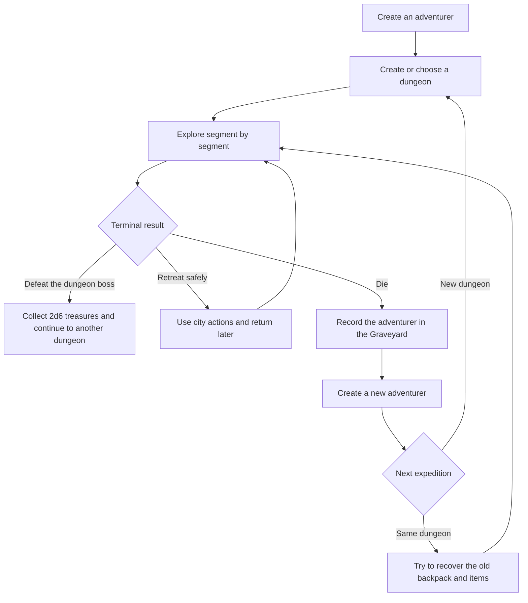
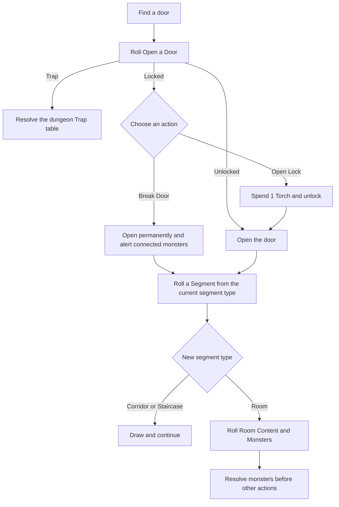
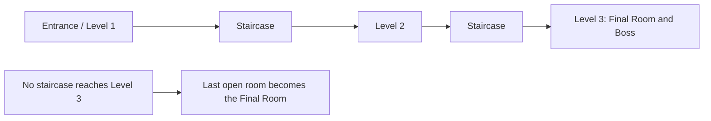
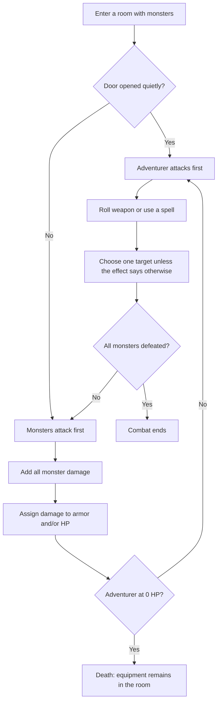

# NoteQuest
**Tiago Junges**
First Edition - Author Edition - Porto Alegre, 2020
> Markdown conversion of the supplied English-language PDF. Artwork and decorative page design have been omitted. Repeated layout elements have been consolidated, and essential processes have been converted into Markdown tables and Mermaid schematics. Original game wording, names, values, and source idiosyncrasies are retained wherever practical.
## Contents
- [Introduction](#introduction)
- [How to Play](#how-to-play)
- [Creating Your Adventurer](#creating-your-adventurer)
- [Building a Dungeon](#building-a-dungeon)
- [Dungeon Rules](#dungeon-rules)
- [Combat](#combat)
- [Dungeons](#dungeons)
- [Palace](#palace)
- [Crypt](#crypt)
- [Tomb](#tomb)
- [Sanctuary](#sanctuary)
- [Temple](#temple)
- [Prison](#prison)
- [Graveyard](#graveyard)
- [Backers](#backers)

## Introduction
NoteQuest is a solo dungeon crawler game. It has an extremely simple and fast rules system, prioritizing the most important and fun part: exploration. You will play with a weak adventurer after fame and fortune. Good luck! (You're gonna need it.)
## How to Play
To play NoteQuest you will need this book, a notebook or grid paper, a pencil, and some dice (d6). Find a quiet place and start your adventure.
First you will create an adventurer and a dungeon. If you manage to complete the dungeon, you can move on to another dungeon and so on. If you die before that (which is very likely), create a new character and try to explore the dungeon again - and find your old character's corpse with all the items in the backpack - or explore a new dungeon. This is the flow of the game.
The book is the Core Book. A supplement called *Expanded World* expands the adventures with HexCrawl, custom dungeons, races, advanced classes, and rules for managing castles, kingdoms, and empires.
It is recommended that you play the Core Book first before venturing into the Expanded World.
### Core game flow

## Creating Your Adventurer
Roll once on the Race table and once on the Class table. Add the Class HP modifier to the Race HP. Record the ability and starting weapon. You begin with **10 Torches** and **0 coins**. If your race or class grants spells, roll on the Basic Spells table for each spell.
### Race
| 2d6 | Race | HP | Ability |
| --- | --- | --- | --- |
| 2 | Slimemen | 10 | If you engulf the body of an enemy, you regain all HP. |
| 3 | Lightbugster | 16 | You start with 3 uses of the Light spell. |
| 4 | Pixie | 8 | You start the game with 5 random Basic Spells. |
| 5 | Gnome | 14 | You start the game with 3 random Basic Spells. |
| 6 | Elf | 16 | You start the game with 1 random Basic Spell. |
| 7 | Human | 20 | None. |
| 8 | Dwarf | 18 | When you roll to Find Secret Passages, roll two dice and discard the lowest. |
| 9 | Halfling | 14 | When you roll to Move Silently, roll two dice and discard the lowest. (Except in the Boss.) |
| 10 | Cat-Person | 19 | You can sell equipment in the town for twice the price. |
| 11 | Rinoceroid | 24 | You can attack with your horn (Damage 1d6). |
| 12 | Dragonkin | 30 | You start with 3 uses of the Fireball spell. |

### Class
| 2d6 | Class | HP | Ability | Starting Weapon |
| --- | --- | --- | --- | --- |
| 2 | Hobo | +4 | None. | Wood Stick (1d6-2 damage) |
| 3 | Grave Digger | +2 | Deal +2 damage to Undead. | Shovel (1d6-1 damage) |
| 4 | Noble | +0 | You start the game with 1 random Basic Spell. | Rapier (1d6+1 damage) |
| 5 | Schoolar | +0 | You start the game with 3 random Basic Spells. | Dagger (1d6-1 damage) |
| 6 | Blacksmith | +4 | You can repair an armor by spending 1 Torch. | Hammer (1d6 damage) |
| 7 | Guard | +4 | None. | Short Sword (1d6 damage) |
| 8 | Cook | +2 | Gain 1 coin for every monster killed (except Undead). | Cleaver (1d6 damage) |
| 9 | Locksmith | +2 | You can open any door without consuming torches. | Dagger (1d6-1 damage) |
| 10 | Lumberjack | +4 | When destroying doors, roll the dice. On a 6 you get 1 torch. | Lumberjack Ax (1d6 dmg) |
| 11 | Miner | +4 | If you run out of torches, you can leave the dungeon. | Pickaxe (1d6-1 damage) |
| 12 | Gladiator | +6 | None. | Short Sword (1d6 damage) |

### Basic Spells
| 1d6 | Spell | Effect |
| --- | --- | --- |
| 1 | Heal | Heals 5 HP. |
| 2 | Light | Creates a globe of light that is worth a torch, but does not use a hand. |
| 3 | Teleport | You teleport to any empty room. You can use it to escape from combat. |
| 4 | Cold Ray | Deals 4 damage to one monster and it cannot attack next turn. |
| 5 | Lightning | Deals 6 damage to one monster. |
| 6 | Fireball | Deals 5 damage to all monsters in the same room. |

## Building a Dungeon
The dungeon is built as you explore, opening door by door. Initially, you know only its name, heard as a whisper in the tavern. Roll three d6 and read one result from each column below.
| 1d6 | Dungeon Type / First Part | Second Part | Third Part |
| --- | --- | --- | --- |
| 1 | The Palace ... | ... of the Secret ... | ... Horrors |
| 2 | The Crypt ... | ... of the Broken ... | ... Curse |
| 3 | The Tomb ... | ... of the Ethernal ... | ... Rest |
| 4 | The Sanctuary ... | ... of the Cold ... | ... Hero |
| 5 | The Temple ... | ... of the Flaming ... | ... Vow |
| 6 | The Prison ... | ... of the Dying ... | ... Darkness |

### Opening Doors
Whenever you find a door, roll on the Open a Door table. A locked door can later be opened by spending a torch or broken. A trap result sends you to the current dungeon's Trap table.
| 1d6 | What happens? |
| --- | --- |
| 1 | You activate a Trap! |
| 2 | Locked! |
| 3 | Locked! |
| 4 | Unlocked |
| 5 | Unlocked |
| 6 | Unlocked |

### Segments
The dungeon map is separated into **Segments**: Corridors, Staircases, and Rooms. After successfully opening a door, roll one d6 and consult the column that matches the segment you are opening the door from. If the new segment is a Room, also roll on that dungeon's Room Content and Monsters tables.
### Door-to-segment procedure

### Common Segments table
| 1d6 | Open from a Staircase | Open from a Corridor | Open from a Room |
| --- | --- | --- | --- |
| 1 | Corridor with another door. | Small room with another door. | Small room with another door. |
| 2 | Corridor with two other doors. | Medium size room with another door. | Medium size room. |
| 3 | Corridor with two other doors. | Wide room with another door. | Medium size room. |
| 4 | Corridor with two other doors. | Wide room with two other doors. | Wide room. |
| 5 | Corridor with three other doors. | Large room with two other doors. | Large room with pillars. |
| 6 | Corridor with three other doors. | Staircase with a door in the end. | Staircase with a door in the end. |

### Common Secret Passage table
| 1d6 | Secret Passage |
| --- | --- |
| 1 | You have activated a Trap! |
| 2 | There's nothing here. |
| 3 | There's nothing here. |
| 4 | You have found a hidden Chest! |
| 5 | You have found a hidden Chest! |
| 6 | A secret door to a Staircase. |

### Final Room
Each staircase you descend leads to a new dungeon level. When entering the third level - with two floors between you and the dungeon entrance - you find the Final Room. If the dungeon is completed without stairs to the third level, the last open room is the Final Room.
The Final Room is a large room with no doors. Roll only on the Dungeon Boss table: do not roll Room Content or Monsters. After defeating the boss, find **2d6 Treasures**.
### Dungeon depth schematic

## Dungeon Rules
### Dungeon Actions
When you enter a segment with monsters, you must face them before doing anything else. If there are no monsters, or they have been defeated, you may open doors and chests and use the following actions:
- **Open Lock:** Spend 1 torch to unlock any locked door.
- **Breaking the Door:** Open a locked door without spending time or torch. The door can no longer be closed, and all monsters in that segment are alerted and attack first.
- **Move Silently:** If you opened a door without breaking it or activating a trap, spend 1 torch and roll one die for each monster in the room. If any die is 1, the monsters see you and attack first. On success, you may pass through undetected, take treasures, and open doors. Making noise or activating a trap ends hiding. You cannot Move Silently in the Boss room.
- **Disarm Traps:** In a room, spend 1 torch to prevent any trap inside that room from taking effect.
- **Find Secret Passage:** In a segment that may have a Secret Passage, spend 1 torch and roll on the Secret Passage table.
- **Open a Chest:** Roll two dice. The higher die gives the number of coins; the lower die gives the number of Treasures. If both dice are 1, the chest is empty and activates a Trap.

### The Darkness
Darkness is the adventurer's greatest enemy. If at any time you are inside the dungeon without a torch, darkness devours you. The character is lost, and a new character finds only the old backpack and clothes at that location. Monsters are unaffected.
Each torch spent represents an action that took time. Torches cost 1 coin in town, and an adventurer can carry at most 10 torches.
### Spending Torches
Every character starts with 10 torches. Entering a dungeon consumes 1 torch to light the way. Other actions, such as Open Lock and Find Secret Passage, may consume additional torches.
### City Actions
- **Rest:** Spend 1 coin and recover your HP and consumed spells.
- **Fix Armor:** Spend 1 coin to recover HP of an armor piece.
- **Buy Torches:** Spend 1 coin to add 1 torch, up to 10.
- **Sell Items:** Sell any item for 1 coin. Magic items sell for 1d6-1 coins.

### Special Conditions
- **Spells:** Each spell has a different effect and may be used inside or outside combat. In combat, casting consumes an attack turn. A used spell is exhausted until recovered in the city. You may possess the same spell more than once, representing additional uses.
- **Load Limit:** Carry at most 10 torches and 10 backpack items.
- **Armor:** Armor has five piece types: Shoulderpads, Bracelets, Boots, Helmet, and Breastplate. You may wear any combination, but no more than one identical piece. Each piece has HP and is destroyed when it loses all HP.
- **Broken Doors:** A broken door connects monster awareness between adjacent segments. If monsters in one connected segment are alerted, those in the other segment are also alerted and attack the adventurer.
- **Keys and Doors:** A key opens any door in its dungeon. Keys found in one dungeon do not open doors in another. The Master Key opens any door in any dungeon.
- **Returning to a Dungeon:** When you return after resting, or return with a new adventurer after death, roll on the Monsters table for each empty room you enter. Rooms that still contain monsters restore those monsters to full health.

## Combat
Determine who attacks first. If you opened the door without making a sound - without breaking it or activating a trap - you attack first. Otherwise, the monsters attack first. Turns then alternate between the adventurer and the monsters.
When monsters attack, add all their damage and subtract it from your HP or from equipped armor HP, as you choose. On your turn, roll the damage of your weapon, choose one enemy, and subtract the result from that enemy's HP.
If the adventurer loses all HP, the character dies and all equipment remains on the floor of that room for a later character to recover.
### Combat loop

### Your Hands
An adventurer normally uses one hand to hold a torch. A Two-Handed weapon therefore cannot be used without another light source. Losing an arm creates the same limitation. Workarounds include a lamp, Light spells, or options from the Expanded World.
### Monster Traits
| Trait | Effect |
| --- | --- |
| Stoneskin | Ignores any damage that is 3 or less. |
| Loot | After the fight, roll 1d6. On 6, find 1 Treasure. On 5, find 1 Key. On 4 or less, find 1 coin. |
| Explosive | When you get a 1 on the damage roll, this monster destroys itself and deals damage equal to its current HP. |
| Firebreath | When you get a 1 on the damage roll, its next attack deals +10 damage. |
| Horde | When you get a 1 on the damage roll, an Orc (6 HP; Damage 3) enters the room. |
| Intangible | Takes no damage if the damage is an even number. |
| Sorcery | When you get a 1 on the damage roll, this monster casts a spell. Roll 1 die and add it to the final damage of the monster's next attack. |
| Deathtouch | When you get a 1 on the damage roll, this monster's next attack kills you. |
| Undead | After this monster is defeated, roll a die. On 1, it comes back to life with 1 HP. |
| Necromancy | When you get a 1 on the damage roll, a Skeleton (4 HP; Damage 1; Undead) appears. |
| Weakness | When you get a 6 on the damage roll, this monster takes twice as much damage. |
| Regeneration | When you get a 1 on the damage roll, this monster recovers 6 HP. |
| Paralyze | When you get a 1 on the damage roll, the next attack paralyzes for 1d6 turns. |
| Poison | All damage from this creature cannot be absorbed by armor or other means. |

## Dungeons
All six dungeon packages use the common Segments and Secret Passage tables above. Each dungeon supplies its own entrance description, Trap, Room Content, Monsters, Reward, Boss, Armor, and Weapon tables.
### Palace
This dungeon is inside a large building with a beautiful entrance door. In the past this was the home of some nobleman. When you open the door you find a giant hall with two doors on each side and a staircase in the center. At the end of the staircase there is a wooden door.
#### Trap
| 1d6 | Trap |
| --- | --- |
| 1 | A blade falls from the ceiling. Roll the dice. On a '2' you lose one of your arms and on a '1' you die. |
| 2 | Acid Spout (5 Damage). |
| 3 | You fall into a ditch (spend 1 torch to go out). |
| 4 | A dart hits you (1 Damage). |
| 5 | You hear a click, but nothing happens. |
| 6 | You hear a click, but nothing happens. |

#### Room Content
| 2d6 | Room Content |
| --- | --- |
| 2 | Dust-filled library. It may have Secret Passage. |
| 3 | Destroyed kitchen with 1d6 coins on the floor. |
| 4 | Large table with a few chairs. It may have Secret Passage. |
| 5 | Bookshelf with 1d6 Magic Scrolls. |
| 6 | Desk with a Chest. |
| 7 | Dirt everywhere. It may have Secret Passage. |
| 8 | Bed with a Chest on the side. |
| 9 | Garden covered by plants. It may have Secret Passage. |
| 10 | Trash deposit. It may have Secret Passage. |
| 11 | Large table with papers and maps. It may have Secret Passage. |
| 12 | Armory. 2d6 Magic Items. |

#### Monsters
| 2d6 | Monsters |
| --- | --- |
| 2 | Minotaur (14 HP; 7 Damage) |
| 3 | 2 Orcs (6 HP; 3 Damage; Loot) |
| 4 | 1 Orc (6 HP; 3 Damage; Loot) |
| 5 | 1d6 Giant Rats (2 HP; 1 Damage) |
| 6 | 1d6 Goblins (3 HP; 1 Damage; Explosive) |
| 7-8 | There are no monsters in this room. |
| 9 | 2 Living Armor (8 HP; 3 Damage) |
| 10 | 3 Fungoid (4 HP; 2 Damage; Loot; Regeneration) |
| 11 | Bone Golem (12 HP; 5 Damage; Undead) |
| 12 | Walking Slime (10 HP; 1 Damage; Loot; Regeneration) |

#### Reward
| 1d6 | Treasure | Wonders | Magic Item |
| --- | --- | --- | --- |
| 1 | Ornament (worth 5 Coins in the town) | Jester Hat (2 HP; Can't Move in Silence) | [Armor] of Royalty (It is very elegant) |
| 2 | Health Potion (Recovers all HP) | Emperor's Sandals (2 HP; +1 dmg against cockroaches) | Leprechaun's [Armor] (Earn double coins in chests) |
| 3 | Magic Scroll (Random Basic Magic; Use once) | Amulet of the Dead (Ignores Undead effect) | Centurion's [Armor] (+1 HP) |
| 4 | Valuable jewel (worth 2d6 x 10 Coins in the town) | Potion of Luck (Ignores the next activated Trap) | [Weapon] of Destruction (Deals +2 damage) |
| 5 | [Roll in the "Wonders" column] | Potion of Fury (Damage +2 until the end of the fight) | [Weapon] of War (Deals +2 damage to Angels) |
| 6 | [Roll in the "Magic Item" column] | Lamp (No need to use hands to light) | [Weapon] of the Dragon Slayer (Double damage against Dragons) |

#### Boss
| 1d6 | Dungeon Boss |
| --- | --- |
| 1 | Walking back and forth is the Zombie Baron (30 HP; 4 Damage; Undead). |
| 2 | Sitting on his old and dusty throne is the Mad King (22 HP; 2 Damage; Explosive). |
| 3 | This was a luxurious room, now is cover in dust. There, the Ghost Lady (13 HP; 3 Damage; Intangible) awaits you. |
| 4 | Around a throne are 2 Unholy Gargoyles (12 HP; 3 Damage; Stoneskin). |
| 5 | Sewing a corpse on a table is the Necromancer (16 HP; 7 Damage; Necromancy). |
| 6 | Sitting on a throne and with one foot on a dragon skull is the Orc King (24 HP; 5 Damage; Horde). |

#### Armor
| 1d6 | Armor |
| --- | --- |
| 1 | Ring (0 HP) |
| 2 | Bracelets (2 HP) |
| 3 | Boots (3 HP) |
| 4 | Shoulderpads (3 HP) |
| 5 | Helm (4 HP) |
| 6 | Breastplate (10 HP) |

#### Weapon
| 1d6 | Weapon |
| --- | --- |
| 1 | Candlestick (1d6-1 Damage) |
| 2 | Sword (1d6 Damage) |
| 3 | Rapier (1d6+1 Damage) |
| 4 | Whip (1d6+1 Damage) |
| 5 | Claw (1d6+1 Damage) |
| 6 | Halberd (1d6+3 Damage; Two-handed) |

### Crypt
This dungeon is hidden inside a small isolated mausoleum in the middle of nowhere. It is covered by cobwebs and inscriptions of names long forgotten. Inside there is a staircase that leads down. At the end of the staircase there is a door.
#### Trap
| 1d6 | Trap |
| --- | --- |
| 1 | A blade falls from the ceiling. Roll the dice. On a '2' you lose one of your arms and on a '1' you die. |
| 2 | Acid Spout (5 Damage). |
| 3 | Appears 1d6 Bats (1 HP; 1 Damage; Poison). |
| 4 | You hear a click, but nothing happens. |
| 5 | You hear a click, but nothing happens. |
| 6 | You hear a click, but nothing happens. |

#### Room Content
| 2d6 | Room Content |
| --- | --- |
| 2 | Tombstone carved with your name. |
| 3 | Several pots with dead plants. |
| 4 | Texts sculpted on the floor. It may have Secret Passage. |
| 5 | Human bones everywhere. It may have Secret Passage. |
| 6 | A pile of bones and 1d6 coins. |
| 7 | Casket with Chest inside. |
| 8 | Various wooden coffins. It may have Secret Passage. |
| 9 | Walls made of skulls. It may have Secret Passage. |
| 10 | Dozens of burned candles everywhere. It may have Secret Passage. |
| 11 | Broken statue of a forgotten person. It may have Secret Passage. |
| 12 | Treasure room with 2d6 Treasures. |

#### Monsters
| 2d6 | Monsters |
| --- | --- |
| 2 | Vampire Servant (9 HP; 4 Damage; Regeneration) |
| 3 | Giant Leech (12 HP; 5 Damage) |
| 4 | 3 Skeletons (4 HP; 1 Damage; Undead) |
| 5 | Ghoul (6 HP; 3 Damage; Regeneration) |
| 6 | 1d6 Goblins (3 HP; 1 Damage; Explosive) |
| 7-8 | There are no monsters in this room. |
| 9 | 1d6 Bats (1 HP; 1 Damage; Poison) |
| 10 | Giant Spider (10 HP; 4 Damage; Paralyze) |
| 11 | 3 Fungoid (4 HP; 2 Damage; Loot; Regeneration) |
| 12 | 2 Giant Spiders (10 HP; 4 Damage; Paralyze) |

#### Reward
| 1d6 | Treasure | Wonders | Magic Item |
| --- | --- | --- | --- |
| 1 | Religious Object (worth 3 Coins in the town) | Garlic necklace (+1 against Vampire and Ghoul) | [Armor] of the Dead (It always stinks) |
| 2 | Health Potion (Recovers all HP) | Potion of Luck (Ignores the next activated Trap) | [Armor] of the Spider Queen (ignores the effect Paralyze) |
| 3 | Magic Scroll (Random Basic Magic; Use once) | Potion of Fury (Damage +2 until the end of the fight) | Count's [Armor] (+2 HP) |
| 4 | Valuable jewel (worth 2d6 x 10 Coins in the town) | Salamander Potion (Recovers lost arm) | [Weapon] of Destruction (Deals +2 damage) |
| 5 | [Roll in the "Wonders" column] | Master key (Open any door) | Vampiric [Weapon] (Recovers 1 HP with each attack) |
| 6 | [Roll in the "Magic Item" column] | Potion of Luminescence (Worth like two torches) | Boatman's Oar (1d6+1 Dmg; ignores Intangible) |

#### Boss
| 1d6 | Dungeon Boss |
| --- | --- |
| 1 | The room is covered with cobwebs. In the center of the web is the Spider Queen (20 HP; 3 Damage; Paralyze). |
| 2 | In the center of the room is a large mass of mucus that writhes to form the Death Dessert (30 HP; 2 Damage). |
| 3 | The sinister figure in the center of the room carries an oar. He is the Death Boatman (20 HP; 2 Dmg; Deathtouch). |
| 4 | In the center of the room is an open coffin and the Master Vampire (20 HP; 5 Dmg; Regeneration) is waking up. |
| 5 | This room is covered by war banners. In the center is the ghost of the Eternal Warrior (10 HP; 5 Dmg; Intangible). |
| 6 | Trapped by several chains inside the room, the Vampiric Beast (19 HP; 7 Dmg) squirms with rage. |

#### Armor
| 1d6 | Armor |
| --- | --- |
| 1 | Ring (0 HP) |
| 2 | Bracelets (2 HP) |
| 3 | Boots (3 HP) |
| 4 | Shoulderpads (3 HP) |
| 5 | Helm (4 HP) |
| 6 | Breastplate (10 HP) |

#### Weapon
| 1d6 | Weapon |
| --- | --- |
| 1 | Femur (1d6-1 Damage) |
| 2 | Pickaxe (1d6 Damage) |
| 3 | Dagger (1d6 Damage) |
| 4 | Warhammer (1d6+1 Damage) |
| 5 | Sickle (1d6+1 Damage) |
| 6 | Glaive (1d6+2 Dmg; Two-handed) |

### Tomb
This dungeon was built inside an immense and imposing stone structure. Someone very important was buried here. Pillars and statues adorn the place. In front of you is a large stone door. Behind it, a long corridor with a door at the end and two other doors on the sides.
#### Trap
| 1d6 | Trap |
| --- | --- |
| 1 | A blade falls from the ceiling. Roll the dice. On a '2' you lose one of your arms and on a '1' you die. |
| 2-3 | Raise 1d6 Skeleton Soldiers (4 HP; 2 Damage; Undead). |
| 4 | Raise 1 Skeleton (3 HP; 1 Damage; Undead). |
| 5 | You hear a click, but nothing happens. |
| 6 | You hear a click, but nothing happens. |

#### Room Content
| 2d6 | Room Content |
| --- | --- |
| 2 | Empty sarcophagus with your name. |
| 3 | Several pots with dead plants. |
| 4 | Texts sculpted on the floor. It may have Secret Passage. |
| 5 | Human bones everywhere. It may have Secret Passage. |
| 6 | Pile of bones and 1d6 coins. |
| 7 | Sarcophagus with Chest inside. |
| 8 | Several wooden coffins. It may have Secret Passage. |
| 9 | Walls made of skulls. It may have Secret Passage. |
| 10 | A destroyed sarcophagus. It may have Secret Passage. |
| 11 | Broken statue of a hero. It may have Secret Passage. |
| 12 | Treasure Room with 2d6 Treasures. |

#### Monsters
| 2d6 | Monsters |
| --- | --- |
| 2 | Ghost of the Prince (6 HP; 4 Damage; Intangible) |
| 3 | Bone Golem (12 HP; 5 Damage; Undead) |
| 4 | 2 Skeleton Soldiers (4 HP; 2 Damage; Undead) |
| 5 | 1 Living Armor (8 HP; 3 Damage) |
| 6 | 1d6 Goblins (3 HP; 1 Damage; Explosive) |
| 7-8 | There are no monsters in this room. |
| 9 | 1d6 Scorpions (2 HP; 1 Damage; Poison) |
| 10 | 2 Living Armor (8 HP; 3 Damage) |
| 11 | 3 Fungoid (4 HP; 2 Damage; Loot; Regeneration) |
| 12 | Giant Spider (10 HP; 4 Damage; Paralyze) |

#### Reward
| 1d6 | Treasure | Wonders | Magic Item |
| --- | --- | --- | --- |
| 1 | Mana Potion (Recovers all Spells) | Crown of the beheaded prince (Does not die in blade traps) | Bone [Armor] (-1 HP) |
| 2 | Health Potion (Recovers all HP) | Potion of Luck (Ignores the next activated Trap) | [Armor] of Strength (+1 Damage) |
| 3 | Magic Scroll (Random Basic Magic; Use once) | Potion of Luck (Ignores the next activated Trap) | [Armor] of the Special Guard (+1 HP) |
| 4 | Valuable jewel (worth 2d6 x 10 Coins in the town) | Potion of Fury (Damage +2 until the end of the fight) | [Weapon] of Destruction (Deals +2 damage) |
| 5 | [Roll in the "Wonders" column] | Sapphire of Magic (Learn a random Spell) | Vampiric [Weapon] (Recovers 1 HP with each attack) |
| 6 | [Roll in the "Magic Item" column] | Lamp (No need to use hands to light) | Vorpal [Weapon] (Kills instantly when get 6 on the die) |

#### Boss
| 1d6 | Dungeon Boss |
| --- | --- |
| 1 | Greenish cloud covers the room. Lying on an altar is the Emperor Scorpio (20 HP; 3 Damage; Poison). |
| 2 | On a great throne is the giant skeleton of the Skeleton King (12 HP; 7 Damage; Undead). |
| 3 | Floating on an altar is the Queen of Bladed Hands (11 HP; 10 Damage). |
| 4 | Flying around your sarcophagus is the Ghost King of the Lost Swamp (10 HP; 4 Damage; Intangible). |
| 5 | In this room are the walking skeletons of the Seven Necrotic Kings (4 HP; 1 Damage; Undead). |
| 6 | From inside a sarcophagus comes the Lich King of the Ethernal Wars (22 HP; 6 Damage; Necromancy, Undead). |

#### Armor
| 1d6 | Armor |
| --- | --- |
| 1 | Ring (0 HP) |
| 2 | Bracelets (2 HP) |
| 3 | Boots (3 HP) |
| 4 | Shoulderpads (3 HP) |
| 5 | Helm (4 HP) |
| 6 | Breastplate (10 HP) |

#### Weapon
| 1d6 | Weapon |
| --- | --- |
| 1 | Shovel (1d6-1 Damage) |
| 2 | Sword (1d6 Damage) |
| 3 | Axe (1d6+1 Damage) |
| 4 | Warhammer (1d6+1 Damage) |
| 5 | Sickle (1d6+1 Damage) |
| 6 | Scythe (1d6+2 Dmg; Two-handed) |

### Sanctuary
A small abandoned chapel in the middle of nowhere. Its entrance is guarded by statues of faceless angels. Inside, there is only a stone altar and a wooden trapdoor on the floor that has already been destroyed. Opening the trapdoor, you see a dark staircase. At the end of the staircase there is a door.
#### Trap
| 1d6 | Trap |
| --- | --- |
| 1 | A blade falls from the ceiling. Roll the dice. On a '2' you lose one of your arms and on a '1' you die. |
| 2 | Spears come out of the ground (5 Damage). |
| 3 | You fall into a ditch (spend 1 torch to go out). |
| 4 | A dart hits you (1 Damage). |
| 5 | You hear a click, but nothing happens. |
| 6 | You hear a click, but nothing happens. |

#### Room Content
| 2d6 | Room Content |
| --- | --- |
| 2 | A magic circle on the floor. (Works as a Portal; see in the expansion.) |
| 3 | 10 chairs lined up. |
| 4 | Torture Room with 1d6 Treasures. |
| 5 | Creature or deity statues. It may have Secret Passage. |
| 6 | Corpse with 1 Treasure. |
| 7 | Large Chest on an altar. |
| 8 | Small altar with 1d6 coins. It may have Secret Passage. |
| 9 | 2d6 paintings of gods (2 coins each). It may have Secret Passage. |
| 10 | Melted candles everywhere. It may have Secret Passage. |
| 11 | Fountain with running water. It may have Secret Passage. |
| 12 | Shelves with 1d6 Treasures. |

#### Monsters
| 2d6 | Monsters |
| --- | --- |
| 2 | 8 Wisp (2 HP; 1 Damage) |
| 3 | 3 Fungoid (4 HP; 2 Damage; Loot; Regeneration) |
| 4 | 3 Warrior Angels (4 HP; 2 Damage) |
| 5 | Sentinel Angel (5 HP; 3 Damage; Sorcery) |
| 6 | 1d6 Goblins (3 HP; 1 Damage; Explosive) |
| 7-8 | There are no monsters in this room. |
| 9 | 2 Orcs (6 HP; 3 Damage; Loot) |
| 10 | Giant Angel Statue (10 HP; 5 Damage; Stoneskin) |
| 11 | Giant Spider (10 HP; 4 Damage; Paralyze) |
| 12 | Fallen Angel of Putrification (21 HP; 4 Damage; Poison) |

#### Reward
| 1d6 | Treasure | Wonders | Magic Item |
| --- | --- | --- | --- |
| 1 | Religious Object (worth 3 Coins in the town) | Protector Candle (Discard and next chest will be double) | Priest's [Armor] (Covered by religious symbols) |
| 2 | Health Potion (Recovers all HP) | Blessed Potion (Destroy a cursed item) | [Armor] of the Gods (ignore Deathtouch) |
| 3 | Magic Scroll (Random Basic Magic; Use once) | Potion of Luck (Ignores the next activated Trap) | Angelic [Armor] (+2 HP) |
| 4 | Valuable jewel (worth 2d6 x 10 Coins) | Potion of Fury (Damage +2 until the end of the fight) | [Weapon] of Destruction (Deals +2 damage) |
| 5 | [Roll in the "Wonders" column] | Master key (Open any door) | Vampiric [Weapon] (Recovers 1 HP with each attack) |
| 6 | [Roll in the "Magic Item" column] | Potion of Luminescence (Worth like two torches) | Vorpal [Weapon] (Kills instantly when get 6 on the die) |

#### Boss
| 1d6 | Dungeon Boss |
| --- | --- |
| 1 | At six meters high, the Rat God (30 HP; 5 Damage; Poison) is waiting for you there with his giant mace. |
| 2 | Around a large sarcophagus covered with runes are the 2 Nether Guardians (9 HP; 3 Damage; Intangible). |
| 3 | Wrapped in mucus and pieces of living human bodies is the terrible Aberration (29 HP; 4 Damage; Weakness). |
| 4 | A light from above iluminates of the room. From this light emerges the Faceless Goddess (40 HP; 7 Dmg; Sorcery). |
| 5 | A light from above iluminates of the room. From this light emerges the God of Destruction (40 HP; 8 Dmg). |
| 6 | In the center of the room, surrounded by lit candles, is the Fallen Angel of Vengeance (25 HP; Dano 8; Sorcery). |

#### Armor
| 1d6 | Armor |
| --- | --- |
| 1 | Ring (0 HP) |
| 2 | Bracelets (2 HP) |
| 3 | Boots (3 HP) |
| 4 | Shoulderpads (3 HP) |
| 5 | Helm (4 HP) |
| 6 | Breastplate (10 HP) |

#### Weapon
| 1d6 | Weapon |
| --- | --- |
| 1 | Pan (1d6-1 Damage) |
| 2 | Machete (1d6 Damage) |
| 3 | Sword (1d6+1 Damage) |
| 4 | Warhammer (1d6+1 Damage) |
| 5 | Mace (1d6+1 Damage) |
| 6 | Scythe (1d6+3 Damage; Two-handed) |

### Temple
A beautiful structure stands among the plants and trees of the place. Its architecture is incredible and its walls are covered with strange inscriptions. The entrance is a large stone door. Behind it, an empty corridor with four more doors, two on each side.
#### Trap
| 1d6 | Trap |
| --- | --- |
| 1 | A blade falls from the ceiling. Roll the dice. On a '2' you lose one of your arms and on a '1' you die. |
| 2 | A giant hammer comes out of the ceiling (5 Dmg). |
| 3 | You fall into a ditch (spend 1 torch to go out). |
| 4 | A dart hits you (1 Damage). |
| 5 | You hear a click, but nothing happens. |
| 6 | You hear a click, but nothing happens. |

#### Room Content
| 2d6 | Room Content |
| --- | --- |
| 2 | A magic circle on the floor. (Works as a Portal; see in the expansion.) |
| 3 | Bottomless pit. |
| 4 | Torture Room with 1d6 Treasures. |
| 5 | Unknown creature statues. It may have Secret Passage. |
| 6 | Corpse with 1 Treasure. |
| 7 | Chest surrounded by melted candles. |
| 8 | Small altar with 1d6 coins. It may have Secret Passage. |
| 9 | 2d6 paintings of demons (1 coin each). It may have Secret Passage. |
| 10 | Carcasses of giant snakes. It may have Secret Passage. |
| 11 | Dry fountain. It may have Secret Passage. |
| 12 | Desk with 1d6 Treasures in the drawers. |

#### Monsters
| 2d6 | Monsters |
| --- | --- |
| 2 | 2d6 Imps (2 HP; 1 Damage) |
| 3 | 3 Fungoid (4 HP; 2 Damage; Loot; Regeneration) |
| 4 | 1d6 Cultists (4 HP; 1 Damage) |
| 5 | 1d6 Serpents (2 HP; 1 Damage; Poison) |
| 6 | 1d6 Goblins (3 HP; 1 Damage; Explosive) |
| 7-8 | There are no monsters in this room. |
| 9 | 2 Orcs (6 HP; 3 Damage; Loot) |
| 10 | Serpent Golem (10 HP; 5 Damage; Poison) |
| 11 | Giant Serpent (17 HP; 3 Damage; Paralyze) |
| 12 | Gargoyle (12 HP; 3 Damage; Stoneskin) |

#### Reward
| 1d6 | Treasure | Wonders | Magic Item |
| --- | --- | --- | --- |
| 1 | Sinister Idol (worth 3 Coins in the town) | Potion of the Color That Came from Beyond (Hair gets a random color) | Cultist's [Armor] (Discard to ignore a Trap) |
| 2 | Health Potion (Recovers all HP) | Potion of Luck (Ignores the next activated Trap) | Scaled [Armor] (+1 Damage against Snakes) |
| 3 | Magic Scroll (Random Basic Magic; Use once) | Potion of Fury (Damage +2 until the end of the fight) | Infernal [Armor] (+3 HP) |
| 4 | Valuable jewel (worth 2d6 x 10 Coins in the town) | Potion of the Helping hand (Creates a new arm) | [Weapon] of Destruction (Deals +2 damage) |
| 5 | [Roll in the "Wonders" column] | Master key (Open any door) | Cosmic [Weapon] (On a 1 it opens a Portal) |
| 6 | [Roll in the "Magic Item" column] | Sapphire of Magic (Learn a random Spell) | Vorpal [Weapon] (Kills instantly when get 6 on the die) |

#### Boss
| 1d6 | Dungeon Boss |
| --- | --- |
| 1 | From a large gap in the center of the room comes the great Tentacle God (20 HP; 6 Damage; Regeneration). |
| 2 | The pile of cultists' bodies ends up welding and forming the Bloody Beast (23 HP; 4 Damage; Weakness). |
| 3 | Inside the empty room is just a small kitten. But make no mistake, this is the Meow Horror (40 HP; 2 Dmg). |
| 4 | There are three giant statues. Their eyes open and reveal themselves as the Three Watchers (10 HP; 3 Damage). |
| 5 | Arising from the fires of hell, the Demon Lord (30 HP; 6 Damage; Firebreath) wants to take your soul. |
| 6 | Covering the room with its snake-like body, the Serpent God (30 HP; 3 Damage; Poison) was waiting for you. |

#### Armor
| 1d6 | Armor |
| --- | --- |
| 1 | Ring (0 HP) |
| 2 | Bracelets (2 HP) |
| 3 | Boots (3 HP) |
| 4 | Shoulderpads (3 HP) |
| 5 | Helm (4 HP) |
| 6 | Breastplate (10 HP) |

#### Weapon
| 1d6 | Weapon |
| --- | --- |
| 1 | Hacksaw (1d6-1 Dmg) |
| 2 | Saber (1d6 Dmg) |
| 3 | Kukri (1d6 Dmg) |
| 4 | Scimitar (1d6+1 Dmg) |
| 5 | Mace (1d6+1 Dmg) |
| 6 | Sword (1d6+1 Dmg) |

### Prison
The entrance to this dungeon is hidden under the ruins of an old abandoned castle. Behind a pile of rubble is a reinforced trap door. Upon opening it, you see a large staircase down. At the end of the staircase there is a door.
#### Trap
| 1d6 | Trap |
| --- | --- |
| 1 | A blade falls from the ceiling. Roll the dice. On a '2' you lose one of your arms and on a '1' you die. |
| 2 | Stones collapse from the ceiling (5 Damage). |
| 3 | You fall into a ditch (spend 1 torch to go out). |
| 4 | A dart hits you (1 Damage). |
| 5 | You hear a click, but nothing happens. |
| 6 | You hear a click, but nothing happens. |

#### Room Content
| 2d6 | Room Content |
| --- | --- |
| 2 | A cell with the skeleton of a childhood friend. It may have Secret Passage. |
| 3 | Large table with papers and confessions signed in blood. |
| 4 | Six cages hanging in the ceil. It may have Secret Passage. |
| 5 | Shelf of belongings with 1d6 Treasures. |
| 6 | Shackles on the walls and hanging bones. |
| 7 | Four empty cells. It may have Secret Passage. |
| 8 | Large cell with bones on all sides. |
| 9 | Torture bed. It may have Secret Passage. |
| 10 | Stack of coffins. It may have Secret Passage. |
| 11 | Slime covered wall. It may have Secret Passage. |
| 12 | Arsenal. 2d6 Magic Items. |

#### Monsters
| 2d6 | Monsters |
| --- | --- |
| 2 | Cave Troll (26 HP; 6 Damage; Regeneration) |
| 3 | Orc Leader (10 HP; 3 Damage; Loot; Horde) |
| 4 | 2 Orcs (6 HP; 3 Damage; Loot) |
| 5 | 1 Orc (6 HP; 3 Damage; Loot) |
| 6 | 1d6 Goblins (3 HP; 1 Damage; Explosive) |
| 7-8 | There are no monsters in this room. |
| 9 | 2 Living Armor (8 HP; 3 Damage) |
| 10 | 3 Fungoid (4 HP; 2 Damage; Loot; Regeneration) |
| 11 | Golem Ossos (12 HP; 5 Damage; Undead) |
| 12 | Giant Magic Turtle (30 HP; 2 Damage; Sorcery) |

#### Reward
| 1d6 | Treasure | Wonders | Magic Item |
| --- | --- | --- | --- |
| 1 | Health Potion (Recovers all HP) | Goblin Whistle (Goblins flee on hearing) | [Armor] of the Goblin Hero (-2 HP) |
| 2 | Magic Scroll (Random Basic Magic; Use once) | Potion of Luck (Ignores the next activated Trap) | [Armor] of Strength (+1 Damage) |
| 3 | Valuable jewel (worth 2d6 x 10 Coins in the town) | Potion of Fury (Damage +2 until the end of the fight) | Elven [Armor] (+2 HP) |
| 4 | [Roll in the "Weapon" table] | Salamander Potion (Recovers lost arm) | [Weapon] of Destruction (Deals +2 damage) |
| 5 | [Roll in the "Wonders" column] | Master key (Open any door) | [Weapon] of the Dragon (Ignores the effect Firebreath) |
| 6 | [Roll in the "Magic Item" column] | Lamp (No need to use hands to light) | Vorpal [Weapon] (Kills instantly when get 6 on the die) |

#### Boss
| 1d6 | Dungeon Boss |
| --- | --- |
| 1 | All furniture is charred. In the middle of the room is the Fire Serpent (20 HP; 3 Damage; Firebreath). |
| 2 | Goblin bodies cover the floor and in the center is the Deadly Stinger Giant Wasp (22 HP; 4 Damage; Poison). |
| 3 | Standing in the center of the room are the 2 Hell Hounds (10 HP; 3 Damage; Firebreath). |
| 4 | Statues everywhere. With an evil smile, the Medusa (20 HP; 4 Damage; Paralyze) was waiting for you. |
| 5 | You see the Cursed Ogre (20 HP; 7 Damage) destroying all the furniture in the room. |
| 6 | In the center of the room is a huge and scary Dragon (28 HP; 7 Damage; Firebreath). |

#### Armor
| 1d6 | Armor |
| --- | --- |
| 1 | Ring (0 HP) |
| 2 | Bracelets (2 HP) |
| 3 | Boots (3 HP) |
| 4 | Shoulderpads (3 HP) |
| 5 | Helm (4 HP) |
| 6 | Breastplate (10 HP) |

#### Weapon
| 1d6 | Weapon |
| --- | --- |
| 1 | BBQ Stick (1d6-2 Dmg) |
| 2 | Machete (1d6 Damage) |
| 3-4 | Spear (1d6+1 Damage) |
| 5-6 | Lance (1d6+2 Damage; Two-handed) |

## Graveyard
Write down the characters that died trying to explore these dungeons:
| Name | Dungeon | Cause of Death |
| --- | --- | --- |
|  |  |  |
|  |  |  |
|  |  |  |
|  |  |  |
|  |  |  |
|  |  |  |
|  |  |  |
|  |  |  |
|  |  |  |
|  |  |  |
|  |  |  |
|  |  |  |
|  |  |  |
|  |  |  |
|  |  |  |
|  |  |  |
|  |  |  |
|  |  |  |
|  |  |  |
|  |  |  |

## Backers

Show the backer list from the original edition

Adeilson de Almeida Gonçalves, Adeir Ribeiro, Adler, adriano jennrich cordeiro, Adriano Peres, Alcyone Fernandes Marques da Silva Rosa, Alexander Aparecido Urso Silva., Alexandre Baraldi Ramos, Alexandre Ferreira da Silveira, Alexandre Fortunato, Alexsandro Teixeira Cuenca, Allan Castro Lima, Allan Macedo de Novaes, Aluísio Soares da Silva Júnior, Álvaro Álvares, Amós do Carmo Moreira Filho, Ana Carolina Aparecida Jacobelli de Oliveira, Anderson Reinaldo Candido, André Angellis, Andre Bruno Lourenço da Silva, André de Melo Sobral, Andre Luis Albuquerque Campos, André Luís Muzzi, Andre Luis Ribeiro Leite, André Luiz Marcondes Pontes, Andre Pio, Andrei Ajudarte, Anna Carolina de Oliveira Velasco, ANTONIO JOSE DE AGUIAR MOTA, Arthur Giacobbo Brandão, Braien Machado, Brenda Felipe, Bruno Costa Coelho, Bruno Deliberali Santos, Bruno Henrique, Bruno Marques, Bruno Prieto, Caio Campos Barboza, Caio Castro Vaz, Caio Eduardo, Caio Fornasari, Caio Noronha Junior, Caio Rocha Pereira, Caio Vinicius, Camila Gamino da Costa, Carlos Almeida, Carlos Eduardo Felin Tamiosso, Carlos OC, Carlos Rafael Aimo Bera, Carlos Valnicio, Cesar Lopes Aguiar, César Roberto Milman da Silva, Cezar Capacle, Charlie, Claudio Aparecido Figueiredo, Claudio Lopes Carteiro Junior, Claudio Torcato, Cristiano Azevedo dos Santos, Daniel Alexandre Freire, Daniel Almenteiro, Daniel Castro, Daniel de Castro, Daniel Lucas Coutinho da Silva, DANIEL MAIONI ARAÚJO DE ASSIS, Daniel Paes Cuter, Daniel Ricardo Alves, Daniel Ritta, Daniel Santos Coimbra, Daniel Zanzini, Danilo de Aguiar Barbosa, Danilo Rolim Meira, Davi Nóbrega, Dayan Valente, Demétrius Renato de Castro Silva, Dennis Patrício Alves, Dheyrdre Machado, Diego Bassinello, Diego Cezar Nascimento, DIEGO RODRIGUES FONTES, Diego Soares, diegounger, diek scheffer, Diogo Emmanoel da Costa Lemos, Diogo Lima Barreto, Diogo Nogueira, Douglas Bloss Pires, Douglas Estevez, Edgard Tanaka, Edson Junior, Edson Ribeiro, Eduardo Augusto Vianna Santiago, Eduardo Leão Garcia, Eduardo Maciel Ribeiro, Eduardo Mancuso Du Mancuso, Eduardo Rafael Miranda Feitoza, Eduardo Simabukuro, Eduardo Victor, Eduardo Vieira Guimarães, Elaine Nascimento, Elder Rocha Alves, Ellias Matheus, EMANUEL MAX, Émerson Lourenço Mariz, ENDRAG0N, Eric Bem dos Santos, Erick Nunes, Érico Jorge Mota Florentino, Erik dos Reis, Euller Pereira, Everson de Oliveira Alves, Ewerton Wander Duarte do Nascimento, Fabiano Barbeiro, Fabiano Neme, Fábio Almeida, Fábio Bordini, FÁBIO CARDOSO SANTA ROSA, Fabio Carvalho, Fábio de Paula Tourinho, Fábio Duarte, Fábio Fabene, Fabio Ruggiero, Fabricio D. Delgado, Faustino Santiago, Felipe Espindola de Borba, Felipe Fragnani Del Aguila, felipe garcia de godoi, Felipe Gonçalves, Felipe Martins de Paiva, Felipe Norberto, Fernando Fenero, Fernando Herrero, Filipe Barreto Gonçalves, Filipe Camargo Dalmatti Alves Lima, Filipe Valentim Bezerra, Flavio Mazzeu, Flavio Rodrigo Sacilotto, FLORENCIO AUGUSTO FILHO, Francinaldo dos Santos Mariano, Francisco Grazziotin, frank de souza melo, Frederico Detofano, Frederico Trevisan Santos, Gabriel Alonso, Gabriel de Andrade Iasi, Gabriel Lemos, Gabriel Matte de Moura, Gabriel Vandresen, Gárgula, Gentle Ogre, Gilson Santos, Giorgio Fortunato, Glauco Bruno Nogueira da silv, Glauco Guimaraes, Googh Gylmor, Guilherme Felga, Guilherme Gomes Neto, Guilherme Nascimento, Gustavo Coelho, Gustavo da Rocha Pereira, Gustavo Henrique Silva, Haruo Takashima, hebert vieira simplicio junior, Heitor Krüger de Freitas, Helber Del Bem Martins, Helio Rodrigues Machado Neto, Henrique Aleixo, Henrique Sérgio Lima Costa, Herbert Lasanha Soares, Hernani Junior, Hypia Miranda Sanches, Igor "Bone" Toscano, Igor Burle, Igor Dagoberto Guterres Filgueira, Igor Dutra Santos, Igor Matheus, Igor Miguel, Iuri Gelbi Silva Londe, IURY DE PAULA LOPES, Ivan Almeida da Silva, J. Cesar, Jack Bullet, Jacques Murta Cabral, Jader007, Janary Damacena, Janilson Aragão, Jean Douglas Costa Nascimento, Jean Lucas, Jean Lucas Sgarbi Carassa, Jefferson Geovane, Jéssica Alves, Jhonnatan Gabriel Farias de Souza, João Felipe Fogageiro Olival, Joao Gabriel Moritz Lima, João Gabriel Patriota Alves de Moura, Joao Luiz, JOÃO MARCÍLIO COELHO NETTO LINS AROUCHA, João Paulo, João Pedro de Brito Moreira Silva, João Pedro Dos Santos Dias Pereira, João Ricardo Bittencourt, João Victor Antunes Krieger, Joao Vitor Toti Pelizzari, Joaquim Neto, Jocy Dieguevara de Moraes Chaves, Johnatan Melo, Johnn Robert Costa Kalil, Johny Ricardo dos Santos, Jorge Gomes de Araujo Junior, Jorge Roberto de Souza, José Antonio dos Santos, José Carlos de França Gonçalves, José Luiz Dos Santos, Josias Batista da Costa, Juanito Cauê Gama Cassemiro, Juliano - jcmsx, Julio Cesar Santos Vieira, Julio Miedes Neto, Kaique de Oliveira, Karol Matrella, Kevin Andrews Marques Silva, Kevin de Paula, Leivison Dias Ferreira, Leonardo Cardoso Gomes Godoy, Leonardo Henrique da Silva de Andrade, Leonardo Marques Rodrigues, Liano Santos Batista, LINCOLN RUTESKI DOS SANTOS, Luan da Silva Avila, Luan Peixoto, Lucas Fowl, Lucas Machado, Lucas Mestre Ferreira Alves, Lucas Nascimento Martins Martines, Lucas Peixoto de Lima, Lucas Tezotto (@BarbaLiteraria), Lucas Trevisano, Lucas Xavier, Luccas Aguiar, Luís Cavalheiro, Luis Guilherme Dias Lima, Luiz Pinto Ribeiro Junior, Manoel Mozzer, Marcelo "Presto" Gaudio Augusto, Marcelo Collar, Marcelo Hilst Martins, Marcelo Lacerda de Góes Telles, Marcio Simão de Vasconcellos, Márcio Tadeu Alves Júnior, Marcos Riego, Marcos da Maia Vicente Júnior, Marcos Vinicios Ornelas, Marcus Vinicius de Mello Oliveira, Marina Pocketmonster, Mário Filho, Marlos, Mateus Duarte, Maurílio Zucatelli Júnior, Maxwell Araujo Santiago Tavares, Milton Diogo, Mizzy Wizzy, nairo lucio de melo junior, Nathaniel Reis de Figueiredo, Neudson Fernandes Vasconcelos, Newton Felipe Ferreira, Nienio Diegoli Gontijo, Paula aragao valverde, PAULO FRANCISCO NUNES DE OLIVEIRA, Paulo José D. Morello, Pedro Augusto Tavares, Pedro Henrique, Pedro Mandagará, Pedro Medeiros, Pedro Salgado, Pedro_Herein, Petras Furtado, Rafael Baldo, Rafael Beltrame, Rafael Lacerda Silveira Rocha, Rafael Oliveira Bezerra, Rafael Panczinski de Oliveira, RALPH FERRAZ GOMES, Raphael D. Viana, Renan França, Renan Pereira Gerber, Renan Vinicius de Barros Becker, Renato de Castro Pereira, Reni Junior, Rian Mendes, Ricardo Mallen Machado de Souza, Ricardo Rodrigues, Rita Adelly, Roberson Barrionuevo, Roberto "Necrobeto" Barreto Miyoshi Moreira, ROBSON DE MELO SOUZA, Rodrigo Castro, Rodrigo Lopes de Aquino, Rodrigo Montecchio, Rodrigo Oliveira, Rodrigo Silveira de Pinho, Ronald Tunner de Souza Santos, Ronaldo Frederico Langer, RPG com Nozes, Ruan Kaylo, Rubens Carvalho Alves de Lima, Samara Bezerra Lisboa, Sammara Adriana Barros Carvalho, Samuel Grave Silva, saulo lima de souza bertani, Saulo Medeiros Aride, Saulo Oliveira, Sérgio J. Sousa, Sergio Paulo, Silvio Damasceno, Sir Paulo (Brierius), T. K. Pereira - Escriba Encapuzado, Tarcisio Lucas, Teófilo Araújo, Teresa cristina canella eugenio, Thairone Campos, Thiago Corôa, THIAGO COSTA ARAUJO, Thiago Henrique Righetti e Silva, Thiago Leite, Thiago Monteiro, Thiago Neri, Thiago Piedade, Tiago Alves Madjar, Tiago HR, Tiago Jedson, Tiago Mendonça Marinho, Valdemar de França, Vergilio Vinciguera, Victor Arthur, Victor Hugo Félix Martins, Victor José, Victor Peixoto Pereira, Vinicius Gomes de Oliveira, Vinicius Ribeiro Cabral, Wanderson Martiniano de Mello, weverson garcia medeiros, William Cunha de Freitas, Willians Novais, Winardlley Nardson Lima.

## Conversion Notes
- Artwork, decorative borders, logos, and character illustrations were omitted.
- Repeated Segments and Secret Passage tables were consolidated because they are identical across all six dungeon packages.
- The game-flow, door-generation, depth, and combat procedures were represented as Mermaid schematics.
- Page-layout artifacts were normalized into headings, lists, and tables.
- Source names, values, and unusual wording were generally preserved; a small number of obvious punctuation and line-break errors were normalized for readability.
