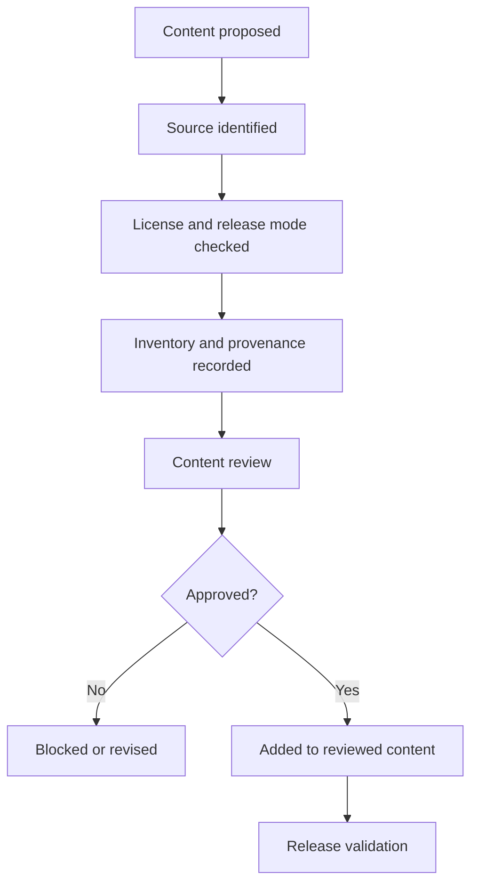

# Content & Licensing Requirements

## {{PRODUCT_OR_RELEASE_NAME}}

*Version {{VERSION}} | {{STATUS}} | Prepared for the Ironsworn Project*

| Field | Value |
|---|---|
| Document owner | {{OWNER}} |
| Related documents | {{RELATED_DOCUMENTS}} |
| Product scope | {{SCOPE}} |
| Release mode | Internal / closed playtest / public non-commercial / public commercial / open source |
| Primary audience | Product owner, developer, UX designer, QA/tester, content reviewer, and legal reviewer |
| Status | {{STATUS}}; not legal advice |
| Last updated | {{DATE}} |

---

## Contents

1. Purpose
2. Source Basis
3. Disclaimer and Review Position
4. Content Context
5. Content Scope
6. Licensing Principles
7. Source Categories
8. Release Mode Policy
9. Content Usage Matrix
10. Product-Level Requirements
11. Feature-Level Requirements
12. Provenance Data Requirements
13. Attribution and Notices
14. Branding and Unofficial Product Requirements
15. Art, Icons, Fonts, UI, and Trade Dress
16. User-Authored and Imported Content
17. Third-Party and Open-Source Content
18. Content Inventory
19. Review Workflow and Release Gates
20. Risk Register
21. Acceptance Criteria
22. Open Questions
23. Approval
24. Pre-Release Checklist

---

## 1. Purpose

{{DEFINE_THE_CONTENT_COPYRIGHT_LICENSE_ATTRIBUTION_PROVENANCE_BRANDING_AND_RELEASE_GATES_FOR_THE_PRODUCT_OR_RELEASE}}

## 2. Source Basis

| Source | Version / reviewed date | License / terms | Approved use | Evidence location |
|---|---|---|---|---|
| {{SOURCE}} | {{VERSION_OR_DATE}} | {{LICENSE}} | {{USE}} | {{LINK_OR_RECORD}} |
| {{SOURCE}} | {{VERSION_OR_DATE}} | {{LICENSE}} | {{USE}} | {{LINK_OR_RECORD}} |

Use official licensing sources and the actual files from which content is copied. Do not infer permission from a third-party summary.

## 3. Disclaimer and Review Position

This document records product requirements and review controls. It is not legal advice. A qualified reviewer should approve the final content inventory, notices, branding, distribution mode, and monetization position before public release.

Licensing is a release gate, not a cleanup task after publication.

## 4. Content Context

{{DESCRIBE_WHICH_OFFICIAL_PROJECT_ORIGINAL_USER_AUTHORED_AND_THIRD_PARTY_CONTENT_THE_PRODUCT_EXPECTS_TO_USE}}

## 5. Content Scope

### 5.1 In scope

| Content area | Examples | Owner |
|---|---|---|
| Rules and mechanics presentation | Labels, summaries, move references, dice help | {{OWNER}} |
| Oracle content | Table names, ranges, prompts, source labels | {{OWNER}} |
| Character / campaign content | Field labels, defaults, help text | {{OWNER}} |
| Visual assets | Icons, illustrations, textures, fonts | {{OWNER}} |
| Product copy | Onboarding, errors, tooltips, release notes | {{OWNER}} |
| User-authored content | Characters, vows, notes, custom data | {{OWNER}} |
| Third-party software / assets | Packages, fonts, icon sets, stock assets | {{OWNER}} |

### 5.2 Out of scope

- Final legal opinion.
- Permission not evidenced by an approved source.
- Content transcription merely for convenience.
- {{OTHER_EXCLUSION}}

## 6. Licensing Principles

| ID | Principle | Requirement |
|---|---|---|
| CLP-001 | Source-first | Every bundled or imported content item identifies its source before inclusion. |
| CLP-002 | License-before-copy | No prose, table, asset text, image, icon, font, or handout is shipped before permitted use is confirmed. |
| CLP-003 | Mechanics can use original wording | Prefer original UI copy and code that implements mechanics over copying expressive prose. |
| CLP-004 | Commercial release is stricter | Monetized releases use only commercially compatible content or separately permitted content. |
| CLP-005 | Non-commercial still has obligations | Attribution, ShareAlike, notices, and disclaimers still apply where required. |
| CLP-006 | Art is separate from text | Text permission does not grant image, icon, layout, or trade-dress permission. |
| CLP-007 | Provenance is inspectable | Reviewers can identify the source, license, approval, and version of each bundled item. |
| CLP-008 | No implied endorsement | Product name, logo, copy, and presentation do not imply official approval. |
| CLP-009 | User content is separate | User-authored material is not treated as official or bundled project content. |
| CLP-010 | Unknown means blocked | Content with unresolved source or terms is excluded from release builds. |

## 7. Source Categories

| Category | Definition | Release position |
|---|---|---|
| `official_rulebook_ncsa` | Content from a non-commercial ShareAlike source. | Internal or approved non-commercial use only. |
| `official_srd_by` | Content from an attribution-only system reference source. | May be commercially compatible after verification and attribution. |
| `official_assets_by` | Official asset content under verified attribution terms. | Include only after item-level inventory and approval. |
| `official_oracles_by` | Official oracle content under verified attribution terms. | Include only after row/table inventory and approval. |
| `project_original` | Original product copy, examples, explanations, and UI text. | Preferred where appropriate. |
| `user_authored` | Player-created characters, vows, notes, and custom content. | Private/user-controlled; not bundled as official content. |
| `third_party_open` | Third-party content under compatible open terms. | Include after compatibility and attribution review. |
| `third_party_commercial` | Licensed paid or proprietary assets. | Include only when embedding/distribution rights are documented. |
| `unknown` | Unresolved source or license. | Blocked. |
| `restricted` | Known incompatible or unapproved content. | Blocked. |

Add project-specific categories only when their permitted use is distinct.

## 8. Release Mode Policy

| Release mode | Content position | Monetization position | Required review |
|---|---|---|---|
| Internal prototype | May use temporary references for analysis; avoid distributable copied content. | None | Product owner. |
| Closed private playtest | Inventory all included content and include required notices. | No monetization unless all content is commercially compatible. | Content reviewer. |
| Public free non-commercial | May use approved non-commercial content subject to all obligations. | No ads, subscriptions, sponsorship, paid access, or commercial promotion. | Content and legal review. |
| Public commercial | Use commercially compatible or separately permitted content only. | Allowed after full review. | Legal and product owner. |
| Open source | Code and embedded content retain separate licenses and notices. | Depends on included content. | Legal and repository review. |

Selected release mode: **{{SELECTED_MODE}}**

## 9. Content Usage Matrix

| Content type | Planned use | Source category | Permitted release modes | Attribution | Approval status |
|---|---|---|---|---|---|
| Dice mechanics | {{USE}} | project_original / verified source | {{MODES}} | {{ATTRIBUTION}} | {{STATUS}} |
| Move names / summaries | {{USE}} | {{CATEGORY}} | {{MODES}} | {{ATTRIBUTION}} | {{STATUS}} |
| Full move text | {{USE_OR_EXCLUDED}} | {{CATEGORY}} | {{MODES}} | {{ATTRIBUTION}} | {{STATUS}} |
| Oracle tables | {{USE}} | {{CATEGORY}} | {{MODES}} | {{ATTRIBUTION}} | {{STATUS}} |
| Asset names / text | {{USE}} | {{CATEGORY}} | {{MODES}} | {{ATTRIBUTION}} | {{STATUS}} |
| Character sheet labels | {{USE}} | project_original / verified source | {{MODES}} | {{ATTRIBUTION}} | {{STATUS}} |
| Artwork and icons | {{USE_OR_EXCLUDED}} | {{CATEGORY}} | {{MODES}} | {{ATTRIBUTION}} | {{STATUS}} |
| Fonts | {{USE}} | {{CATEGORY}} | {{MODES}} | {{ATTRIBUTION}} | {{STATUS}} |
| Screenshots / documentation | {{USE}} | {{CATEGORY}} | {{MODES}} | {{ATTRIBUTION}} | {{STATUS}} |

## 10. Product-Level Requirements

| ID | Requirement | Priority | Acceptance criteria |
|---|---|---:|---|
| CLR-001 | The product shall maintain an inventory of all bundled official and third-party content. | Must | Every bundled item has source, license, version/date, attribution, and approval status. |
| CLR-002 | The product shall distinguish source categories in content metadata. | Must | Reviewers can filter or inspect content by category. |
| CLR-003 | Release builds shall exclude `unknown` and `restricted` content. | Must | Validation or release review fails when blocked content is included. |
| CLR-004 | The product shall include all required attribution and license notices. | Must | Notices are present in the app and distribution materials as required. |
| CLR-005 | The product shall show a visible unofficial-product disclaimer. | Must | About / Legal area contains approved wording. |
| CLR-006 | The product shall keep user-authored content separate from bundled content. | Must | User records cannot be mistaken for official data. |
| CLR-007 | The product shall preserve provenance through import and export. | Must | Imported/exported content retains source and license metadata. |
| CLR-008 | Commercial builds shall exclude non-commercial-only content unless separate permission is documented. | Must | Commercial release gate passes. |
| CLR-009 | {{REQUIREMENT}} | {{PRIORITY}} | {{ACCEPTANCE}} |

## 11. Feature-Level Requirements

Repeat for each feature containing or exposing content.

### 11.1 {{FEATURE_NAME}}

| ID | Requirement | Priority | Acceptance criteria |
|---|---|---:|---|
| CLR-{{FEATURE}}-001 | {{CONTENT_BEHAVIOR}} | Must | {{ACCEPTANCE}} |
| CLR-{{FEATURE}}-002 | {{PROVENANCE_OR_ATTRIBUTION_BEHAVIOR}} | Should | {{ACCEPTANCE}} |

Questions to answer:

- Does the feature bundle official text or only implement mechanics?
- Can original UI wording replace copied prose?
- Does the feature expose source/provenance to the user?
- Can user-authored content be confused with bundled content?
- Does export reproduce licensed content or reference it by ID?
- Are screenshots or documentation likely to include protected visual material?

## 12. Provenance Data Requirements

| Field | Required | Description |
|---|---:|---|
| contentId | Yes | Stable content identifier. |
| sourceCategory | Yes | Approved category from this document. |
| sourceName | Yes for bundled/imported content | Human-readable source. |
| sourceLocation | Should | Page, file, URL record, or source document identifier. |
| sourceVersion | Should | Version, edition, or reviewed date. |
| author / rights holder | Yes where known | Attribution subject. |
| licenseId | Yes | Canonical license identifier. |
| licenseLocation | Yes for bundled content | Stored notice or verified official terms. |
| attribution | Yes when required | Display-ready notice or reference. |
| modifications | Should | Summary of changes or original adaptation. |
| approvalStatus | Yes | Draft, approved, blocked, or restricted. |
| approvedBy / approvedAt | Should | Review evidence. |
| contentHash | Should | Detects post-review changes. |

## 13. Attribution and Notices

### 13.1 Required notice locations

| Location | Content | Required for release modes |
|---|---|---|
| In-app About / Legal | Creator credit, license notices, unofficial disclaimer, third-party notices | {{MODES}} |
| Repository NOTICE | Source and third-party notices | {{MODES}} |
| Content README / manifest | Item-level provenance and data-license details | {{MODES}} |
| Distribution / store listing | Unofficial status and required credits | {{MODES}} |
| Export package | Relevant provenance references | {{MODES}} |

### 13.2 Notice draft

```text
{{APPROVED_ATTRIBUTION_NOTICE}}
```

### 13.3 Unofficial-product disclaimer draft

```text
{{APPROVED_UNOFFICIAL_PRODUCT_DISCLAIMER}}
```

Do not finalize legal wording without review.

## 14. Branding and Unofficial Product Requirements

- Product name shall not imply official ownership or endorsement.
- Official logos, marks, or look-alike marks are excluded unless expressly permitted.
- Marketing copy shall identify the product as an unofficial companion where required.
- Metadata, screenshots, social previews, and store copy shall follow the same rule.
- Domain names and package identifiers shall be reviewed for confusion risk.

## 15. Art, Icons, Fonts, UI, and Trade Dress

| Asset | Source / license | Embedding permitted | Redistribution permitted | Attribution | Approval |
|---|---|---:|---:|---|---|
| {{ASSET}} | {{SOURCE_LICENSE}} | Yes / No | Yes / No | {{ATTRIBUTION}} | {{STATUS}} |
| {{ASSET}} | {{SOURCE_LICENSE}} | Yes / No | Yes / No | {{ATTRIBUTION}} | {{STATUS}} |

Requirements:

- Do not copy the rulebook or official character-sheet layout.
- Do not assume text permission covers official artwork or icons.
- Verify font web/app embedding rights, not merely desktop use.
- Record license files and required notices for icon and UI libraries.
- Generated assets require source, model/tool, prompt or process record where policy requires, and a rights review.

## 16. User-Authored and Imported Content

- User-authored characters, vows, journals, and custom content remain user-controlled data.
- The app shall not use private user content for marketing, training, examples, or publication without explicit permission.
- Imported shared content should require source and license metadata where applicable.
- The app should warn users that they are responsible for rights to imported or shared material.
- Export should preserve user authorship and content provenance.
- Deleting bundled content must not delete user-authored notes merely linked to it.

## 17. Third-Party and Open-Source Content

| Dependency / asset | Version | License | Use | Notice required | Review status |
|---|---|---|---|---:|---|
| {{DEPENDENCY}} | {{VERSION}} | {{LICENSE}} | {{USE}} | Yes / No | {{STATUS}} |
| {{DEPENDENCY}} | {{VERSION}} | {{LICENSE}} | {{USE}} | Yes / No | {{STATUS}} |

Review:

- Runtime packages.
- Development packages where notices or redistribution matter.
- Fonts and icon sets.
- Stock assets and purchased UI kits.
- Code snippets, examples, and copied test data.
- Documentation screenshots and external quotations.

## 18. Content Inventory

| ID | File / record | Content type | Source category | Source | License | Attribution | Modifications | Approval |
|---|---|---|---|---|---|---|---|---|
| CNT-001 | {{PATH_OR_ID}} | {{TYPE}} | {{CATEGORY}} | {{SOURCE}} | {{LICENSE}} | {{ATTRIBUTION}} | {{CHANGES}} | {{STATUS}} |
| CNT-002 | {{PATH_OR_ID}} | {{TYPE}} | {{CATEGORY}} | {{SOURCE}} | {{LICENSE}} | {{ATTRIBUTION}} | {{CHANGES}} | {{STATUS}} |

## 19. Review Workflow and Release Gates



| Gate | Pass condition | Owner |
|---|---|---|
| Source gate | Source and rights holder are known. | {{OWNER}} |
| License gate | Intended use is permitted for the selected release mode. | {{OWNER}} |
| Provenance gate | Required metadata and content hash are recorded. | {{OWNER}} |
| Attribution gate | Required notices are included and accurate. | {{OWNER}} |
| Brand gate | No implied endorsement or copied trade dress. | {{OWNER}} |
| Build gate | Unknown and restricted content is absent. | {{OWNER}} |
| Commercial gate | Non-commercial-only content is absent or separately permitted. | {{OWNER}} |

## 20. Risk Register

| ID | Risk | Impact | Mitigation | Owner |
|---|---|---|---|---|
| CL-RISK-001 | Unapproved official prose is shipped. | Release block / infringement risk. | Inventory, code review, and build validation. | {{OWNER}} |
| CL-RISK-002 | Non-commercial content enters a commercial build. | License breach. | Release-mode filtering and legal sign-off. | {{OWNER}} |
| CL-RISK-003 | Official visual identity is imitated. | Brand confusion. | Independent design review and asset inventory. | {{OWNER}} |
| CL-RISK-004 | User-authored content is exposed or reused without consent. | Privacy and trust harm. | Data separation and explicit consent. | {{OWNER}} |
| CL-RISK-005 | {{RISK}} | {{IMPACT}} | {{MITIGATION}} | {{OWNER}} |

## 21. Acceptance Criteria

- [ ] Every bundled content item appears in the content inventory.
- [ ] Source, license, version/date, attribution, modification, and approval status are recorded.
- [ ] Unknown and restricted content is absent from release builds.
- [ ] The selected release mode is compatible with every bundled content item.
- [ ] Required notices and unofficial-product disclaimer are present.
- [ ] Official artwork, icons, screenshots, layout, and trade dress are absent unless separately approved.
- [ ] User-authored content remains separate and private by default.
- [ ] Import and export preserve provenance where applicable.
- [ ] Commercial release excludes non-commercial-only material unless separate permission is documented.
- [ ] A content/licensing reviewer has approved the release inventory.

## 22. Open Questions

| ID | Question | Owner | Decision point | Status |
|---|---|---|---|---|
| OQ-001 | {{QUESTION}} | {{OWNER}} | {{DATE_OR_MILESTONE}} | Open |
| OQ-002 | {{QUESTION}} | {{OWNER}} | {{DATE_OR_MILESTONE}} | Open |

## 23. Approval

| Role | Name | Decision | Date | Notes |
|---|---|---|---|---|
| Product Owner | {{NAME}} | Pending / Approved / Rejected | {{DATE}} | {{NOTES}} |
| Content Reviewer | {{NAME}} | Pending / Approved / Rejected | {{DATE}} | {{NOTES}} |
| Legal Reviewer | {{NAME}} | Pending / Approved / Rejected | {{DATE}} | {{NOTES}} |
| Technical Lead | {{NAME}} | Pending / Approved / Rejected | {{DATE}} | {{NOTES}} |

## 24. Pre-Release Checklist

- [ ] Release mode is explicitly selected.
- [ ] Content inventory matches the build.
- [ ] Content hashes are current after final edits.
- [ ] No unknown or restricted content remains.
- [ ] Attribution and license notices are present in all required locations.
- [ ] Unofficial-product disclaimer is visible.
- [ ] Marketing copy and screenshots passed brand review.
- [ ] Fonts, icons, images, and packages passed embedding/distribution review.
- [ ] User-authored data is not included in public fixtures without permission.
- [ ] Public/commercial release received the required sign-offs.
